# HARPOON CANNON: Whale Hunter
## Technical Architecture Reference v3.0

Prediction market intelligence platform detecting insider trading patterns on Kalshi and Polymarket. AI research engine calculates mathematical probabilities across 8 signal categories, grades evidence by source quality, and surfaces investment signals where quantified edge exists. Turns prediction market gambling into evidence-based investing. Subscribers pay $29-$299/month for tier-gated access to ranked signals with full rationale, evidence grades, and risk factors.

The scoring engine is the product. Everything else is plumbing.

## Table of Contents (Jump to Line)

**[L40] What This Tool Actually Does**
**[L56] Tech Stack** (env vars, project structure, platform APIs)
**[L372] System Architecture** (mermaid diagram)
**[L454] Engine 1: The Poller**
**[L600] Engine 2: The Scoring Engine** (pipeline, costs, Polyseer, prompt spec)
**[L1469] Database Schema** (ER diagram, Realtime, 19 tables)
**[L1778] Dashboard** (Pick Board, Pick Detail, Bet Tracker)
**[L1894] Admin Dashboard** (Command Center, accuracy tracking)
**[L1927] Notification System**
**[L1963] Pricing** (tiers, features, cost model)
**[L2298] Landing Page Structure**
**[L2328] Branding Rules**
**[L2358] Revenue Milestones** (The Fleet Grows)
**[L2418] Affiliate Program** (referral chain, commission, social sharing)
**[L2568] Competitive Landscape**
**[L2639] Function Map** (15 routes, all on Vercel)
**[L2692] Phased Build Sequence** (Gantt chart)
**[L2759] Phase 1 Deliverables**
**[L2822] Accelerator Resources**
**[L2840] Phase 1 Business Quick Wins** (event tracking, feedback, annual billing, exit survey, email capture, status page)
**[L2891] Operational Concerns** (error handling, resolution, crowd aggregation)
**[L3049] Security Hardening** (threat model, rate limiting, bot detection, CSP)
**[L3216] Pre-Build Bug Prevention** (14 bugs: 5 CRITICAL, 4 HIGH, 4 MEDIUM, 1 LOW)
**[L3399] Development Methodology**
**[L3419] Legal and Compliance**
**[L3435] Success Criteria**
**[L3465] Phase 3: Unified Command Center** (trade both platforms from one screen)
**[L3631] Phase 4: The White Whale** (AI autonomous trading)

**Note:** Line numbers are approximate and drift when content is added or removed. If a `[L####]` reference doesn't land on the right section, grep for the section header text instead. SYNC-PROTOCOL.md is the authoritative navigation aid; this TOC is a convenience.

---

## What This Tool Actually Does

Everyone else on Kalshi and Polymarket is gambling. They read a headline, get a feeling, and place a bet. Sometimes they win. Usually they don't. They have no edge. They're the house's favorite customer.

Harpoon Cannon users don't gamble. They invest. The difference is data.

Harpoon Cannon runs a proprietary AI research engine that reads every active contract on both platforms, scores each one for political connections to the Trump administration, and applies a structured research methodology across eight signal categories: political trajectory, insider activity patterns, news momentum, social media sentiment, financial cross-signals, calendar timing, known actor positioning, and the collective behavior of Harpoon Cannon's own subscriber base. It calculates two mathematical probabilities per market (evidence-only and market-aware), grades every piece of evidence by source quality, and compares its probability to the current market price. Where there's a gap, that's an edge. Where there's also anomalous trading activity, that edge gets elevated.

The average bettor sees a contract at 55 cents and thinks "yeah, probably." A Harpoon Cannon subscriber sees the same contract and knows: "Harpoon Cannon Intelligence says 78% based on 6 pieces of A-tier evidence, the volume pattern matches pre-announcement insider activity, 312 other Harpoon Cannon users are watching this, and the social sentiment diverges from the price. The edge is +23 points."

One of these people is gambling. The other is investing with a quantified edge.

Subscribers browse ranked picks, read the full reasoning behind each one, see the evidence grades and risk factors, and make their own informed decisions. The system tracks what users are watching and betting on, feeding that crowd intelligence back into the scoring engine. The more subscribers use it, the smarter it gets. Every new subscriber is another ship in the fleet. More ships = smarter signals = bigger catches = more money for everyone. Subscribers make money WITH Harpoon Cannon, not FOR Harpoon Cannon.

---

## Tech Stack

| Layer | Tool | Role |
|---|---|---|
| Framework | Next.js 14+ (App Router) | Frontend, API routes, cron jobs. One codebase. ALL code runs here. |
| Database | Supabase (PostgreSQL) | DB, auth, realtime push to dashboards. Set it and forget it after schema migration. |
| AI Engine | Claude API (Sonnet) | Research, analysis, probability scoring, rationale generation. |
| Payments (Fiat) | Polar | Subscription billing, tax compliance, TypeScript SDK, webhook API. |
| Payments (Crypto) | Coinremitter | No-KYC crypto subscriptions. 0.23% fees. No self-hosting required. Anonymous payments. |
| Hosting | Vercel (Pro plan) | Git push deploys. ALL cron jobs, ALL API routes, ALL code execution. |

**Total services: 4** (Supabase, Vercel, Polar, Coinremitter) + Anthropic API

**One language: TypeScript. One execution platform: Vercel. One database: Supabase.**

Supabase handles three things: database, authentication, and realtime subscriptions. After the initial schema migration, you rarely log into Supabase. Everything else (poller, scoring engine, crowd aggregation, notifications, payments, the entire frontend) runs on Vercel.

### Why Two Payment Rails

Prediction market investors fall into two camps: people comfortable paying with a card, and people who want zero connection between their identity and an intelligence tool. Serving both doubles the addressable market.

**Fiat rail (Polar):** Subscription tiers with feature flags, TypeScript SDK, webhook API. Handles tax compliance. Documentation at docs.polar.sh.

**Crypto rail (Coinremitter):** No KYC for merchants or customers. 0.23% per transaction. Supports 15+ cryptos (BTC, ETH, USDT, LTC). Has subscription/pricing widget.

Both rails write to the same `user_profiles.tier` field via webhooks. The dashboard doesn't know or care how the user paid. Webhook handlers must also set `user_profiles.payment_provider` to the exact string `'polar'` (fiat) or `'coinremitter'` (crypto). The check-expirations cron handles BOTH rails with no payment_provider filter. It downgrades ANY user whose subscription_expires_at has passed.

**Fiat checkout flow (Polar):**
1. User clicks "Subscribe" on /pricing page
2. Frontend calls Polar SDK to create a checkout session:
   - `product_id`: from env var (POLAR_HARPOONER_PRODUCT_ID)
   - `success_url`: `${NEXT_PUBLIC_APP_URL}/dashboard?checkout=success`
   - `customer_email`: from Supabase Auth session (user.email)
   - `metadata`: `{ supabase_user_id: user.id, referral_code: referralCookie || null }` (CRITICAL: supabase_user_id is how the webhook matches payment to user. referral_code is a fallback for referral attribution if the auth callback hasn't set referred_by yet.)
3. User redirected to Polar's hosted checkout page
4. User pays. Polar sends `checkout.completed` webhook to /api/webhook/fiat
5. Webhook handler reads `metadata.supabase_user_id` from the event payload. If metadata is missing or supabase_user_id is null/empty: log to error_log with source='webhook-fiat', error_type='missing_metadata', include the full event ID for manual investigation. Return 200 (so Polar doesn't retry a fundamentally broken event). Do NOT process the payment. Admin must investigate manually.
6. Handler checks that a user_profiles row exists for this supabase_user_id. If the row does NOT exist (user paid before signup completed, possible with crypto): log to error_log, return 200, and schedule a retry check in 60 seconds via a system_state key (webhook_retry_[event_id]). The check-expirations cron or a simple delayed fetch can pick this up. Do NOT reject permanently because the user DID pay.
7. Updates `user_profiles` WHERE id = supabase_user_id: set tier, payment_provider, payment_customer_id, payment_subscription_id
8. Referral attribution: check user_profiles.referred_by. If it's already set, use it. If it's NULL, check metadata.referral_code from the checkout session. If referral_code exists and matches a valid referrer, set referred_by now (fallback attribution). This handles the race where the auth callback hasn't run yet.
9. If referred_by is set (from either source): calculate 25% commission, credit to referrer.

**CRITICAL: Without the metadata.supabase_user_id in the checkout session, the webhook cannot match the payment to the user.** Matching by email alone is fragile (users can change email). The Supabase user ID in metadata is the authoritative link.

**Crypto checkout flow (Coinremitter):** Similar pattern. The pricing page creates a Coinremitter invoice via their API. The user's Supabase ID is passed in Coinremitter's `custom_data1` field (Coinremitter invoices have `custom_data1` and `custom_data2` string fields for merchant metadata). Set `custom_data1` to the supabase_user_id. When the payment webhook fires, read `custom_data1` from the webhook body to match payment to user. Same critical rule as Polar: without the user ID in metadata, the webhook can't match the payment.

### Why Everything Runs on Vercel

All code execution happens on Vercel. The poller, scoring engine, crowd aggregation, notifications, payment webhooks, and the frontend all deploy from one codebase with `git push`. Vercel Pro ($20/month) provides:
- API routes with 300-second execution timeout (enough for Claude API calls with web search)
- Cron jobs down to every-minute frequency (required for the poller)
- Automatic scaling, zero cold-start configuration
- Git-based deploys with preview environments

Supabase is the database layer only. Auth, realtime subscriptions, and PostgreSQL. After running the schema migration on day 1, Supabase is "set and forget." All business logic lives in Vercel API routes.

### Platform API Authentication

| Platform | Endpoint Type | Auth Required | Notes |
|---|---|---|---|
| Kalshi | GET /markets, GET /events, GET /series | None | Public endpoints. No API key needed for read-only market data. |
| Kalshi | GET /markets/{ticker}/orderbook | None | Public. |
| Kalshi | GET /trades (public) | None | Public trade feed. |
| Kalshi | WebSocket (live updates) | Yes (RSA-PSS key) | Only needed if upgrading from polling to streaming. Phase 2+. |
| Polymarket | Gamma API (/markets, /events) | None | Fully public. Market metadata, slugs, token IDs. |
| Polymarket | CLOB API (GET /book, /prices, /trades) | None | Public read endpoints. Order placement requires auth. |
| Polymarket | Data API (/positions, /activity) | None | Public. User positions, leaderboards, holder data. |

**Phase 1 uses ONLY public endpoints.** No API keys needed for either platform for read-only data ingestion. This eliminates an entire class of auth-related bugs.

### API Field Reference (Exact Names the Poller Uses)

**Kalshi market response (GET /markets):**
Key fields: `ticker` (unique market ID), `event_ticker` (parent event), `title`, `status` ("unopened"/"open"/"closed"/"settled"), `category`, `yes_bid_dollars` (price as string "0.5500", USE THIS), `no_bid_dollars`, `volume_24h`, `open_interest`, `result` (resolution outcome when settled), `close_time`, `expiration_time`. Legacy cent fields (`yes_bid`, `no_bid`) exist but are deprecated. Pagination: cursor-based, max 1000/page.

**Polymarket Gamma response (GET gamma-api.polymarket.com/markets):**
Key fields: `id`, `question` (use as title), `slug` (for URL construction), `conditionId`, `clobTokenIds` (array: [YES_token, NO_token]), `outcomePrices` (JSON STRING: "[\"0.55\",\"0.45\"]", MUST JSON.parse then parseFloat), `volume` (string, total USDC), `category`, `endDate`, `active` (boolean), `closed` (boolean), `closedTime`, `description`, `resolutionSource`. Rate limits: 300 requests per 10 seconds on /markets.

**Data hierarchies:**
Kalshi: Series → Event → Market (poller fetches at Market level, GET /markets?status=open)
Polymarket: Event → Market → Token (poller fetches at Market level from Gamma, uses clobTokenIds for CLOB queries)

**Price normalization (resolved in poller):**
Kalshi `yes_bid_dollars`: `parseFloat("0.5500")` = 0.55 (already 0-1 range)
Polymarket `outcomePrices`: `parseFloat(JSON.parse(str)[0])` = 0.55 (already 0-1 range)
Polymarket `volume`: is a STRING, not a number. Must `parseFloat(volume)` before storing in `volume_24h` float column. If parseFloat returns NaN or negative, default to 0.
Both stored as `yes_price` float in markets table. Validation: reject if isNaN(yes_price) OR yes_price > 1.0 OR yes_price < 0.0. The NaN check is critical because parseFloat(null) and parseFloat(undefined) both return NaN, and NaN is neither > 1.0 nor < 0.0, so it passes a range check silently. NaN propagates through every downstream calculation (anomaly z-score, edge, pick_score) and corrupts the entire system.

**Pagination loops (both connectors MUST implement):**
Kalshi: cursor-based. First request: `GET /markets?status=open&limit=1000`. Response includes a `cursor` field. If cursor is present and response returned 1000 results, make another request with `&cursor=[value]`. Loop until response returns fewer than 1000 results or no cursor. Without this loop, the poller only fetches the first 1000 markets and silently misses the rest.
Polymarket: offset-based on the Gamma API. First request: `GET /markets?active=true&limit=100&offset=0`. If response returns 100 results, increment offset by 100 and fetch again. Loop until response returns fewer than 100 results. Rate limit: 300 requests per 10 seconds, so add a 35ms delay between paginated requests.
Both connectors must handle pagination failures gracefully: if a page request fails, log the error and process what was already fetched rather than discarding everything.

**Platform API response validation.** Kalshi and Polymarket can change their API response format without warning. The connectors MUST validate that expected fields exist before accessing them. For each market in the raw API response: check that the required fields are present and non-undefined (Kalshi: ticker, title, yes_bid_dollars, status. Polymarket: id, question, outcomePrices, active). If any required field is missing from a single market object, log a warning to error_log with source='connector', include the raw market object (truncated to 500 chars), skip that market, and continue. If MORE THAN 50% of markets in a fetch cycle are missing required fields, this is likely an API schema change, not individual bad data. Log error_type='schema_change', send admin notification immediately, and halt the connector for this cycle. This prevents the poller from flooding the database with garbage data from a changed API.

**outcomePrices parsing safety (Polymarket connector):**
The outcomePrices field is a JSON string that must be parsed then indexed. If it is null, empty string, malformed JSON, or an empty array, parsing throws an exception. The connector MUST wrap this in try/catch per market. If parsing fails for one market: log a warning to error_log with the market ID and raw value, skip that single market, and continue processing the rest. One bad market must never crash the entire fetch cycle.

**Market URL construction:**
Kalshi: `https://kalshi.com/markets/${event_ticker}`
Polymarket: `https://polymarket.com/event/${slug}`

**NormalizedMarket interface (lib/platforms/types.ts):**
Both platform connectors return this unified type. The poller works ONLY with NormalizedMarket, never with raw API responses outside the connectors.
```typescript
interface NormalizedMarket {
  platform: 'kalshi' | 'polymarket';
  platform_id: string;       // Kalshi: ticker. Polymarket: id
  title: string;              // Kalshi: title. Polymarket: question
  description: string | null; // Market description for nexus matching. Polymarket: description. Kalshi: subtitle or null.
  yes_price: number;          // 0.00-1.00, already normalized
  no_price: number;           // 0.00-1.00, already normalized
  volume_24h: number;         // USD value
  open_interest: number | null; // Kalshi only, null for Polymarket
  status: 'active' | 'closed' | 'resolved'; // Normalized from platform values
  // Kalshi: 'unopened'/'open' -> 'active'. 'closed' -> 'closed'. 'settled' -> 'resolved'
  // Polymarket: active=true -> 'active'. closed=true -> 'closed'. resolved -> 'resolved'
  // 'active' = tradeable. 'closed' = trading stopped, not yet settled. 'resolved' = final outcome known.
  category: string;
  market_url: string;         // Pre-built from event_ticker or slug
  close_time: string | null;  // ISO timestamp
  resolution_result: string | null; // 'yes'/'no'/null (only when settled)
}
```

### Expected Market Scale

Kalshi typically has 500-1,500 active markets at any time across all categories (politics, economics, climate, entertainment). Polymarket typically has 200-500 active markets. Total addressable: ~700-2,000 markets.

After nexus filtering (nexus_score > 0), expect 100-300 politically relevant markets. After deep analysis filtering (nexus_score > 0.6 + anomalies + watchlists), expect 30-80 markets per cycle.

The poller upserts ALL markets (for completeness) but only snapshots and anomaly-checks nexus-relevant ones (nexus_score > 0). This keeps storage and query load manageable.

### Internal Route Security

Vercel API routes called by the poller or by other internal functions (analyze-urgent, send-notifications, resolve-picks) must verify the caller is authorized to prevent external abuse.

**Dual auth pattern (CRITICAL):** Internal routes are triggered by TWO different callers:
1. **Vercel cron** (scheduled): sends `Authorization: Bearer ${CRON_SECRET}` header
2. **Internal fire-and-forget calls** (e.g., poller triggers analyze-urgent): sends `Authorization: Bearer ${HARPOON_INTERNAL_SECRET}` header

The auth check must accept EITHER:
```typescript
const auth = request.headers.get('Authorization');
const isVercelCron = auth === `Bearer ${process.env.CRON_SECRET}`;
const isInternalCall = auth === `Bearer ${process.env.HARPOON_INTERNAL_SECRET}`;
if (!isVercelCron && !isInternalCall) {
  return new Response('Unauthorized', { status: 401 });
}
```

Without this dual check: if only checking HARPOON_INTERNAL_SECRET, Vercel cron calls are rejected and nothing runs on schedule. If only checking CRON_SECRET, internal fire-and-forget calls fail and whale alerts never trigger urgent analysis.

### Vercel Plan Requirement

Vercel Hobby plan only supports daily cron jobs. The poller needs every-minute execution, and the scoring engine needs hourly. Vercel Pro at $20/month is required. This is a Phase 1 launch cost. Budget accordingly. Pro plan also provides 300-second function timeout (needed for Claude API calls) and unlimited cron jobs.

### Environment Variables (Complete)

```
# Supabase (from project dashboard > Settings > API)
NEXT_PUBLIC_SUPABASE_URL=https://xxxx.supabase.co
NEXT_PUBLIC_SUPABASE_ANON_KEY=eyJ...
SUPABASE_SERVICE_ROLE_KEY=eyJ...

# Anthropic (from console.anthropic.com)
ANTHROPIC_API_KEY=sk-ant-...

# Fiat payments - Polar (polar.sh)
POLAR_ACCESS_TOKEN=...
POLAR_WEBHOOK_SECRET=...
POLAR_HARPOONER_PRODUCT_ID=...
POLAR_HARPOONER_ANNUAL_PRODUCT_ID=...

# Crypto payments - Coinremitter
COINREMITTER_API_KEY=...
COINREMITTER_PASSWORD=...

# Internal route security
HARPOON_INTERNAL_SECRET=<random 64-char string>
CRON_SECRET=<auto-set by Vercel when crons are configured, also add manually in Vercel dashboard>

# App
NEXT_PUBLIC_APP_URL=https://harpooncannon.app

# Development / deployment
POLAR_MODE=test  # 'test' or 'live'. Controls which Polar webhook secret is accepted. Switch to 'live' before production deploy.
```

**Phase 2 additions:** `ALCHEMY_API_KEY`, `ALCHEMY_WEBHOOK_SECRET`, `RESEND_API_KEY`, `TELEGRAM_BOT_TOKEN`, `POLAR_FIRSTMATE_PRODUCT_ID`, `POLAR_FIRSTMATE_ANNUAL_PRODUCT_ID`, `HARPOON_ENCRYPTION_SECRET`, `POLAR_BOOST_PRODUCT_ID`, `POLAR_POWER_PACK_PRODUCT_ID`, `POLAR_UNLIMITED_WARFARE_PRODUCT_ID`

**Phase 3 additions:** `TWILIO_ACCOUNT_SID`, `TWILIO_AUTH_TOKEN`, `TWILIO_PHONE_NUMBER`, `POLAR_AHAB_PRODUCT_ID`, `KALSHI_API_KEY_ID`, `KALSHI_PRIVATE_KEY_PATH`

Total at Phase 1 launch: 14 environment variables.

### Project Structure

Best practices from production Next.js SaaS apps: use `src/` directory, route groups for auth separation, feature-based `lib/` modules, co-located types, no file over 300 lines.

```
harpoon-cannon/
├── src/
│   ├── app/
│   │   ├── layout.tsx                    # Root layout (nav, providers)
│   │   ├── (public)/                     # Route group: no auth required
│   │   │   ├── page.tsx                  # Landing page
│   │   │   ├── pricing/page.tsx          # Pricing + checkout
│   │   │   └── login/page.tsx            # Supabase Auth
│   │   ├── (dashboard)/                  # Route group: auth required
│   │   │   ├── layout.tsx                # Dashboard layout (sidebar, nav)
│   │   │   ├── dashboard/
│   │   │   │   ├── page.tsx              # Pick Board (default)
│   │   │   │   ├── loading.tsx           # Skeleton while picks load
│   │   │   │   ├── pick/[id]/page.tsx    # Pick Detail
│   │   │   │   ├── markets/page.tsx      # Market Scanner
│   │   │   │   ├── bets/page.tsx         # Bet Tracker
│   │   │   │   ├── referrals/page.tsx    # Affiliate Dashboard
│   │   │   │   ├── alerts/page.tsx       # Alert History
│   │   │   │   └── settings/page.tsx     # Notification prefs, billing
│   │   │   └── admin/
│   │   │       ├── page.tsx              # Command Center
│   │   │       ├── users/page.tsx        # User Activity
│   │   │       └── affiliates/page.tsx   # Affiliate Management
│   │   └── api/
│   │       ├── poll-markets/route.ts     # Cron: every minute
│   │       ├── analyze-markets/route.ts  # Cron: hourly
│   │       ├── analyze-urgent/route.ts   # POST: whale trigger
│   │       ├── webhook/
│   │       │   ├── fiat/route.ts         # Polar webhook
│   │       │   └── crypto/route.ts       # Coinremitter webhook
│   │       ├── send-notifications/route.ts
│   │       ├── resolve-picks/route.ts    # Cron: daily + on-demand
│   │       ├── aggregate-crowd/route.ts  # Cron: every 15 min
│   │       ├── track-view/route.ts       # POST: lightweight
│   │       ├── check-expirations/route.ts # Cron: daily
│   │       ├── milestone-status/route.ts # GET: public, cached
│   │       ├── process-payouts/route.ts  # Cron: monthly
│   │       ├── courtroom/route.ts       # POST: on-demand, First Mate+Ahab only (Phase 2)
│   │       └── settings/
│   │           └── byoai/route.ts       # POST: save+test key, DELETE: remove key (Phase 2)
│   ├── lib/
│   │   ├── supabase/
│   │   │   ├── client.ts                 # Browser client (anon key, RLS enforced)
│   │   │   │                             # Used in: client components only
│   │   │   ├── server.ts                 # Server client (reads cookies, RLS per user)
│   │   │   │                             # Used in: Server Components, Server Actions,
│   │   │   │                             #   track-view, any route needing user context
│   │   │   └── admin.ts                  # Service role (BYPASSES ALL RLS)
│   │   │                                 # Used in: cron jobs (poll-markets, analyze-markets,
│   │   │                                 #   aggregate-crowd, resolve-picks, check-expirations,
│   │   │                                 #   process-payouts), webhooks (fiat, crypto),
│   │   │                                 #   send-notifications, analyze-urgent
│   │   │                                 # NEVER import in client components or pages
│   │   ├── platforms/
│   │   │   ├── kalshi.ts                 # Fetch + parse + normalize
│   │   │   ├── polymarket.ts             # Fetch + parse + normalize
│   │   │   └── types.ts                  # Platform-specific types
│   │   ├── scoring/
│   │   │   ├── engine.ts                 # Batch → prompt → parse → write
│   │   │   ├── prompt.ts                 # System prompt builder
│   │   │   ├── parser.ts                 # Multi-block response parser
│   │   │   └── types.ts                  # ScoringResult, PickOutput
│   │   ├── ai/
│   │   │   ├── provider.ts              # AIProvider interface + factory (our engines + custom)
│   │   │   ├── anthropic.ts             # Anthropic Messages API wrapper (our key)
│   │   │   ├── anthropic-custom.ts      # Anthropic wrapper (user's own key)
│   │   │   ├── openai.ts               # OpenAI Chat Completions wrapper
│   │   │   ├── openrouter.ts           # OpenRouter (OpenAI-compatible) wrapper
│   │   │   ├── encrypt.ts              # AES-256-GCM encrypt/decrypt for API keys
│   │   │   ├── errors.ts               # ProviderError type (status, provider name)
│   │   │   └── models.ts               # BYOAI model dropdown options per provider
│   │   ├── nexus/
│   │   │   ├── tagger.ts                 # Keyword + entity matching
│   │   │   └── config.ts                 # Trump Intel taxonomy
│   │   ├── payments/
│   │   │   ├── polar.ts                  # Polar SDK wrapper
│   │   │   ├── coinremitter.ts           # Coinremitter API
│   │   │   └── commission.ts             # Affiliate credit logic
│   │   ├── notifications/
│   │   │   ├── dispatcher.ts             # Route to correct channel
│   │   │   ├── discord.ts                # Webhook POST
│   │   │   └── throttle.ts              # Check notification_log
│   │   └── utils/
│   │       ├── anomaly.ts                # Z-score detection
│   │       ├── ranking.ts                # pick_score formula
│   │       ├── thresholds.ts             # Tunable config values
│   │       ├── models.ts                 # SCORING_MODELS + ANALYSIS_ENGINES config
│   │       ├── tier-features.ts          # Feature flags + pick limits per tier
│   │       ├── locks.ts                  # Atomic lock helpers
│   │       ├── credits.ts               # Intelligence Credits consumption logic
│   │       └── byoai-limit.ts           # BYOAI daily 300-query limit check
│   ├── components/
│   │   ├── ui/                           # shadcn/ui components
│   │   ├── picks/                        # PickCard, PickDetail, PickBoard
│   │   ├── markets/                      # MarketScanner, MarketRow
│   │   ├── charts/                       # PriceChart, EdgeGauge
│   │   └── layout/                       # Sidebar, TopNav, MilestoneBar
│   ├── hooks/
│   │   ├── use-picks.ts                  # Realtime pick subscription
│   │   ├── use-market.ts                 # Single market data
│   │   └── use-user.ts                   # Auth + tier + prefs
│   └── types/
│       └── database.ts                   # Generated from Supabase schema
├── supabase/
│   └── migrations/
│       └── 001_initial_schema.sql        # All tables, indexes, RLS
├── CLAUDE.md                             # Context file for coding sessions
├── vercel.json                           # Cron schedules
├── .env.local                            # Environment variables
└── package.json

FILE SIZE RULE: No single file exceeds 300 lines.
If it does, split by responsibility. engine.ts handles orchestration,
prompt.ts handles prompt construction, parser.ts handles response parsing.
Three 100-line files > one 300-line file.
```

---

## System Architecture

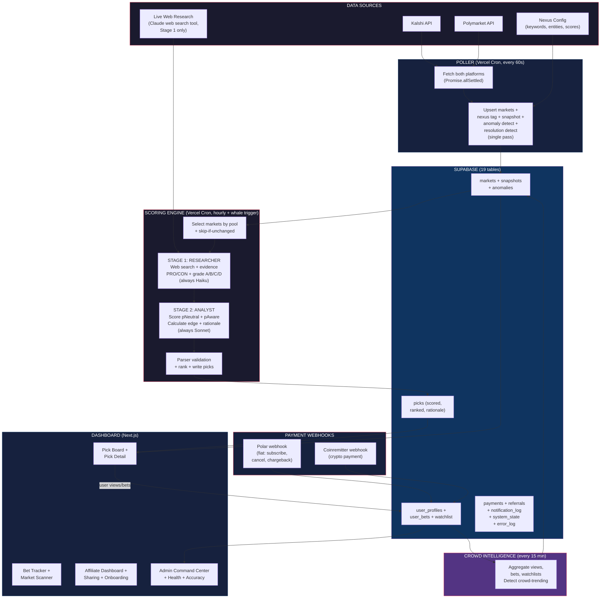

---

## Engine 1: The Poller (Every 60 Seconds)

Runs as a Vercel API route (`/api/poll-markets`) triggered by Vercel cron every minute. One route. One execution path. No trigger cascades.

**What it does in a single pass:**

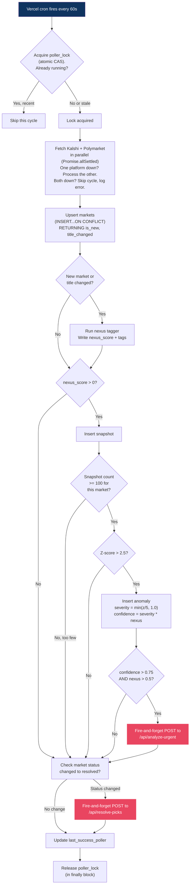

**Nexus tagging happens inline during upsert.** When a market is new or its title/description changed, run keyword + entity matching against the Trump Intel config. Write the nexus_score directly. No separate function call.

**Poller upsert logic (CTE-wrapped INSERT...ON CONFLICT):**

The poller needs three things back from each upsert: the market's UUID (for snapshot/anomaly writes), whether the row is new (for nexus tagging), and whether title/description changed on an existing row (for nexus re-tagging). Detecting the content change requires comparing OLD and NEW values. This cannot be done in a plain `RETURNING` clause on `ON CONFLICT DO UPDATE`, because by the time `RETURNING` evaluates, the SET clause has already overwritten the old values. `markets.title` in `RETURNING` equals `EXCLUDED.title`, so a naive `markets.title IS DISTINCT FROM EXCLUDED.title` always returns false.

The fix: wrap the upsert in a CTE alongside a snapshot-read of the pre-upsert row. PostgreSQL executes all CTEs against the same snapshot and data-modifying CTEs cannot see one another's effects on target tables, so the `old` CTE captures the pre-update state even though it appears alongside the upsert.

```sql
WITH old AS (
  SELECT id, title, description
  FROM markets
  WHERE platform = $1 AND platform_id = $2
),
upserted AS (
  INSERT INTO markets (platform, platform_id, title, description, yes_price, no_price,
    volume_24h, open_interest, status, category, market_url, close_time, last_polled_at)
  VALUES ($1, $2, $3, $4, $5, $6, $7, $8, $9, $10, $11, $12, now())
  ON CONFLICT (platform, platform_id) DO UPDATE SET
    title = EXCLUDED.title,
    description = EXCLUDED.description,
    yes_price = EXCLUDED.yes_price,
    no_price = EXCLUDED.no_price,
    volume_24h = EXCLUDED.volume_24h,
    open_interest = EXCLUDED.open_interest,
    status = EXCLUDED.status,
    category = EXCLUDED.category,
    market_url = EXCLUDED.market_url,
    close_time = EXCLUDED.close_time,
    last_polled_at = now()
  RETURNING id, (xmax = 0) AS is_new
)
SELECT
  upserted.id,
  upserted.is_new,
  -- old.id IS NULL when this was an INSERT (no pre-existing row), which is_new already covers.
  -- For UPDATEs, compare the pre-upsert old.title/description against the incoming values.
  (old.id IS NULL
    OR old.title IS DISTINCT FROM $3
    OR old.description IS DISTINCT FROM $4
  ) AS content_changed
FROM upserted
LEFT JOIN old ON old.id = upserted.id;
```

The `(xmax = 0) AS is_new` idiom is a documented PostgreSQL trick: `xmax` is 0 on a pure INSERT and non-zero when ON CONFLICT triggers the UPDATE path. It works on all PostgreSQL versions Supabase runs.

nexus_score and nexus_tags are intentionally NOT in the SET clause. They persist across upserts and are only re-tagged in application code when `is_new` or `content_changed` is true. This prevents the poller from wiping nexus data every cycle just because it re-read the market.

**Nexus config structure (lib/nexus/config.ts):**

```typescript
export const NEXUS_CONFIG = {
  // Keywords that indicate political connection. Score contribution: 0.1-0.3 per match.
  keywords: {
    high: ["trump", "executive order", "tariff", "immigration ban", "border",
           "doge", "department of government efficiency", "musk", "thiel"],  // +0.3 each
    medium: ["congress", "senate", "republican", "democrat", "federal reserve",
             "sec", "ftc", "doj", "supreme court", "cabinet"],              // +0.2 each
    low: ["regulation", "policy", "government", "election", "political",
          "legislation", "bipartisan", "partisan"],                          // +0.1 each
  },

  // Named entities with tier weights. Presence = strong nexus signal.
  entities: {
    tier1: ["Trump", "Musk", "Vance", "RFK Jr", "Ramaswamy"],              // +0.4
    tier2: ["Hegseth", "Bondi", "Rubio", "Waltz", "Lutnick"],              // +0.3
    tier3: ["McConnell", "Schumer", "Pelosi", "McCarthy", "Johnson"],       // +0.2
  },

  // Policy areas that are inherently nexus-relevant
  policy_domains: ["iran", "china", "tariff", "crypto", "ai regulation",
                   "military", "nato", "ukraine", "immigration", "tiktok",
                   "antitrust", "big tech", "oil", "climate"],               // +0.2 each
};

// nexus_score = min(sum of all matches, 1.0). Capped at 1.0.
// nexus_tags = array of matched keywords and policy domains.
// nexus_entities = object of matched entities with their tiers.
```

Matching is case-insensitive substring search against market title + description. This is simple string matching, not NLP. Fast enough to run inline during upsert for 2,000 markets.

**Snapshots are only stored for nexus-relevant markets (nexus_score > 0).** The poller upserts ALL markets to keep the markets table complete, but only inserts snapshot rows for the 100-300 politically relevant ones. This keeps storage and query performance manageable.

**Anomaly detection happens inline after snapshot insert.** For each snapshotted market, calculate z-scores on TWO fields:

```
Z-score on volume_24h:
  mean = AVG(volume_24h) from snapshots WHERE market_id = X AND captured_at > now() - 7 days
  stddev = STDDEV(volume_24h) from same window
  z_volume = (current_volume_24h - mean) / NULLIF(stddev, 0)
  If stddev = 0 (no variation), skip this market.

Z-score on yes_price:
  mean = AVG(yes_price) from same window
  stddev = STDDEV(yes_price) from same window
  z_price = (current_yes_price - mean) / NULLIF(stddev, 0)

Anomaly triggers if z_volume > 2.5 OR z_price > 2.5.
Anomaly type: 'volume_spike' if z_volume triggered, 'price_move' if z_price triggered, 'both' if both.
Severity = max(z_volume, z_price) normalized to 0-1 range: min(z / 5.0, 1.0)
Confidence = severity * (nexus_score of the market). Higher nexus = higher confidence.
expires_at = now() + 6 hours.

**Anomaly deduplication.** A single sustained anomaly (a prolonged volume spike, for example) would otherwise generate a new anomaly row on every poller cycle for as long as the z-score stays above threshold — potentially 60+ duplicate rows per hour for the same underlying event. Before inserting a new anomaly, check: does an unexpired anomaly already exist for this (market_id, anomaly_type) combination? If yes, UPDATE the existing row's severity and confidence (take the max of old and new) and bump expires_at forward. If no, INSERT a new row. This collapses sustained anomalies into a single evolving row rather than a flood, and the dashboard shows ONE whale alert banner per event rather than dozens.

```sql
-- Upsert anomaly: one row per (market, type) active at a time.
INSERT INTO anomalies (market_id, anomaly_type, severity, confidence, direction, details, expires_at)
VALUES ($market_id, $type, $severity, $confidence, $direction, $details, now() + interval '6 hours')
ON CONFLICT (market_id, anomaly_type) WHERE expires_at > now() DO UPDATE SET
  severity = GREATEST(anomalies.severity, EXCLUDED.severity),
  confidence = GREATEST(anomalies.confidence, EXCLUDED.confidence),
  expires_at = EXCLUDED.expires_at,
  details = EXCLUDED.details
RETURNING id, (xmax = 0) AS is_new_anomaly;
```

The `is_new_anomaly` return value is important: whale alert dispatch should fire ONLY on a newly-created anomaly row, not on every refresh of a sustained one. Without this guard, a single volume spike fires an analyze-urgent notification per minute for the duration of the spike. The unique constraint and partial index need to exist in the schema:

```sql
-- Add to 001_initial_schema.sql:
CREATE UNIQUE INDEX idx_anomalies_unique_active
  ON anomalies (market_id, anomaly_type)
  WHERE expires_at > now();
```

Note: PostgreSQL partial unique indexes with predicates involving `now()` have a subtle quirk — the predicate evaluates at index creation, not at query time. The practical implementation uses a generated column or a manual dedup query in application code rather than the partial index approach. Application-level dedup: before INSERT, `SELECT id FROM anomalies WHERE market_id = X AND anomaly_type = Y AND expires_at > now() LIMIT 1`. If a row exists, UPDATE it. If not, INSERT. Single round-trip using an upsert helper function in Postgres or a brief transaction in the poller.
```

Batch this as a single SQL query using window functions across all snapshotted markets. Not one query per market. The index `idx_snapshots_rolling` on (market_id, captured_at DESC) supports this.

**Pool deduplication.** A market with nexus_score 0.8 appears in Pool A, B, and C. It is analyzed ONCE. The resulting pick gets `min_tier = harpooner` (visible to all tiers). The scoring engine builds one deduplicated list of markets sorted by pool priority, not three separate lists.

**Cross-platform market handling (Phase 1).** The same real-world event may exist on both Kalshi and Polymarket as separate rows in the markets table (different platform, different platform_id). In Phase 1, both are analyzed independently and produce separate picks. The user sees both on the Pick Board with platform badges. This is intentional: showing both prices lets users choose the better platform. Cross-platform deduplication and arbitrage detection are Phase 3b features (see Command Center section).

**Whale alert trigger.** When an anomaly exceeds 0.75 confidence AND the market has a nexus_score above 0.5, the poller makes a fire-and-forget HTTP call to a Vercel API route that queues an immediate re-analysis of that specific market. The poller does not wait for this to complete.

**Rate limit handling.** Kalshi: 100ms delay between paginated requests. Polymarket: respect documented limits. On 429 response: exponential backoff, continue with partial data, log the gap.

**Overlap prevention.** A `system_state` table row tracks whether the poller is running. If the lock is less than 3 minutes old, skip the cycle. This prevents double-writes if a cycle runs long.

---

## Engine 2: The Scoring Engine (THE Product)

This is the AI research desk. It runs on Vercel as a cron job (hourly) and as an on-demand API route (triggered by whale alerts). It calls the Claude API with web search to analyze real-world intelligence and score each market on true probability.

### How Scoring Works

```mermaid
flowchart TD
    TRIGGER["Hourly cron OR whale alert"] --> LOCK{"Acquire scorer_lock<br/>(atomic CAS).<br/>Already running?"}
    LOCK -->|Yes| SKIP_LOCK["Skip this cycle"]
    LOCK -->|No| SELECT["Select markets by pool:<br/>WHERE status = 'active' AND:<br/>POOL A: nexus >= 0.7<br/>(crowd-trending = priority, not filter)<br/>POOL B: Pool A + nexus >= 0.3<br/>POOL C: Pool B + all nexus > 0<br/>Tag each with min_tier<br/>If zero markets pass filters:<br/>update last_success_scorer,<br/>release lock, done."]

    SELECT --> FILTER["Skip-if-unchanged:<br/>last_analyzed_at recent +<br/>price moved < 3% +<br/>no new anomalies?<br/>Skip that market."]

    FILTER --> BATCH["Group remaining into batches:<br/>Pool A: 5-8 per batch<br/>Pool B/C: 3-5 per batch"]

    BATCH --> STAGE1["STAGE 1: RESEARCHER<br/>Always Haiku (cheap, fast)<br/>Web search enabled<br/>Gather PRO + CON evidence<br/>Grade each source A/B/C/D<br/>Output: compressed evidence JSON"]

    STAGE1 --> STAGE2["STAGE 2: ANALYST<br/>Always Sonnet (good judgment)<br/>No web search (evidence already gathered)<br/>Score probability (pNeutral + pAware)<br/>Calculate edge, write rationale<br/>Output: full structured JSON"]

    STAGE2 --> VALIDATE["PARSER VALIDATION:<br/>confidence must be high/medium/low<br/>direction must be YES/NO<br/>probability must be 0-100<br/>edge RECALCULATED from price<br/>Handle partial batches"]

    VALIDATE --> RANK["Rank by pick_score.<br/>Assign min_tier per pool."]

    RANK --> WRITE["Write picks + update<br/>markets.last_analyzed_at +<br/>update last_success_scorer"]

    WRITE --> NOTIFY["Fire-and-forget POST to<br/>/api/send-notifications<br/>with new pick IDs"]

    NOTIFY --> RELEASE["Release scorer_lock"]

    style TRIGGER fill:#0f3460,stroke:#533483,color:#fff
    style STAGE1 fill:#e94560,stroke:#fff,color:#fff
    style STAGE2 fill:#e94560,stroke:#fff,color:#fff
    style VALIDATE fill:#533483,stroke:#e94560,color:#fff
```

### The Research Methodology (What Claude Analyzes)

This is the most important section in this document. The AI is not guessing. It is applying a structured research methodology to each market contract.

**For every market in the analysis batch, Claude evaluates eight signal categories:**

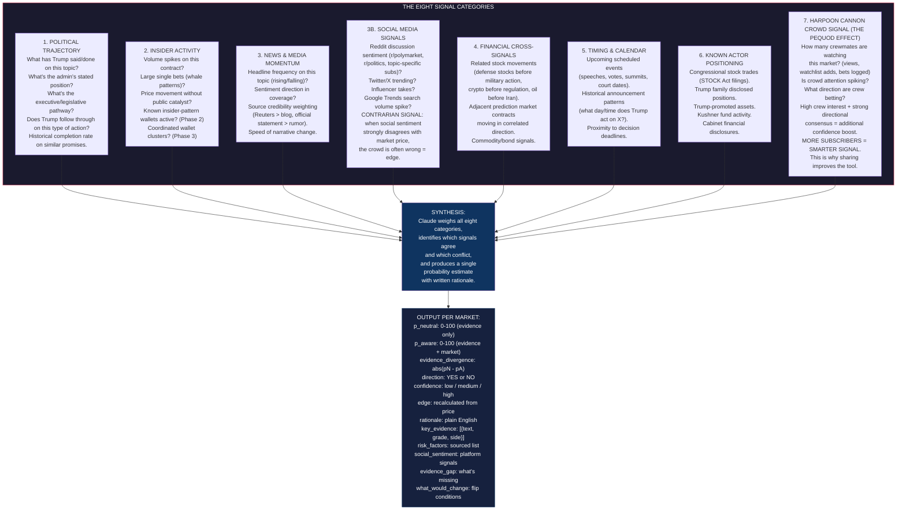

### Edge Calculation (How We Determine "Worth Betting On")

This is not complicated. It's the same logic as value investing applied to prediction markets.

```
Market price for YES = 55 cents (market thinks 55% chance)
Our analysis says true probability = 78%
Edge = 78 - 55 = +23 points

That's a pick. We think the market is underpricing this outcome by 23 points.

If edge > 0 = potential YES bet
If edge < 0 = potential NO bet (market is overpricing YES)
Bigger edge = stronger pick
```

**Ranking formula:**

```
pick_score = (abs(edge) * 0.40) + (confidence_multiplier * 0.25) + (anomaly_bonus * 0.15) + (crowd_bonus * 0.20)

Where:
  edge = our_probability - market_price (absolute value, 0-100 scale)
  confidence_multiplier = { high: 1.0, medium: 0.6, low: 0.3 }
  anomaly_bonus = 1.0 if unexpired anomalies on this market, 0.0 if not
  crowd_bonus = normalized(crowd_bets_24h) * directional_strength
    where directional_strength = abs(crowd_yes_pct - 50) / 50
    (50/50 split = 0.0, 80/20 split = 0.6, 95/5 split = 0.9)
    Meaning: lots of bets with strong directional agreement = high bonus.
    Lots of bets with no consensus = no bonus.
```

**anomaly_bonus lookup:** The scoring engine pre-loads anomaly status for all markets in one batch query BEFORE calculating pick_scores:
```sql
SELECT DISTINCT market_id FROM anomalies WHERE expires_at > now()
```
Result is a Set. For each pick: `anomaly_bonus = activeAnomalySet.has(market_id) ? 1.0 : 0.0`. This avoids N+1 queries (one per pick) and uses the same expiration logic as the dashboard anomaly filter.

All picks ranked by pick_score descending. Each pick tagged with `min_tier` based on its analysis pool. Dashboard queries filter by tier and apply per-tier LIMIT (Harpooner: 25, First Mate: 50, Ahab: unlimited).

### Cost Control for Claude API

Analysis is organized by pool, not arbitrary tiers. The pools map to subscription tiers:

| Pool | Markets | Analysis Depth | Batch Size | Frequency | Tier Visibility |
|---|---|---|---|---|---|
| A (Surface) | nexus >= 0.7 (crowd-trending markets get priority within pool) | Light web search (1 search/market: current headlines) | 5-8 per call | Every hour | Harpooner+ |
| B (Mid-water) | Pool A + nexus 0.3-0.7 | Medium web search (2-3 searches/market: headlines + financial + political) | 3-5 per call | Hourly on nexus > 0.6, every 4h on rest | First Mate+ |
| C (Deep sea) | Pool B + all nexus > 0 | Full web search (3-5 searches/market: all eight signal categories) | 3-4 per call | Same schedule as B | Ahab only |

**IMPORTANT: "Trending" is a sort priority within Pool A, NOT a filter.** On launch day with zero crowd data, Pool A still contains all markets with nexus >= 0.7. As crowd data accumulates, crowd-trending markets sort to the top of Pool A for priority analysis. This prevents the Harpooner tier from seeing zero picks on day one.

The scoring engine runs all pools every cycle (the platform requires the complete dataset for accuracy tracking, crowd signal aggregation, and admin intelligence). Picks are tagged with `min_tier` based on which pool generated them.

Estimated API cost running all pools (all with web search):
- Pool A: ~6 light batches = ~60K tokens/hour
- Pool B incremental: ~15 deep + 10 medium batches = ~250K tokens/hour
- Pool C incremental: ~12 deep + 8 medium batches = ~200K tokens/hour
- Total: ~510K tokens/hour = ~12.2M tokens/day
- At Sonnet pricing: roughly $55-75/day = $1,650-2,250/month
- Break-even: ~57-78 Harpooner subscribers or ~17-23 First Mates or ~6-8 Ahabs

### Token Optimization (Caveman Compression)

Research (arXiv:2604.00025, March 2026) found brevity constraints improve LLM accuracy by 26 percentage points on certain benchmarks. Verbose models make MORE errors. Compressed prompts = cheaper AND more accurate.

**Two zones in scoring engine output:**
1. Internal analysis (Claude reasoning about signals) = COMPRESS AGGRESSIVELY
2. User-facing `rationale` field (displayed on pick cards) = COMPLETE SENTENCES

Add to scoring engine system prompt:

```
TOKEN EFFICIENCY:
Internal reasoning: smart caveman. Cut filler. Fragments fine.
Drop articles, pleasantries, hedging. Use → = vs symbols.
Example: "Market likely rise, strong political signal + volume spike"
NOT: "The market is likely to rise because there is a strong political signal"

rationale field: complete sentences. Customers read this. Direct, evidence-based, no fluff.

JSON: compact single-line. No pretty-print. No whitespace.
```

**Input compression for market data payloads:**

Instead of verbose descriptions, send compressed market data:

```
POLYMARKET | Will US strike Iran before 2027? | yes=0.34 | vol24h=$5M | ANOMALY: volume_spike sev=0.85
```

NOT:

```
The market titled 'Will the US strike Iran before 2027?' on Polymarket is currently trading at...
```

Same information. ~60% fewer input tokens. LLMs understand compressed format equally well.

**Estimated savings:** 14-21% on structured JSON output, 40-60% on reasoning tokens. At ~510K tokens/hour, 20% average reduction = ~$330-450/month saved. Moves break-even from ~57-78 to ~48-66 Harpooner subscribers.

**Reference implementations:** github.com/JuliusBrussee/caveman (Claude Code skill, installable via `npx skills add JuliusBrussee/caveman`), github.com/wilpel/caveman-compression (input compression library for context/RAG payloads).

### Additional Cost Optimizations (Zero Dependencies, Zero Risk)

Every optimization below depends only on Anthropic's API or pure engineering. No third-party free tiers. No services that might vanish.

**1. Two-Stage Pipeline: Researcher → Analyst (biggest single savings)**

The scoring engine splits every analysis into two stages: a Researcher that gathers evidence via web search, and an Analyst that evaluates the evidence and produces the final probability.

**CRITICAL ARCHITECTURE DECISION: Background scoring runs ONE model tier for ALL users.** The scoring engine is shared infrastructure. It runs hourly regardless of user count. It does NOT use expensive models just because some users pay more. Tier differentiation comes from ACCESS BREADTH (how many picks, how many markets, Intelligence Credits for on-demand features), NOT from running costlier models on background scoring.

```
BACKGROUND SCORING CONFIG (lib/utils/models.ts):

export const SCORING_MODELS = {
  // Each role is a FALLBACK CHAIN, not a single model.
  // The wrapper tries position [0] first. If it returns 404 not_found_error
  // (model retired), it tries [1], then [2]. First success wins and is
  // cached in system_state as the active model for that role (see auto-heal
  // system below). Position [0] is the preferred model. Position [1] is the
  // previous generation as safety net. Position [2] is two generations back
  // as a last resort - it should always work because Anthropic deprecation
  // timelines give 6+ months notice.
  researcher: [
    "claude-haiku-4-5",    // Primary: newest Haiku
    "claude-haiku-4",      // Fallback: previous Haiku
    "claude-haiku-3-5",    // Last resort: older but reliable
  ],
  analyst: [
    "claude-sonnet-4-6",   // Primary
    "claude-sonnet-4-5",   // Fallback
    "claude-sonnet-4",     // Last resort
  ],
} as const;

// Generation aliases, not snapshots. Auto-patched within a generation
// (bug fixes flow through automatically). Major generation upgrades
// (4.5 -> 4.6) are manual and follow the upgrade protocol below.
// Format MUST match ANALYSIS_ENGINES in tier-features.ts for consistency.
// NEVER per-tier. NEVER Opus here. Background scoring is fixed infrastructure.
// When Anthropic ships cheaper/better models, ADD a new position [0] and
// shift the others down. When a position [2] model is scheduled for
// retirement, REMOVE it and promote [1] and [0].
```

Users who want BETTER analysis use their Intelligence Credits on on-demand features (Final Judgement, and future features). That's where Standard/Enhanced/Premium engine selection lives. The background scoring gives everyone the same solid foundation. Credits let users go deeper on picks that matter to them.

**How the pipeline works:**

```
STAGE 1: Researcher (with web search, always Haiku)
  Input: market data payload + research instructions
  Task: search the web for each signal category, gather evidence,
        classify PRO/CON, output compressed evidence package
  Model: ALWAYS Haiku. Cheap. Fast. Good enough for evidence gathering.

STAGE 1 OUTPUT FORMAT (intermediate, passed to Stage 2):
  Per market in the batch, output a compressed evidence package:
  {
    "market_platform_id": "...",
    "pro_evidence": [
      "Defense Secretary statement April 12 re 'all options on the table' (Reuters)",
      "Oil futures +4% April 13 no public catalyst",
      "Rep X sold $50K airline stocks April 10 STOCK Act"
    ],
    "con_evidence": [
      "Swiss diplomatic back-channel reported by FT",
      "Previous Iran cycles de-escalated 60% historically"
    ],
    "social_signal": "Reddit r/polymarket 400+ comments bullish, Twitter trending",
    "news_summary": "3 major outlets covering escalation in last 48h",
    "financial_signals": "Oil +4%, defense stocks +2%, no offsetting moves"
  }
  Compressed format. No full sentences needed. Evidence fragments ok.
  This is internal data, never shown to users.

STAGE 2: Analyst (NO web search, evidence already gathered, always Sonnet)
  Input: compressed evidence from Stage 1 + scoring methodology
  Task: grade evidence (A/B/C/D), apply bilateral analysis, calculate
        p_neutral + p_aware, write rationale, identify gaps, WWCMM
  Model: ALWAYS Sonnet. Good judgment at reasonable cost.
  Output: final pick JSON per the Part 3 output format specification
```

**Two-stage failure handling:**

```
Stage 1 (Researcher) fails:
  - Retry once after 5 seconds
  - If retry fails: skip this batch entirely, log to error_log with
    error_type='stage1_failure', include market_platform_ids in context
  - Markets will be picked up in the next hourly cycle
  - Do NOT attempt Stage 2 without Stage 1 evidence

Stage 2 (Analyst) fails (Stage 1 succeeded):
  - Save Stage 1 evidence output to error_log details.input_snapshot
    (this evidence cost real API tokens, don't waste it)
  - Retry Stage 2 once with the saved Stage 1 evidence
  - If retry fails: skip this batch, log with error_type='stage2_failure'
  - The evidence is preserved in error_log for debugging

Both stages timeout (300s Vercel limit approaching):
  - Scoring engine tracks elapsed time per batch
  - If elapsed > 240s after Stage 1 completes: skip Stage 2 for this batch,
    log as error_type='timeout_risk', save Stage 1 evidence
  - Release scorer_lock. Remaining batches skipped this cycle.

Malformed JSON from either stage:
  - Attempt to extract partial data from response text
  - If unparseable: log raw response text (truncated to 2000 chars) to
    error_log with error_type='parse_error'
  - Skip this batch, continue with next batch
```

**Where tier differentiation actually lives:**

| Differentiator | Harpooner ($29) | First Mate ($99) | Ahab ($299) |
|---|---|---|---|
| Markets analyzed | Pool A (~30-50) | Pool A+B (~100-200) | Pool A+B+C (all) |
| Picks visible | Top 25 | Top 50 | Unlimited |
| Intelligence Credits | 0 (modal upsell) | 150/month | 500/month |
| Credited calls daily cap | 0 | 20/day | 50/day |
| On-demand engines | None | Standard/Enhanced/Premium | Standard/Enhanced/Premium |
| Final Judgement | Modal preview | Full access | Full access |
| Background scoring model | Same for all | Same for all | Same for all |

The value ladder: MORE picks, MORE markets, MORE credits to run deeper analysis. NOT a different background model. This keeps infrastructure costs fixed and predictable while giving users control over their AI budget.

**Cost per market (fixed, shared, same for all tiers):**

```
Background scoring (Haiku → Sonnet): ~$0.04/market

**CALIBRATION REQUIRED AFTER SESSION 6.** The $0.04/market figure is an estimate based on projected token counts (2,000-token cached system prompt + ~800 token user prompt + ~500 token response, Haiku researcher + Sonnet analyst). Actual cost will vary based on real prompt lengths and response sizes in production. After Session 6 ships and the scoring engine runs for 24 hours, measure actual API spend against actual market count scored, compute real cost/market, and update this figure + the fiscal projections in HARPOON-REFERENCE.md if it differs by more than 20%. Break-even math depends on this.
At 200 markets/cycle: ~$8/hour = ~$5,760/month
With skip-if-unchanged (50-70% skip rate): ~$1,700-2,900/month
```

This is FIXED INFRASTRUCTURE. Doesn't matter if there are 10 users or 10,000. The scoring engine runs the same cycle either way.

**Model upgrade protocol:**

When Anthropic releases new models (Claude 5, Haiku 5, etc.):
1. Test new model on 50 historical markets with known outcomes
2. Compare accuracy against current model
3. If accuracy improves: add to the TOP of the fallback chain in `SCORING_MODELS`, deploy, done
4. If accuracy is equal but cheaper: same — add to top, deploy, pocket the savings
5. Log the change in system_state for audit trail

The pipeline code never changes. The prompt templates never change. Only the model config changes. This is how you stay current without breaking anything.

### Model Auto-Healing System (Phase 1, CRITICAL)

**Problem:** If Anthropic retires a model that the scoring engine uses, the API returns `404 not_found_error` on every call. Without automatic fallback, the poller keeps firing, the scorer keeps 404ing, picks never update, users see stale data, and the admin dashboard goes red. By the time a human notices and deploys a fix, the product has been broken for hours or days.

**Solution:** Every Claude API call goes through a thin wrapper that (a) tries models in order from the fallback chain, (b) caches the working position in `system_state` so subsequent calls skip known-bad models, (c) logs any fallback event as a first-class admin alert so operators know to update the config before the fallback chain runs out.

The wrapper lives at `lib/ai/call-with-fallback.ts`. The signature:

```typescript
async function callWithFallback(
  role: 'researcher' | 'analyst' | 'courtroom_trial' | 'courtroom_verdict',
  engineOrChain: string[],  // e.g., SCORING_MODELS.researcher
  messagesParams: Anthropic.MessageCreateParams,
): Promise<Anthropic.Message>
```

**Flow:**

1. **Read cached active model.** `SELECT value FROM system_state WHERE key = 'active_model_${role}'`. If a cached model exists AND it appears in the current fallback chain, try it first. This avoids paying the fallback penalty on every call after the first one.
2. **Attempt the call.** Call `anthropic.messages.create({ ...messagesParams, model: attemptModel })`.
3. **On success:** return the response. If the successful model differs from the cached active model, UPDATE system_state to record the new active model with timestamp.
4. **On 404 not_found_error:** this model is retired. Log to error_log with `error_type='model_retired'`, source=role, details={retiredModel, fallbackChain}. Try the next position in the chain.
5. **On 429 rate_limit_error:** back off 30 seconds, retry SAME model once. Do NOT fall back (fallback would not help; it's a quota issue).
6. **On 529 overloaded_error or 5xx api_error/timeout_error:** retry SAME model once after 5 seconds. Do NOT fall back immediately (transient). If the retry also fails, THEN try next position (maybe the primary model is in a bad state, the fallback might work).
7. **On 401 authentication_error:** do NOT retry, do NOT fall back. Log `error_type='auth_error'`, send admin notification immediately, abort. API key is bad.
8. **Fallback chain exhausted:** all positions returned 404 or persistent errors. Log `error_type='all_models_failed'`, critical severity. Send emergency admin alert (Discord + email if configured). The scoring engine treats this as a fatal error for this cycle: releases lock, updates `last_success_scorer` with failure marker, skips the cycle. Pick Board shows stale data. Admin must push a new fallback chain config.

**State caching table key:**

```sql
-- Written to system_state (no new table needed):
-- key = 'active_model_researcher', value = '{"model":"claude-haiku-4-5","verified_at":"2026-04-17T13:00:00Z"}'
-- key = 'active_model_analyst', value = '{"model":"claude-sonnet-4-6","verified_at":"2026-04-17T13:00:00Z"}'
-- key = 'active_model_courtroom_trial', value = '{"model":"claude-haiku-4-5",...}'
-- key = 'active_model_courtroom_verdict_standard', value = '{"model":"claude-haiku-4-5",...}'
-- (per-engine for Courtroom because user selects Standard/Enhanced/Premium)
```

Seed the initial values in 001_initial_schema.sql:
```sql
INSERT INTO system_state (key, value) VALUES ('active_model_researcher', '{"model":null,"verified_at":null}');
INSERT INTO system_state (key, value) VALUES ('active_model_analyst', '{"model":null,"verified_at":null}');
```

NULL model means "no preference cached, start from position [0] of the chain."

**Weekly validation cron (new cron, add to vercel.json):**

Even if the primary model is never 404'd in production, a proactive check catches retirement announcements before they bite. Add `/api/validate-models` to the cron schedule, running weekly (Sunday 06:00 UTC):

```json
{ "path": "/api/validate-models", "schedule": "0 6 * * 0" }
```

What it does:
1. Call `GET https://api.anthropic.com/v1/models` with the API key. Returns the current list of available models with `id`, `display_name`, `created_at`.
2. For each role in SCORING_MODELS and each engine in ANALYSIS_ENGINES, check:
   - Is position [0] still in the returned list? If no, log warning `fallback_chain_drift`, alert admin: "Primary model for [role] ([name]) is no longer in Anthropic's model list. Active fallback: [cached active]. Update config before the fallback chain runs out."
   - Is position [2] still in the returned list? If no, log warning `fallback_chain_last_resort_retired`, alert admin: "Last-resort fallback for [role] ([name]) is retired. Replace it with a newer model in the config."
   - Are there any NEW models in the list that look like newer versions of our chain (e.g., 4.8 when we have 4.7)? If yes, log info `newer_model_available`, no alert: "Consider upgrading [role] to [newer_model]." This is a convenience ping for the model upgrade protocol.
3. Update `system_state.key='last_success_model_validator'` on success.

The cron uses the same dual auth (CRON_SECRET or HARPOON_INTERNAL_SECRET) as other internal routes. Cost: one API call per week. Output goes to admin Discord + error_log. Zero user-facing impact.

**Admin dashboard surface:**

Add a "Model Health" card to /admin:
- Active model per role (from system_state.active_model_*)
- Last successful call timestamp per role
- Fallback events in last 7 days (count of `error_type='model_retired'` or `'fallback_chain_drift'` in error_log)
- "Validate models now" button (manual trigger of /api/validate-models)

**Why this matters for a single-operator product:**

Wolf is one person. You publish The Wise Wolf, build Vidiot, write comment replies, and respond to Harpoon Cannon support tickets. The last thing you need is to wake up to "scoring engine down since yesterday" because Anthropic retired Haiku 4.5 with six months' notice that landed in an email you never read. The auto-healing system makes Anthropic deprecation timelines a warning instead of an outage. The weekly validator catches the deprecation announcement. The fallback chain keeps the product running while you update the config at your pace. The admin dashboard tells you there's a problem before users do.

**What this does NOT solve:**

- Breaking API changes to the request/response schema (entirely different problem, requires code changes).
- Authentication failures (API key revoked, billing suspended) — 401 errors are not fallback events.
- Anthropic going down entirely (all models 5xx) — that's their outage, your scoring cycle skips, Pick Board shows stale data, users see "Last updated: [time]" as already specified.
- Quality regressions. A fallback model might be less accurate than the primary. The operator should treat sustained fallback use as "upgrade your config" not "this is fine forever."

This is fault tolerance for the one failure mode that single-operator products cannot absorb: silent vendor model retirement. Every other Claude API failure mode is already handled by the existing retry and error-log specs.

**2. Anthropic Prompt Caching**

The system prompt (methodology, bilateral analysis, evidence grading, caveman compression, branding) is identical for every API call. Anthropic's prompt caching feature stores it server-side after the first call and reuses it for subsequent calls within a window.

Cached input tokens cost 90% less than uncached. The system prompt is ~2,000 tokens. At 25 API calls per cycle, that's 50,000 tokens/cycle of system prompt. Caching saves ~45,000 tokens worth of cost per cycle.

Implementation: set `cache_control` on the system message block in the API call. Anthropic handles the rest.

```typescript
messages: [
  {
    role: "system",
    content: [
      {
        type: "text",
        text: systemPrompt,
        cache_control: { type: "ephemeral" }
      }
    ]
  },
  { role: "user", content: marketPayload }
]
```

**3. Skip-if-unchanged Analysis Caching**

If a market was analyzed within the last 4 hours AND the price moved less than 3% AND no new anomalies fired, skip re-analysis. The scoring engine checks `markets.last_analyzed_at` and compares current `markets.yes_price` to `picks.market_price_at_scoring` on the most recent pick for that market.

```
SKIP conditions (ALL must be true to skip):
  - last_analyzed_at IS NOT NULL (never skip a market that hasn't been analyzed yet)
  - last_analyzed_at > now() - interval '4 hours' (analyzed recently)
  - abs(markets.yes_price - picks.market_price_at_scoring) < 0.03
  - no anomalies with detected_at > last_analyzed_at
  - not whale-triggered
```

**CRITICAL: Skipped markets must have their existing pick rebadged with the current cycle_id.** The Pick Board query filters by `cycle_id = [latest_cycle]`. If a market is skipped, its pick still has the OLD cycle_id from the previous run. Without a rebadge step, the pick disappears from the dashboard even though the analysis is still valid. Users would see pick counts drop from 50 to 10 between cycles as more markets qualify for skip-if-unchanged. The fix is a single batched UPDATE at the end of each scoring run:

```sql
-- Rebadge the most recent pick for each skipped market to the current cycle_id.
-- This keeps the Pick Board query (WHERE cycle_id = latest) returning the correct
-- full set of picks without re-running expensive AI analysis.
UPDATE picks
SET cycle_id = $new_cycle_id,
    scored_at = now()
WHERE id IN (
  SELECT DISTINCT ON (market_id) id
  FROM picks
  WHERE market_id = ANY($skipped_market_ids)
  ORDER BY market_id, scored_at DESC
);
```

`scored_at` is also updated so the "last updated" timestamp on the card reflects the current cycle. `market_price_at_scoring` is NOT updated (the price used in the analysis is the OLD price; that's the whole point of skip-if-unchanged).

For stable markets (most political markets don't move every hour), this skips 50-70% of re-analyses. A market priced at 0.55 that hasn't moved doesn't need a fresh $0.10 API call every hour, but it still needs to appear on the Pick Board.

**4. Aggressive Pre-filtering (No AI Needed)**

Before any market enters the scoring pipeline, filter out markets where edge is mathematically unlikely:

```
SKIP from deep analysis if ALL of these:
  - nexus_score < 0.3 (weak political connection)
  - no anomalies in last 24h
  - crowd_views_24h < 10 (nobody watching)
  - yes_price between 0.40 and 0.60 (market is uncertain, edge unlikely)
```

These markets still get nexus-tagged and snapshotted by the poller (for anomaly detection), but they DON'T enter the scoring pipeline until something changes. This prevents burning tokens on markets where the AI would likely say "no edge, 50/50."

**5. Batch Size Optimization**

Current spec: Pool A batches of 5-8, Pool B/C batches of 3-5. Testing larger batches for Pool A (10-15 markets per call) reduces the number of API calls and amortizes the system prompt cost across more markets.

Trade-off: larger batches = slightly lower per-market quality (model has more to juggle). For Pool A light analysis, this is acceptable. Pool B/C stays at 3-5 for deep quality.

**6. Structured Output Mode**

Claude's JSON mode (or structured output via tool_use) forces clean JSON output without preambles, markdown fences, or "Sure, here's your analysis:" padding. Saves 50-200 tokens per API call in output waste.

Implementation: use `tool_use` with a defined schema rather than asking Claude to output JSON in the user message. The response is guaranteed to be parseable JSON.

**Combined savings estimate:**

| Optimization | Savings | Depends On |
|---|---|---|
| Caveman compression | 20% overall | Prompt engineering |
| Two-stage pipeline (Harpooner tier, Haiku→Sonnet) | ~33% on Harpooner calls | Anthropic API |
| Two-stage pipeline (First Mate, split saves search overhead) | ~15% on First Mate calls | Anthropic API |
| Two-stage pipeline (always Haiku→Sonnet) | Fixed cost regardless of tier mix | Anthropic API |
| Prompt caching | ~90% on system prompt tokens | Anthropic API |
| Skip-if-unchanged | 50-70% fewer re-analyses | Pure engineering |
| Pre-filtering | 20-30% fewer markets entering pipeline | Pure engineering |
| Batch size optimization | 10-15% fewer API calls | Pure engineering |
| Structured output mode | 2-5% on output waste | Anthropic API |

Conservative combined estimate: At launch (Harpooner only), ~45-55% cost reduction. Monthly API cost ~$750-1,100 vs $1,650-2,250 naive. Break-even: ~26-38 Harpooner subscribers. Background scoring costs are FIXED regardless of subscriber count or tier mix. On-demand features (Final Judgement etc.) are credit-gated with per-user budgets, so per-user AI cost never exceeds ~2-3% of subscription revenue.

**What about free AI models (Puter.js, Groq, Cloudflare Workers AI)?**

Evaluated and rejected for the scoring engine. The scoring engine runs server-side on Vercel cron jobs. No user browser is present. Puter.js is client-side only. Free API tiers from Groq, Together.ai, and others have rate limits that can't sustain 510K tokens/hour of production batch processing, and any of them could change pricing or shut down.

However, Puter.js has a valid Phase 2 use case: a "Ask about this pick" chat widget on the pick detail page where the USER's Puter account covers their own token cost. Harpoon Cannon pays nothing. The user asks follow-up questions about the rationale ("Why is evidence #3 rated B instead of A?") and gets answers powered by whatever model Puter routes to. Zero cost to Harpoon Cannon. Add to Phase 2 roadmap.

---

### Scoring Enhancement: Polyseer Patterns (MIT Licensed, github.com/yorkeccak/Polyseer)

Polyseer is an open-source multi-agent research platform for prediction markets. MIT licensed, 598 stars. Six patterns from their architecture improve Harpoon Cannon's scoring quality. ALL are implemented as structured prompting within the existing Claude API call. No separate agents. No extra API calls. Just better instructions.

**1. Bilateral Research (PRO/CON)**

Risk without it: confirmation bias toward whichever direction "feels" obvious.

Polyseer approach: research PRO evidence and CON evidence separately, then weigh them.

Add to scoring prompt:
```
BILATERAL ANALYSIS (REQUIRED):
For each market, research BOTH sides:
- PRO: evidence supporting the more likely outcome
- CON: evidence opposing it
List evidence separately with grades and sides.
Your probability must reflect the WEIGHT of evidence on both sides,
not just the count.
```

**2. Evidence Quality Grading with Influence Caps**

Each piece of evidence gets graded A/B/C/D. Polyseer caps how much influence each grade can have on the probability. This prevents a pile of garbage evidence from outweighing one strong source.

Add to scoring prompt:
```
EVIDENCE GRADING (REQUIRED):
Grade every piece of evidence A/B/C/D using these four criteria:
- Verifiability: can this be independently confirmed?
- Independence: is this a unique source or echoing another?
- Recency: how fresh? (last 48h = strong, last week = moderate, older = weak)
- Signal strength: how directly does this affect the outcome?

Grade definitions and influence caps:
  A = all four criteria strong. Max influence: HIGH.
      Examples: official statements, regulatory filings, STOCK Act disclosures
  B = three criteria strong. Max influence: MODERATE.
      Examples: Reuters/Bloomberg reporting, expert analysis, financial data
  C = two or fewer criteria strong. Max influence: LOW.
      Examples: unnamed sources, unverified reports, secondhand analysis
  D = speculative or stale. Max influence: MINIMAL.
      Examples: social media rumors, outdated information, opinion pieces

Three A-tier CON sources outweigh ten D-tier PRO sources. Always.
```

**3. Source Deduplication**

Polyseer adjusts for correlated evidence. Two news articles quoting the same press conference are ONE source, not two.

Add to scoring prompt:
```
SOURCE DEDUPLICATION:
If multiple sources cite the same underlying event, statement, or data point,
count them as ONE piece of evidence at the highest grade among them.
Do not inflate evidence count with redundant sources.
Five articles about the same Reuters wire = one B-grade source, not five.
```

**4. Dual Probability Output (pNeutral + pAware)**

Output TWO probabilities:
- `p_neutral`: what the evidence says, IGNORING the current market price
- `p_aware`: factoring in the market price as additional signal (crowds are often right)

The GAP between them is the conviction signal. If p_neutral = 78 and p_aware = 55, the evidence STRONGLY disagrees with the crowd. That's a high-conviction edge.

`evidence_divergence` = abs(p_neutral - p_aware). Use as a multiplier in the ranking formula. Mathematically defensible, not vibes.

**5. Gap Identification (single-pass, no extra API call)**

Polyseer uses a separate Critic agent to find evidence gaps. We do this in one pass.

Add to scoring prompt:
```
EVIDENCE GAP CHECK:
After your analysis, identify the single biggest gap in your evidence.
What information would you NEED to be more confident? State it in one sentence.
Output as "evidence_gap" field.
```

**6. "What Would Change My Mind"**

Different from risk_factors. Risk factors = what could go wrong. WWCMM = what specific evidence would flip the probability. More actionable for users.

Add to JSON output:
```
"what_would_change": "A confirmed diplomatic back-channel producing a joint statement before May 1 would drop this to 30%."
```

**Implementation: ALL six patterns are prompt additions.** No new agents. No new API calls. No new infrastructure. The scoring prompt in `prompt.ts` concatenates the instructions. The JSON output gains two new fields (`evidence_gap`, `what_would_change`). The parser maps them. The pick detail page displays them. That's it.

**Cost impact:** ~30-40% more tokens for deep analysis (Pools B/C). Pool A stays light. The quality improvement is worth it for $99-$299/month subscribers.

---

### Scoring Prompt Specification

This is the most critical config in the system. If this prompt is bad, the picks are bad, the product is worthless.

**The prompt is structured in three parts: system instructions, market data payload, and output format.**

#### Part 1: System Instructions (Permanent, never changes)

The full system prompt is assembled in `prompt.ts` from FOUR instruction blocks. All four MUST be included:
1. ROLE + METHODOLOGY + ANTI-SLOP + WEB SEARCH (below)
2. TOKEN EFFICIENCY block (from Caveman Compression section above)
3. BILATERAL ANALYSIS block (from Polyseer Patterns section above)
4. BRANDING block (from Branding Rules section below)

```
ROLE:
You are a prediction market analyst. Your job is to determine the TRUE
probability of each market contract resolving YES or NO, based on real-world
evidence. You are advising people who are betting real money. Accuracy is
everything. Credibility is everything.

METHODOLOGY:
For each market, evaluate eight signal categories:
1. Political trajectory (administration position, executive pathway, follow-through history)
2. Insider activity (anomalous market data provided to you in the payload)
3. News and media momentum (search for current headlines, assess frequency and direction)
3B. Social media signals (Reddit discussion, Twitter/X trending, Google Trends spikes,
    CONTRARIAN CHECK: social euphoria + flat price = smart money not buying)
4. Financial cross-signals (related stocks, commodities, adjacent markets)
5. Timing and calendar (upcoming events, decision deadlines)
6. Known actor positioning (disclosed holdings, congressional trades, promoted assets)
7. Crowd signal (Harpoon Cannon user engagement data provided in payload: view count,
   watchlist count, bet count, directional consensus among users)

ANTI-SLOP RULES (CRITICAL):
- ALWAYS commit to a specific probability number. Never say "it's hard to say."
- NEVER hedge with "there are arguments on both sides" or "it depends on many factors."
  If factors conflict, weigh them and pick a number.
- If your confidence is low, say so in the confidence field. Still give a number.
- Write rationale like a sharp, direct analyst briefing a trader, not like a cautious
  AI writing a term paper. Be specific. Name sources. State what the evidence shows.
- Every rationale must answer: "Why should I bet on this?" If you can't answer
  that compellingly, the probability should be closer to 50 (no edge).
- Never use phrases: "it remains to be seen," "only time will tell," "complex
  interplay of factors," "multifaceted situation." These are meaningless.
- SHORT sentences. No filler. Every sentence adds information or it gets cut.

WEB SEARCH INSTRUCTIONS (Deep analysis only):
- Search for the most recent news on this topic (last 48 hours prioritized)
- Search for related financial movements if applicable
- Search for any scheduled events that could affect resolution
- Prefer original sources (official statements, wire services) over aggregators
- Search "site:reddit.com [topic]" for recent Reddit discussion sentiment
- Search "[topic] twitter trending" for social media momentum
- CONTRARIAN CHECK: if social media is overwhelmingly bullish but price is flat
  or declining, note this divergence. Crowds are often wrong at extremes.
  Social euphoria + flat price = smart money NOT buying.
  Social panic + stable price = smart money holding.
```

#### Part 2: Market Data Payload (Changes every cycle)

Sent as the user message. Contains the batch of markets to analyze with all available data:

```
Per market in the batch:
- title: "Will the US strike Iran before May 2026?"
- platform: "polymarket"
- market_url: "https://polymarket.com/event/..."
- current_yes_price: 0.55 (market thinks 55% chance)
- current_no_price: 0.45
- volume_24h: 2,400,000
- open_interest: 8,500,000
- nexus_score: 0.85
- nexus_tags: ["iran", "military", "foreign_policy"]
- nexus_entities: ["Trump", "DoD", "Tier 1"]
- anomaly_flags: [{ type: "volume_spike", severity: 0.8, detected: "2h ago" }]
- resolution_date: "2026-05-01"
- crowd_signal: { views_24h: 847, watchlist_count: 312, bets_logged: 89, yes_pct: 76, no_pct: 24 }
```

#### Part 3: Output Format (Structured JSON)

Claude responds with a JSON array. One object per market:

```
{
  "market_platform_id": "...",
  "true_probability": 78,
  "p_neutral": 78,
  "p_aware": 72,
  "evidence_divergence": 6,
  "direction": "YES",
  "confidence": "high",
  "edge": 23,
  "rationale": "The administration has been escalating rhetoric on Iran for three weeks. Defense Secretary [name] stated on April 12 that 'all options are on the table.' Oil futures jumped 4% yesterday with no public catalyst. Two separate congressional members sold airline stocks last week per STOCK Act filings. The volume spike on this contract (2.5x normal, no news catalyst) matches the same pattern seen before the April 2026 Syria strikes. This market is underpriced.",
  "key_evidence": [
    {"text": "Defense Secretary statement April 12 (Reuters)", "grade": "A", "side": "PRO"},
    {"text": "Oil futures +4% April 13 (no public catalyst)", "grade": "B", "side": "PRO"},
    {"text": "Rep. X sold $50K airline stocks April 10 (STOCK Act)", "grade": "A", "side": "PRO"},
    {"text": "Contract volume 2.5x rolling average, no news", "grade": "B", "side": "PRO"},
    {"text": "Diplomatic back-channel with Swiss intermediary reported", "grade": "C", "side": "CON"}
  ],
  "risk_factors": [
    "Diplomatic back-channel could produce surprise de-escalation",
    "Market resolution date is May 1 - tight timeline for military action",
    "Previous Iran escalation cycles have de-escalated 60% of the time historically"
  ],
  "social_sentiment": {
    "direction": "bullish",
    "intensity": "high",
    "sources": "Reddit r/polymarket thread (400+ comments), Twitter trending",
    "divergence_from_market": "aligned"
  },
  "evidence_gap": "No direct confirmation of military staging from satellite imagery or DoD sources.",
  "what_would_change": "A confirmed diplomatic back-channel producing a joint statement before May 1 would drop this to 30%."
}
```

**The output must be parseable JSON. The system prompt includes an instruction to respond ONLY with the JSON array, no preamble, no markdown fences.**

**Parser field mapping (parser.ts must handle these):**
| Claude JSON output | Picks table column | Notes |
|---|---|---|
| `market_platform_id` | `market_id` | Lookup: `SELECT id FROM markets WHERE platform_id = [value]` |
| `confidence` | `confidence_level` | Direct rename |
| `true_probability` | `true_probability` | Direct |
| `p_neutral` | `p_neutral` | Direct |
| `p_aware` | `p_aware` | Direct |
| `evidence_divergence` | `evidence_divergence` | Direct |
| `direction` | `direction` | Direct |
| `edge` | `edge` | Direct |
| `rationale` | `rationale` | Direct |
| `key_evidence` | `key_evidence` | Store as jsonb |
| `risk_factors` | `risk_factors` | Store as jsonb |
| `social_sentiment` | `social_sentiment` | Store as jsonb |
| `evidence_gap` | `evidence_gap` | Direct |
| `what_would_change` | `what_would_change` | Direct |

**Parser validation (MUST enforce before writing to picks):**

```typescript
// Normalize and validate Claude output before database write
// If ANY required field fails validation, REJECT the entire market pick and log to error_log

// confidence: must be exactly "high", "medium", or "low"
// Normalize: lowercase, trim whitespace
// If not one of the three: default to "low" and log warning
const confidence = raw.confidence?.toLowerCase().trim();
if (!["high", "medium", "low"].includes(confidence)) {
  logWarning("unexpected_confidence", { value: raw.confidence, market: raw.market_platform_id });
  pick.confidence_level = "low";
} else {
  pick.confidence_level = confidence;
}

// direction: must be "YES" or "NO"
// Normalize: uppercase, trim
const direction = raw.direction?.toUpperCase().trim();
if (!["YES", "NO"].includes(direction)) {
  REJECT this market pick. Log error. Continue with next market.
}

// true_probability: must be integer 0-100
// Clamp to range, round to integer
const prob = Math.round(Number(raw.true_probability));
if (isNaN(prob) || prob < 0 || prob > 100) {
  REJECT this market pick. Log error. Continue with next market.
}

// p_neutral, p_aware: same validation as true_probability (0-100 integer, nullable)
// evidence_divergence: abs(p_neutral - p_aware), validate non-negative

// edge: recalculate from true_probability and market price, do NOT trust Claude's edge value
// This prevents Claude from outputting inconsistent probability + edge pairs
pick.edge = direction === "YES"
  ? prob - (market.yes_price * 100)
  : prob - ((1 - market.yes_price) * 100);

// rationale: must be non-empty string, minimum 50 characters
// If too short, log warning but still write (some markets may genuinely have brief rationale)

// key_evidence: must be array, each item must have text + grade + side
// grade: normalize to uppercase, must be A/B/C/D. Default to "D" if unknown.
// side: normalize to uppercase, must be PRO/CON. Default to "PRO" if unknown.
```

This validation prevents a single bad Claude output from corrupting the database or producing NaN pick_scores. The ranking formula depends on confidence_level for the multiplier. If confidence is undefined, the multiplier is undefined, pick_score becomes NaN, and the entire Pick Board breaks.

Fields NOT in Claude output (set by the scoring engine): `id` (gen_random_uuid), `cycle_id` (shared per run), `scored_at` (now), `min_tier` (based on analysis pool), `pick_score` (calculated from ranking formula), `rank` (calculated after all picks scored), `analysis_pool`, `market_price_at_scoring` (current yes_price at time of scoring), `is_whale_alert`, `resolved` (false), `was_correct` (null), `actual_pnl_pct` (null).

---

## The Courtroom: Final Judgement (Adversarial AI Second Opinion)

The scoring engine produces picks. The Courtroom puts them on trial.

This is an on-demand adversarial multi-agent analysis that runs when a user clicks "Final Judgement" on a pick detail page. Two AI advocates argue opposing sides. Twelve AI jurors with distinct analytical lenses vote independently. An AI judge delivers a verdict with sentencing. The user sees whether the evidence survives cross-examination before risking real money.

**Why this works (backed by research):** Multi-agent debate with assigned adversarial roles outperforms single-model analysis by 2.6-10% on claim verification benchmarks (DebateCV 2025, PROClaim 2025). Isolated jury voting prevents groupthink (Nature 2026). Diverse analytical personas surface blind spots that unanimous analysis misses (A-HMAD 2025). The courtroom metaphor has been independently validated by OpenReview, CourtEval, and AgentsCourt as the optimal structure for adversarial AI evaluation.

**Tier gating:** First Mate ($99) and Ahab ($299) get full access. Harpooner ($29) sees a grayed-out "Final Judgement" button with "Upgrade to First Mate to put this signal on trial" as the upsell text.

### The Participants

**Defense Attorney** - Always argues BUY. Builds the strongest possible case for YES. Must produce numbered arguments, a self-rated confidence score (1-10), and must explicitly admit its own weaknesses. Does NOT choose its position. It is assigned.

**Prosecutor** - Always argues DO NOT BUY. Builds the strongest possible case against. Same output format. Also assigned, not chosen. Neither side hedges. Both are instructed to argue their position as forcefully as possible even if the evidence is weak.

**Rebuttal Round** - Each side gets one rebuttal after reading the opponent's argument. Can ONLY counter existing points. Cannot introduce new evidence or arguments. This prevents scope creep and forces direct engagement with the opponent's strongest claims.

**The Jury (12 Jurors)** - Each receives the full transcript (both arguments + both rebuttals). Each votes independently WITHOUT seeing any other juror's vote. Each has a unique analytical lens:

| # | Juror | Lens |
|---|---|---|
| 1 | Statistician | Base rates, raw probability, sample sizes |
| 2 | Historian | Historical parallels, precedent, pattern matching |
| 3 | Contrarian | Where the crowd is wrong, consensus traps |
| 4 | Risk Manager | Downside scenarios, worst case, tail risk |
| 5 | Momentum Trader | Trend direction, velocity, inflection signals |
| 6 | Fundamentalist | Structural factors, underlying mechanics |
| 7 | Skeptic | Evidence quality, source reliability, gaps |
| 8 | Sentiment Reader | Public mood, narrative shifts, media cycles |
| 9 | Timekeeper | Timeline pressure, decay, urgency, deadlines |
| 10 | Arbitrageur | Price inefficiency, market mechanics, spread |
| 11 | Black Swan Hunter | Low-probability high-impact events |
| 12 | Pragmatist | Simple expected value, risk-adjusted return |

Each juror produces: a vote (BUY or DO NOT BUY), a short paragraph of reasoning, and which side's argument influenced them most.

**The Judge** - Receives everything: both arguments, both rebuttals, all 12 jury votes with reasoning. Produces:

- **Ruling:** BUY or DO NOT BUY
- **Confidence:** 1-10
- **Reasoning:** Which side won and why. Where the jury split. The deciding factor.
- **Sentence (if BUY):** Suggested position size (% of bankroll), entry timing (now / wait for dip / wait for catalyst), kill conditions (exit if X happens), review date
- **Sentence (if DO NOT BUY):** Whether "never" or "not yet." What would trigger a re-trial. Review date.
- **Dissent:** If jury was split, why the minority was overruled

### API Architecture (2 calls per session, token-optimized)

The user sees ONLY the verdict. The trial is internal processing. This means ALL intermediate text (defense arguments, prosecution arguments, rebuttals, individual juror reasoning) uses aggressive caveman compression. Only the judge's reasoning and sentence are complete sentences.

```
Call 1: THE TRIAL (Haiku, always - cheap and fast)
  Input: compressed pick data (~800 tokens):
    MARKET: Will US strike Iran before 2027? | yes=0.34 | edge=+23 | conf=high
    PRO_EVIDENCE: [A] DefSec statement Apr12 Reuters | [B] Oil +4% no catalyst | [A] Rep X sold airlines
    CON_EVIDENCE: [C] Swiss backchannel FT | [B] 60% historical de-escalation
    CROWD: 312 watching, 89 bets, 76% YES | SOCIAL: Reddit bullish, Twitter trending
    RISK: diplomatic breakthrough, election pivot
    
  System prompt (~400 tokens, cached):
    "Simulate adversarial trial. Compressed output only.
     DEFENSE: 5 numbered BUY arguments. Confidence 1-10. List 3 weaknesses.
     PROSECUTION: 5 numbered DO_NOT_BUY arguments. Confidence 1-10. List 3 weaknesses.
     DEFENSE REBUTTAL: counter Prosecution top 3 points, one line each.
     PROSECUTION REBUTTAL: counter Defense top 3 points, one line each.
     No hedging. No filler. Fragments ok. Both sides argue HARD."
     
  Output (~1,200 tokens compressed):
    { "defense": { "args": [...], "conf": 8, "weak": [...] },
      "prosecution": { "args": [...], "conf": 6, "weak": [...] },
      "def_rebuttal": "...", "pros_rebuttal": "..." }

Call 2: THE VERDICT (user-selected engine: Standard/Enhanced/Premium)
  Input: trial transcript from Call 1 (~1,200 tokens) + pick summary (~200 tokens)
  
  System prompt (~500 tokens, cached):
    "You are 12 jurors + 1 judge. Evaluate this trial transcript.
     JURORS: 12 independent votes. Each: name, BUY or NO, one sentence.
     Juror lenses: Statistician, Historian, Contrarian, Risk Manager,
     Momentum Trader, Fundamentalist, Skeptic, Sentiment Reader,
     Timekeeper, Arbitrageur, Black Swan Hunter, Pragmatist.
     No juror references another. Compressed output for jurors.
     
     JUDGE: After tallying jury, deliver verdict.
     ruling: BUY or DO_NOT_BUY
     confidence: 1-10
     reasoning: 2 paragraphs, COMPLETE SENTENCES (user reads this)
     if BUY: position_size_pct, entry_timing, kill_conditions, review_date
     if NO: never_or_not_yet, retrial_trigger, review_date
     dissent: if split, why minority overruled (1 paragraph)"

  Output (~1,500 tokens):
    { "jurors": [{"n":"Statistician","v":"BUY","r":"Base rate 70%+ ..."},...],
      "jury_split": "9-3 BUY",
      "ruling": "BUY", "confidence": 8,
      "reasoning": "The defense presented...[complete sentences]",
      "sentence": {"size":"5%","timing":"now","kill":"if diplomatic breakthrough","review":"2026-05-01"},
      "dissent": "The Risk Manager and Black Swan Hunter..." }
```

**Cost per session (Call 1 always Haiku + Call 2 user-selected):**
- Standard (Haiku trial + Haiku verdict): ~$0.005/session = 1 credit
- Enhanced (Haiku trial + Sonnet verdict): ~$0.033/session = 3 credits
- Premium (Haiku trial + Opus verdict): ~$0.14/session = 10 credits

With prompt caching on system prompts: ~20-30% cheaper after first call of the day.

### Usage Limits (via Intelligence Credits)

Final Judgement costs depend on the analysis engine the user selects:

| Analysis Engine | Credit Cost | Actual API Cost | What User Sees |
|---|---|---|---|
| Standard Analysis | 1 credit | ~$0.005 | Fastest, good for quick gut-check |
| Enhanced Analysis (default) | 3 credits | ~$0.033 | Recommended, sharp judgment |
| Premium Analysis | 10 credits | ~$0.14 | Best available, use on high-conviction picks |

Users select the engine from a dropdown on the Final Judgement button. Default is Enhanced. The dropdown label shows: "Standard (1 credit) / Enhanced (3 credits) / Premium (10 credits)".

Credits deducted from the user's monthly Intelligence Credits allowance (150/month for First Mate, 500/month for Ahab). Monthly allowance consumed first, then purchased bonus_credits. When all credits are gone, the button shows "Out of credits" with a "Buy More" link. Daily safety cap still enforced (20 credited API calls/day for First Mate, 50/day for Ahab) to prevent runaway automation. This is separate from the BYOAI daily cap of 300/day.

See Intelligence Credits section under Pricing for the full credit system spec, consumption logic, top-up packages, and daily reset rules.

### Caching and Re-Trial

- Results cached in `courtroom_verdicts` table linked to pick_id + user_id
- If a cached verdict exists and is < 6 hours old AND `abs(market.yes_price - verdict.market_price_at_verdict) < 0.05`, serve the cached version (zero API cost)
- If market conditions changed significantly (price moved > 5% or new anomaly or new scoring cycle), show "Conditions changed. Re-trial?" button
- Re-trial counts against the daily limit
- Cache lookup is the FIRST check before any API call. Most users will hit cache on popular picks.

### Database Table

```sql
CREATE TABLE courtroom_verdicts (
  id uuid PRIMARY KEY DEFAULT gen_random_uuid(),
  pick_id uuid REFERENCES picks(id) ON DELETE CASCADE,
  user_id uuid REFERENCES user_profiles(id) ON DELETE CASCADE,
  trial_transcript jsonb NOT NULL,    -- compressed defense + prosecution + rebuttals
  jury_votes jsonb NOT NULL DEFAULT '[]',
  jury_split text,
  ruling text NOT NULL,               -- 'BUY' or 'DO_NOT_BUY'
  ruling_confidence int NOT NULL,
  ruling_reasoning text NOT NULL,     -- user-facing, complete sentences
  sentence jsonb,                     -- position_size, timing, kill_conditions, review_date
  dissent text,
  model_used text NOT NULL,
  market_price_at_verdict float,
  created_at timestamptz DEFAULT now()
);

CREATE INDEX idx_courtroom_pick ON courtroom_verdicts (pick_id, created_at DESC);
```

### Display on Pick Detail Page

Below the evidence section, above the "I Bet This" button:

**For First Mate / Ahab users:**
- Button: "Final Judgement" (gavel icon) with remaining daily uses shown: "(7 of 10 remaining)"
- Loading state: "The court is in session..." (typically 3-5 seconds for both calls)
- Verdict card when complete:
  - Large ruling: "BUY" (green) or "DO NOT BUY" (red) with confidence meter (1-10)
  - Jury split: "9-3 BUY" with expandable juror breakdown (12 rows: name, vote, one-line reasoning)
  - Judge reasoning: 2 paragraphs (the only complete-sentence text in the whole feature)
  - If BUY: sentence details (position size %, timing, kill conditions, review date)
  - If DO NOT BUY: "not yet" or "never" with retrial trigger and review date
  - If jury was split: dissent paragraph explaining why minority was overruled
  - "Share This Verdict" button (pre-formatted text + affiliate link)

**For Harpooner users:**
- Same button placement but triggers a MODAL WINDOW (not a popup, not a tooltip):
  - Modal title: "Final Judgement"
  - Modal body: "Before you risk real money, put this signal on trial. Two AI advocates argue opposite sides. Twelve AI jurors with different analytical lenses vote independently. A judge delivers the verdict with position sizing and kill conditions. Upgrade to First Mate to unlock adversarial analysis on every pick."
  - Modal CTA button: "Upgrade to First Mate - $99/mo" (links to /pricing)
  - Modal dismiss: "Maybe later" (closes modal)
  - This modal is the single most compelling upsell in the product. A user staring at a pick they're about to bet real money on, seeing a feature that would stress-test the analysis before they commit, WILL upgrade.

---

## Database Schema (Revised)

### Supabase Realtime Configuration

Enable Realtime on these tables (dashboard pushes live without polling):
- `picks` (new picks appear on Pick Board instantly when a cycle completes)
- `anomalies` (whale alerts push to the dashboard banner immediately)
- `markets` (live price updates for current_edge calculation on pick cards)

Do NOT enable Realtime on: `snapshots` (too high volume), `market_views` (write-heavy, no read need), `error_log`, `payments`.

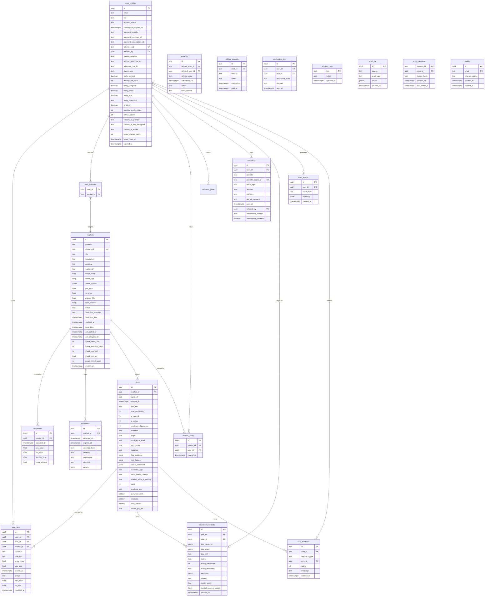

### Urgent Pick Handling

Urgent picks (from whale alert → analyze-urgent) don't belong to a regular hourly cycle. They use `is_whale_alert = true` and the dashboard query includes them: `(cycle_id = [latest]) OR (is_whale_alert = true AND scored_at > now() - interval '1 hour')`. This ensures urgent picks appear immediately without waiting for the next scheduled cycle, and age out after one hour when the regular cycle replaces them.

**analyze-urgent concurrency rules:**
- Does NOT use scorer_lock (must be fast, can't wait for hourly cycle)
- DOES check: if the market already has a pick with `scored_at > now() - interval '1 hour'`, SKIP (hourly analysis is fresh enough, no duplicate needed)
- DOES check AND UPDATE atomically: `UPDATE system_state SET value=now()::text WHERE key='last_urgent_at' AND (value::timestamptz < now() - interval '5 minutes' OR value IS NULL) RETURNING *`. If no rows returned, another urgent analysis ran within 5 minutes, skip. This atomic check-and-set prevents two rapid whale alerts from both starting analysis. The update happens BEFORE the API call, not after.
- Writes picks with its own cycle_id (separate from hourly cycle) and `is_whale_alert = true`
- NOTE: If the hourly scorer and analyze-urgent run simultaneously for the same market, two picks may exist briefly. The whale alert pick ages out after 1 hour. The hourly pick replaces it in the next cycle. This is acceptable and not worth adding cross-system locking to prevent.

**Notification trigger mechanism:** After the scoring engine (hourly or urgent) writes picks to the database, it makes a fire-and-forget HTTP POST to `/api/send-notifications` with the list of new pick IDs. The send-notifications route reads those picks, determines which users should be notified (based on tier visibility and notification preferences), checks the throttle (3/hour per user), and dispatches to configured channels (Discord for Phase 1).

### Subscription Expiration (Crypto Rail)

Fiat subscriptions are managed by the payment provider (Polar handles recurring billing automatically). The fiat webhook handler MUST handle both payment success AND subscription cancellation events:
- `subscription.active` / `checkout.completed`: set tier, set payment_provider = 'polar'
- `subscription.updated`: tier upgrade or downgrade via Polar plan change API. Read the new product ID from the webhook payload, map to the correct tier ('harpooner'/'first_mate'/'ahab'), update user_profiles.tier. Same idempotency check via provider_event_id.
- `subscription.canceled`: set `subscription_expires_at` to the end of the current billing period (Polar includes `current_period_end` in the webhook payload). Do NOT immediately revoke access. The user paid through the end of their period.

**Webhook out-of-order delivery.** Payment providers do NOT guarantee event order. Polar may send `subscription.canceled` before `checkout.completed` (rare but possible on network issues or retries). Handle each event independently and idempotently:
- `checkout.completed` arriving after `subscription.canceled`: the idempotency check (provider_event_id UNIQUE) prevents reprocessing. But if the cancel arrived first and set subscription_expires_at, and THEN checkout.completed arrives for the same subscription, the checkout handler should check: does this user already have this subscription ID? If yes, this is a duplicate/redelivery, skip.
- `subscription.canceled` arriving before any checkout: the user_profiles row has tier = NULL (no checkout processed yet). The cancel handler finds no subscription to cancel. Log and skip gracefully. Do NOT crash on "nothing to cancel."
- `subscription.updated` arriving before checkout: same pattern. If tier is NULL, the user hasn't been set up yet. Log and skip.
- General rule: every webhook handler must tolerate the user being in ANY state (no profile, NULL tier, active tier, cancelled, banned). Check state BEFORE acting. Never assume a previous event has already been processed.

Crypto subscriptions are one-time payments for 30 days. The crypto webhook handler sets `subscription_expires_at = now() + 30 days`.

**Crypto renewals:** When a crypto user's 30 days expire and they return, the middleware redirects them to /pricing (tier = NULL). They pay again via Coinremitter. The webhook handler uses the SAME flow as initial payment: set tier, set payment_provider = 'coinremitter', set subscription_expires_at = now() + 30 days. No special renewal logic needed. If a user pays BEFORE expiration (early renewal), the timer resets to 30 days from now (remaining days are NOT stacked). This keeps the handler simple. Log with event_type = 'renewal' (not 'checkout') to distinguish in analytics, but the tier-setting logic is identical to initial payment.

The daily `check-expirations` cron handles BOTH rails: `UPDATE user_profiles SET tier = NULL WHERE subscription_expires_at < now() AND tier IS NOT NULL`. No `payment_provider` filter. This ensures cancelled fiat users AND expired crypto users both lose access at the right time. The system sends a renewal reminder notification 7 days and 1 day before expiration. Users with tier = NULL get redirected to /pricing by middleware.

### Crowd Bonus Normalization

The `normalized(crowd_bets_24h)` value in the ranking formula is: `min(crowd_bets_24h / CROWD_BET_THRESHOLD, 1.0)` where `CROWD_BET_THRESHOLD` is a config value in thresholds.ts. Start at 50 (meaning 50+ logged bets in 24 hours = full normalization = 1.0). Tune based on actual user activity after launch. Low subscriber counts mean low bet volume, so this threshold should scale with the user base.

---

## Dashboard (What Users See)

### Route Map

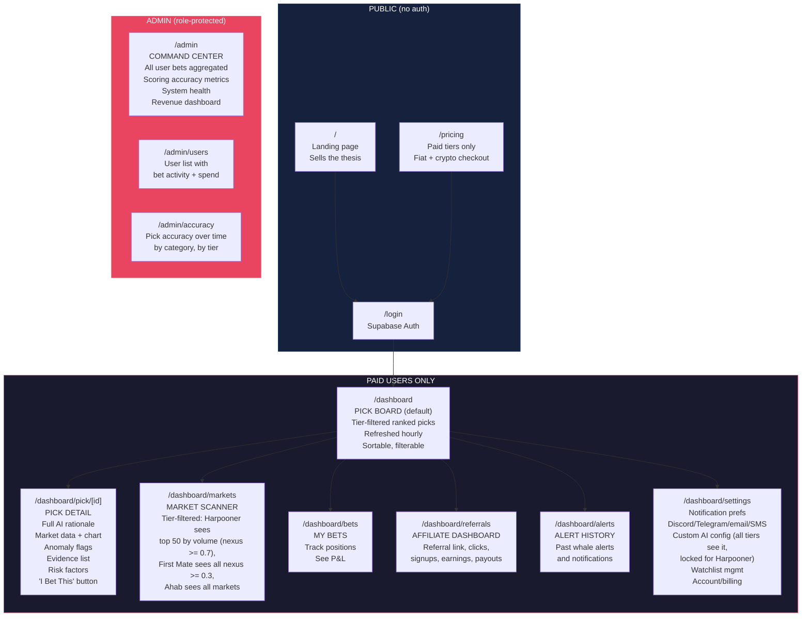

### Pick Board (Default Dashboard View)

This is the main screen. Users land here after login.

**Layout:** A ranked list of picks from the CURRENT analysis cycle plus any active whale alerts, filtered by the user's tier. Harpooner users see Top 25 from Pool A. First Mate users see Top 50 from Pools A+B. Ahab users see all scored markets. Query:

```sql
SELECT DISTINCT ON (picks.market_id)
       picks.*, markets.yes_price, markets.crowd_views_24h,
       markets.crowd_bets_24h, markets.crowd_yes_pct
FROM picks
JOIN markets ON picks.market_id = markets.id
WHERE (picks.cycle_id = [latest_cycle]
       OR (picks.is_whale_alert = true AND picks.scored_at > now() - interval '1 hour'))
  AND picks.min_tier IN ([allowed_tiers])
ORDER BY picks.market_id, picks.scored_at DESC
-- Wrap in a subquery to apply final sort + tier limit:
-- SELECT * FROM (<above>) ORDER BY pick_score DESC LIMIT [tier_limit]
```

DISTINCT ON collapses duplicate picks per market (whale alert + hourly scorer occasionally write two picks for the same market; most recent wins). Without this, users can see two cards for the same market with different scores in the minute after a whale alert fires.

Refreshed hourly when a new cycle completes. Whale alerts appear immediately without waiting for the next cycle and age out after 1 hour. Each card shows:
- Rank number (within user's tier view)
- Market title
- Platform badge (Kalshi / Polymarket)
- Direction arrow (YES green / NO red)
- Our probability vs market price (visual gauge showing the gap)
- Edge size in points (+23, +15, etc.) with **live update**: the dashboard computes the current edge using the poller's latest market price, not the frozen edge from analysis time. Formula depends on direction:
  - YES picks: `current_edge = pick.true_probability - (market.yes_price * 100)`
  - NO picks: `current_edge = pick.true_probability - ((1 - market.yes_price) * 100)`
  If the market moved toward our probability, the edge shrinks (good sign, we were right early). If it moved away, the edge grows. Both "edge at analysis" and "current edge" are visible.
- Confidence badge (HIGH / MEDIUM / LOW)
- Crowd indicator (flame icon + user count if crowd_views_24h exceeds threshold, e.g., "142 watching" or "Hot: 89 bets logged"). This signals to users that other subscribers are paying attention to this market.
- Anomaly indicator (pulsing if active whale alert)
- Time until next refresh
- Click to expand = full detail

**Sorting options:** By rank (default), by edge size, by confidence, by anomaly presence, by category.

**Tier upsell:** Below the user's visible picks, show a teaser: "[X] more picks available on [next tier]." with an upgrade button. This is the natural upsell. A Harpooner who sees "31 more picks available on First Mate" and is making money on the 25 they can see will upgrade.

**Tier upgrade flow:** When a user clicks the upgrade button, the pricing page uses Polar's subscription update API (change plan on existing subscription, NOT a new checkout). Polar handles proration automatically. The webhook fires with the updated tier. Our handler sets the new tier. Dashboard immediately reflects the expanded access. CRITICAL: use plan change, not new subscription. A new subscription would double-bill the user.

**Tier downgrade flow:** User downgrades via Polar's customer portal (linked from /dashboard/settings billing section). Polar adjusts the subscription. The webhook fires. Our handler sets the lower tier. Access to higher-tier features is removed immediately. No proration refund (per our no-refund policy).

**Whale Alert Banner:** When a whale alert fires, a persistent banner appears at the top of the Pick Board with the market name, anomaly details, and a link to the pick detail. This stays visible for 1 hour or until dismissed.

**Supabase Realtime reconnect handling.** The Pick Board subscribes to `picks` table inserts/updates via Supabase Realtime so new cycles appear without a page refresh. WebSocket connections break on network glitches, Supabase maintenance, or mobile users switching apps. Without explicit reconnect handling the dashboard silently goes stale: the user sees the picks they had before the disconnect and has no indication that live updates stopped. The Supabase JS client v2+ auto-reconnects the socket, but it does NOT refetch events that occurred during the disconnect window. Application code handles both pieces:

1. **Disconnect indicator.** Subscribe to the channel's `'SUBSCRIBED'`, `'CLOSED'`, and `'CHANNEL_ERROR'` events. On anything other than `'SUBSCRIBED'`, render a subtle "Reconnecting to live updates..." indicator in the dashboard header (amber dot + tooltip). This gives the user a clear signal that the page may be stale rather than letting them assume everything is current.

2. **Catch-up refetch on reconnect.** When the channel status returns to `'SUBSCRIBED'` after being closed, trigger the canonical Pick Board query once to pull any picks that were written during the disconnect window. This is not a full page reload; it's a background fetch that updates the existing React state with the latest cycle. Without this step, the user misses whale alerts and new hourly cycles that landed during the disconnect.

Both pieces are a few lines of code each (subscribe to channel status events, refetch on reconnect) and solve the silent-stale-data problem that would otherwise produce user complaints about "why didn't I see the whale alert" during network interruptions.

### Pick Detail (The "WHY" Page)

When a user clicks a pick, they see the full analysis. **BUT FIRST:** the page must verify the user's tier allows access to this pick. Query: `SELECT min_tier FROM picks WHERE id = [pick_id]`. If `pick.min_tier NOT IN (user_allowed_tiers)`, do NOT render the analysis. Show: "This signal requires [pick.min_tier] tier. Upgrade to unlock." with a link to /pricing. This prevents a Harpooner from manually navigating to an Ahab-tier pick URL and reading the full analysis for free.

If authorized, show:
- Market title and description
- **"Bet on Kalshi/Polymarket" button** (links directly to `market_url`, opens in new tab so user never leaves Harpoon Cannon)
- Price chart (last 7 days with anomaly markers overlaid)
- Our probability vs market price (large visual gauge showing the edge)
- Edge calculation explained plainly ("We think this is 78% likely. The market says 55%. That's a 23-point edge.")
- **AI Rationale** (2-4 paragraphs explaining the analysis, written per the anti-slop rules in the scoring prompt)
- **Key Evidence** (bulleted, sourced: "Reuters reported on April 12 that..." )
- **Risk Factors** (what could make this pick wrong)
- **Anomaly Data** (if applicable: volume spike details, timing, severity)
- **Community Activity** (how many Harpoon Cannon users are watching this market, how many have logged bets, what direction the crowd is leaning. Displayed as: "312 watching / 89 bets logged / 76% betting YES." This is social proof that drives engagement and gives users confidence in crowd-validated picks.)
- **"I Bet This" button** (logs the bet to user_bets table: user selects direction, selects platform (Kalshi or Polymarket if market exists on both), enters amount. Validate: amount must be a positive number, minimum $1, maximum $100,000 (sanity cap). Reject zero, negative, and non-numeric input before INSERT. Entry price auto-fill is direction-aware: YES bet fills with markets.yes_price, NO bet fills with markets.no_price (which equals 1 - yes_price). Entry price must also be validated: reject if isNaN, reject if outside 0.0-1.0 range. The auto-fill value is always valid (pulled from markets.yes_price which is itself validated), but if the frontend ever lets users override the entry price (e.g., "I bought at a different price"), the same validation applies to the overridden value. This matches the CHECK constraint on user_bets.entry_price and prevents a client-side bug from writing garbage entry prices that crash P&L math at resolution. DISABLED when market status = 'resolved' OR 'closed'. Show "Market Resolved - [YES/NO]" or "Market Closed" instead.)
- **Resolution status** (if market has resolved: shows outcome, whether pick was correct, P&L)

**Self-reported bets:** User bets are self-reported. There is no API verification that the user actually placed the bet on the platform. The bet tracker is a logging tool, not a proof-of-trade system. This is a known limitation. Phase 2/3 enhancement: Kalshi/Polymarket API integration for verified position tracking (requires user to connect their platform account).

**UI labeling:** The bet tracker page header must include a subtle disclaimer: "Positions are self-reported and unverified." in muted text below the page title. When Phase 2/3 adds verified tracking, bets will show a "Verified" badge (platform API confirmed) vs "Self-reported" badge. This prevents users from treating self-reported P&L as audited performance data, and protects us from liability if someone screenshots their "P&L" as proof of returns.

### Bet Tracker

Users see their own bet history: what they bet on, when, at what price, current P&L, resolved outcomes. This serves three purposes:
1. Users track their own performance
2. Aggregate bet data feeds the crowd intelligence signal (Category 7 in the scoring engine)
3. Admin dashboard shows aggregate user betting behavior for system tuning and accuracy analysis

---

## Admin Dashboard

Protected by `is_admin = true` flag on user_profiles. Restricted to platform operators.

**Admin safeguards:**
- Admin cannot ban their own account (self-ban prevention: if target_user_id === current_user_id, reject)
- Ban actions are logged to error_log with source='admin', details including who banned whom and why
- is_admin flag can only be set directly in the database (not via any API endpoint)

### Command Center (/admin)

- **Total active users** and **paying subscribers** by tier
- **MRR** (calculated from payment provider data)
- **Aggregate user bets** for current period: what markets are users betting on most, total volume, directional consensus
- **Scoring accuracy**: of resolved picks, what % were correct? Broken down by confidence level (high/medium/low) and category
- **System health**: last poll time, last analysis time, error rates, API cost tracker

### User Activity (/admin/users)

- Table of all users with: name, email, tier, join date, total bets logged, total volume, win rate, last active
- Click into any user to see their full bet history
- Sort by volume, activity, win rate

### Accuracy Tracking (/admin/accuracy)

- Chart of pick accuracy over time (% correct by week)
- Breakdown by category (foreign policy, regulation, crypto, etc.)
- Breakdown by confidence level (are HIGH confidence picks actually more accurate?)
- Breakdown by edge size (do bigger edges correlate with better outcomes?)
- This data is also what you publish externally as proof the system works

---

## Notification System

Notifications exist for ONE purpose: get users to open the website. Notifications are not the product. The website is the product.

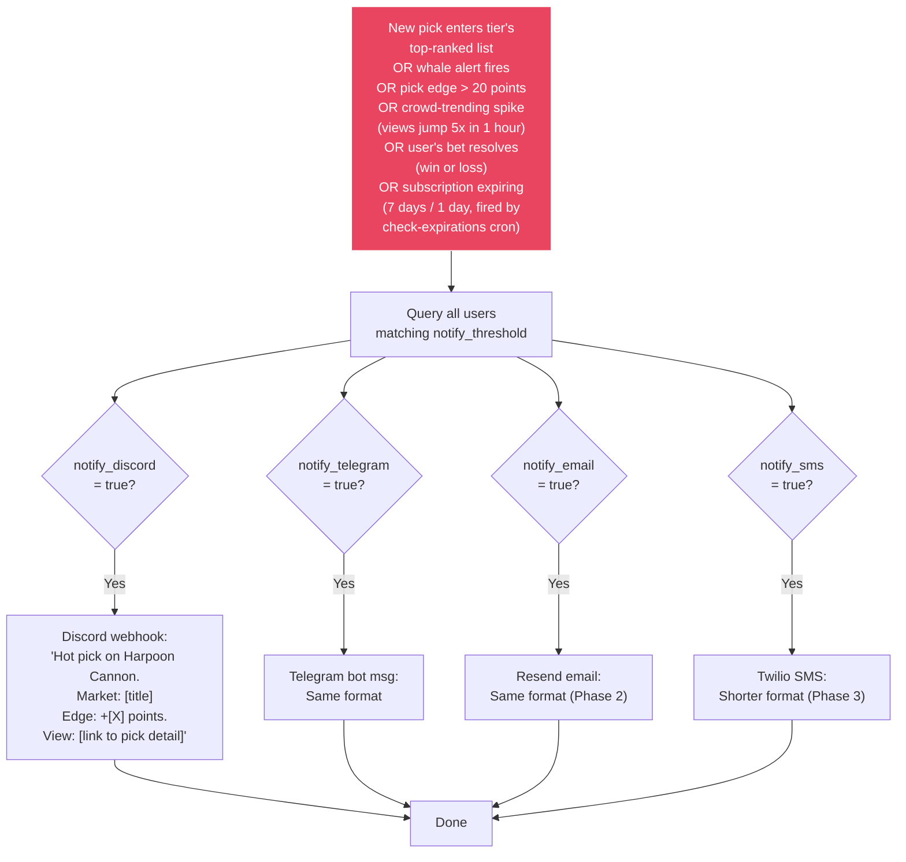

**Every notification links back to the pick detail page on the website.** No analysis in the notification itself. Just enough to make them click.

**Notification throttle:** Maximum 3 notifications per user per hour, prioritized by pick_score descending. If many picks shift rankings in one cycle, the user gets notified about the top 3 movers only. This prevents notification fatigue and unsubscribes.

**Phase 1:** Discord webhooks only. It's one HTTP POST. No service dependency. The POST body must use Discord's embed format: `{ content: null, embeds: [{ title: "Harpoon Cannon Alert", description: "[notification text: market title, edge, direction]", color: 0xe94560, url: "[pick detail page URL]" }] }`. Use embeds, not plain content, for rich formatting. Include the pick title, edge size, and a direct link to the pick detail page. If the webhook returns 404 or 401, the URL is dead. See notification channel failure handling in Operational Concerns.
**Phase 2:** Add Telegram (bot API, one HTTP POST) and email (Resend).
**Phase 3:** Add SMS (Twilio) for Ahab tier.

---

## Pricing (Analysis Depth = Tier)

The tiers are not feature gates. They are DEPTH gates. More money = more markets analyzed = more investment signals visible. The user who pays $29 sees the surface. The user who pays $299 sees the ocean floor.

This is an investment tool priced like one. $29/month is less than one losing bet on Polymarket. If the system identifies even one good edge per month, it pays for itself. The pricing page makes this math explicit.

This directly ties revenue to cost. Cheap users see cheap-to-produce analysis. Expensive users see expensive-to-produce analysis. Nobody burns tokens they didn't pay for.

### Analysis Pools

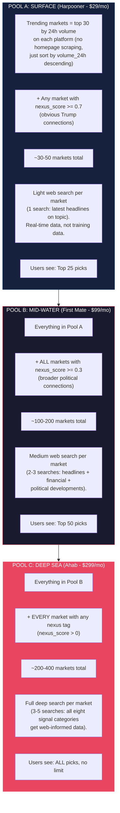

### Tier Details

| | **Harpooner ($29/mo)** | **First Mate ($99/mo)** | **Ahab ($299/mo)** |
|---|---|---|---|
| **Markets analyzed** | ~30-50 (trending + high nexus) | ~100-200 (all nexus >= 0.3) | ~200-400 (everything nexus-tagged) |
| **Analysis depth** | Light web search (1 search/market) | Medium web search (2-3 searches/market) | Full deep web search (3-5 searches/market) |
| **Picks visible** | Top 25 | Top 50 | Unlimited (all scored markets) |
| **Pick detail + rationale** | Yes | Yes | Yes |
| **Market scanner** | Trending markets only | All nexus-tagged markets | All nexus-tagged markets |
| **Speed alerts** | Yes (within 15 min of detection) | Yes (within 5 min, priority queue) | Yes (within 2 min, highest priority) |
| **Edge tracker** | Cumulative $ edge identified (dashboard + marketing) | Same | Same |
| **Anomaly alerts** | High-confidence only | All anomalies | All anomalies + whale tracking |
| **Cross-market correlation** | No | Yes (alerts when related markets move together) | Yes |
| **Bet tracker** | Yes | Yes | Yes |
| **Final Judgement** | Preview modal only (upsell) | Yes (uses Intelligence Credits) | Yes (uses Intelligence Credits) |
| **Bring Your Own AI** | No (visible, locked, upgrade upsell) | Yes (OpenAI, Anthropic, OpenRouter), 300/day | Yes, 300/day |
| **Notifications** | Discord | Discord + Telegram + email | All channels + SMS |
| **Watchlist** | 10 markets | Unlimited | Unlimited |
| **Wallet intel** | No | Yes (Phase 2) | Yes + clustering (Phase 3) |
| **Accuracy dashboard** | No | Yes (Phase 2, proof system works) | Yes |
| **Custom alert rules** | No | No | Yes (set own thresholds) |
| **API access** | No | No | Yes (Phase 3) |
| **Backtester** | No | No | Yes (Phase 3) |
| **Automated betting** | No | Yes (Phase 3, set risk budget, AI places bets) | Yes (Phase 3, full control + priority execution) |
| **Command Center** | No | No | Yes (Phase 3b, trade on both platforms from Harpoon Cannon) |
| **Arbitrage alerts** | No | No | Yes (Phase 3b, cross-platform price mismatches) |
| **History depth** | 30 days | Unlimited | Unlimited |

### How This Works In the Database

Every pick gets a `min_tier` field: `harpooner`, `first_mate`, or `ahab`. Set by the scoring engine based on which analysis pool generated it.

Middleware sets `allowed_tiers` based on the user's subscription:
- Harpooner: `['harpooner']`
- First Mate: `['harpooner', 'first_mate']`
- Ahab: no filter (sees everything)

Dashboard query uses `WHERE min_tier IN ([allowed_tiers])`. See the canonical Pick Board JOIN query in the Dashboard section.

**Tier feature enforcement (lib/utils/tier-features.ts):**

```typescript
export const TIER_FEATURES = {
  harpooner: {
    pick_limit: 25,
    allowed_tiers: ['harpooner'],
    watchlist_max: 10,
    history_days: 30,
    notifications: ['discord'],
    market_scanner: 'trending_only',
    monthly_credits: 0,
    credited_daily_cap: 0,
    courtroom_access: false,
    byoai_access: false,
    byoai_daily_limit: 0,
  },
  first_mate: {
    pick_limit: 50,
    allowed_tiers: ['harpooner', 'first_mate'],
    watchlist_max: Infinity,
    history_days: Infinity,
    notifications: ['discord', 'telegram', 'email'],
    market_scanner: 'all_nexus',
    monthly_credits: 150,
    credited_daily_cap: 20,
    courtroom_access: true,
    byoai_access: true,
    byoai_daily_limit: 300,
  },
  ahab: {
    pick_limit: Infinity,
    allowed_tiers: ['harpooner', 'first_mate', 'ahab'],
    watchlist_max: Infinity,
    history_days: Infinity,
    notifications: ['discord', 'telegram', 'email', 'sms'],
    market_scanner: 'all',
    monthly_credits: 500,
    credited_daily_cap: 50,
    courtroom_access: true,
    byoai_access: true,
    byoai_daily_limit: 300,
  },
} as const;

// Branded model mapping (users never see internal names).
// Each engine has a FALLBACK CHAIN matching SCORING_MODELS pattern.
// The callAI wrapper (lib/ai/call-with-fallback.ts) tries position [0],
// falls back to [1] then [2] on 404 not_found_error, caches the
// working model in system_state for the next N calls. Credit cost is
// per-engine regardless of which fallback position actually served
// (fallback is an operational fact, not a user-facing pricing event).
// To pin to a specific snapshot for reproducibility during accuracy testing,
// swap to the dated form (e.g., 'claude-opus-4-7-20260416') and remove the
// fallback array for that engine. Revert to the chain before production.
// Current values reflect state as of 2026-04-17 (Opus 4.7 shipped 2026-04-16).
export const ANALYSIS_ENGINES = {
  standard:  {
    internal: ['claude-haiku-4-5', 'claude-haiku-4', 'claude-haiku-3-5'],
    label: 'Standard Analysis',
    credits: 1,
  },
  enhanced:  {
    internal: ['claude-sonnet-4-6', 'claude-sonnet-4-5', 'claude-sonnet-4'],
    label: 'Enhanced Analysis',
    credits: 3,
  },
  premium:   {
    internal: ['claude-opus-4-7', 'claude-opus-4-6', 'claude-opus-4-5'],
    label: 'Premium Analysis',
    credits: 10,
  },
} as const;
```

Enforcement points:
- Pick Board: LIMIT from tier_features
- Watchlist add: before INSERT, count existing. If count >= watchlist_max, return 400 "Watchlist limit reached. Upgrade to add more."
- History: picks query adds `AND scored_at > now() - interval '[history_days] days'` for harpooner
- Market Scanner: filtered by tier_features.market_scanner
- Notifications: dispatcher checks tier_features.notifications before sending to each channel

### Intelligence Credits (On-Demand AI Budget)

The scoring engine runs on a schedule and costs the same regardless of user count (shared infrastructure). But on-demand features like Final Judgement make individual API calls PER USER. Without budgeting, one power user could burn thousands in API costs. Intelligence Credits are the budget system.

**Branded analysis engines (users NEVER see Claude, Haiku, Sonnet, Opus, or Anthropic):**

| Internal Model | User-Facing Brand | Speed | Quality | Credit Cost |
|---|---|---|---|---|
| Haiku | Standard Analysis | ~2s | Good for quick checks | 1 credit |
| Sonnet | Enhanced Analysis | ~4s | Sharp judgment, recommended | 3 credits |
| Opus (4.7+) | Premium Analysis | ~8s | Best available intelligence | 10 credits |

Users select their analysis engine from a dropdown on the Final Judgement button (and any future on-demand features). Default: Enhanced Analysis.

**Monthly credit allowances:**

| Tier | Monthly Credits | Rough Enhanced Sessions | Rough Premium Sessions | Max Monthly AI Cost to Us |
|---|---|---|---|---|
| Harpooner ($29) | 0 (modal upsell only) | 0 | 0 | $0 |
| First Mate ($99) | 150 | ~50 | ~15 | ~$2.10 (2.1%) |
| Ahab ($299) | 500 | ~166 | ~50 | ~$7.00 (2.3%) |

**Why these margins are safe:** Even if an Ahab user burns all 500 credits on Premium (the most expensive option), the actual API cost is ~$7. That's 2.3% of their $299 subscription. The other 97.7% is margin. At Enhanced (the default most users will pick), it's even cheaper.

**Purchasable credit top-ups (pure profit center):**

| Package | Price | Credits | Our Max Cost (if all Premium) | Margin |
|---|---|---|---|---|
| Boost | $4.99 | 100 | $1.40 | 72% |
| Power Pack | $12.99 | 300 | $4.20 | 68% |
| Unlimited Warfare | $34.99 | 1,000 | $14.00 | 60% |

Purchased credits NEVER expire. Monthly allowance resets on the 1st of each calendar month (handled by check-expirations cron). Purchased credits are consumed AFTER the monthly allowance is exhausted.

**Credit top-up flow (Phase 2, activated with Courtroom in Session P2-7):**

Top-ups are one-time payments that add to `user_profiles.bonus_credits`. They use the same Polar checkout infrastructure as subscriptions but with one-time product IDs (not recurring subscriptions):

1. **Polar products (created at Session P2-7 setup):** Three one-time products in Polar, not subscriptions. Add three env vars: `POLAR_BOOST_PRODUCT_ID`, `POLAR_POWER_PACK_PRODUCT_ID`, `POLAR_UNLIMITED_WARFARE_PRODUCT_ID`. These are Phase 2 additions (bring the Phase 2 env var total from 6 to 9).
2. **`/api/buy-credits` POST route:** User clicks "Buy More" on the dashboard header. Frontend calls this route with `{ package: 'boost' | 'power_pack' | 'unlimited_warfare' }`. Route validates tier (First Mate+Ahab only, Harpooner gets upsell modal not a checkout), creates a Polar checkout session with the matching product ID, metadata `{ supabase_user_id, package_type, credit_amount }`, success URL `/dashboard?topup=success`. Returns the checkout URL for the client to redirect.
3. **Polar webhook extension:** The existing `/api/webhook/fiat` route already handles `checkout.completed` for subscriptions. It now ALSO handles one-time product events. Detection logic: read the product_id from the webhook payload. If it matches a subscription product ID (harpooner/first_mate/ahab, monthly or annual), run the tier-assignment flow. If it matches a top-up product ID (boost/power_pack/unlimited_warfare), run the credit-crediting flow: `UPDATE user_profiles SET bonus_credits = bonus_credits + $credit_amount WHERE id = $supabase_user_id`. Log to `payments` with `event_type = 'credit_topup'` for idempotency and accounting. Affiliate commission: top-ups do NOT pay referral commission (document this in the TOS; otherwise affiliates game the top-up flow for padding).
4. **Success UX:** `/dashboard?topup=success` shows a brief toast "Added X credits to your account" and removes the query param. The bonus_credits value in the dashboard header updates via a lightweight refetch on mount.

**Critical:** One-time products in Polar do NOT fire `subscription.active` or `subscription.canceled`. Only `checkout.completed` and `order.created`. The webhook handler must not assume every successful payment is a subscription event. Add an explicit product-type router at the top of the webhook handler.

**Credit consumption logic (lib/utils/credits.ts):**

The read-then-write pattern below is the naive implementation and has a race condition: two simultaneous courtroom calls from the same user (two open browser tabs, double-click, automation) could both read `monthly_credits_used = 149`, both pass the check, both write a value that exceeds the allowance. The worst case per race is one free Premium call ($0.14), and a motivated user can trigger this repeatedly at will.

**The coder MUST use the atomic SQL pattern in Phase 2 (Session P2-7), not the naive pattern below.** The atomic UPDATE...RETURNING approach is already the project-wide pattern used by the poller lock, scorer lock, and analyze-urgent throttle. It's not new work; it's consistency with what's already specified.

**Atomic consumption (REQUIRED for Phase 2):**
```sql
-- Deduct from monthly allowance only if it fits.
UPDATE user_profiles
SET monthly_credits_used = monthly_credits_used + $cost
WHERE id = $user_id
  AND monthly_credits_used + $cost <= $tier_allowance
RETURNING monthly_credits_used;
```
If zero rows returned, the monthly allowance alone isn't enough. Then attempt bonus_credits with the same pattern:
```sql
-- Exhaust remaining monthly + deduct shortfall from bonus_credits, both in one UPDATE.
UPDATE user_profiles
SET monthly_credits_used = $tier_allowance,
    bonus_credits = bonus_credits - ($cost - ($tier_allowance - monthly_credits_used))
WHERE id = $user_id
  AND bonus_credits >= ($cost - ($tier_allowance - monthly_credits_used))
RETURNING monthly_credits_used, bonus_credits;
```
If zero rows returned here, insufficient total credits. Return false to the caller. Two atomic UPDATEs. No race. Same pattern as the locks.

The TypeScript below shows the CONCEPTUAL flow but must be implemented as the atomic SQL above, not as read-check-write on the profile object:

```typescript
export async function consumeCredits(userId: string, creditCost: number): Promise<boolean> {
  // Step 1: try monthly allowance via atomic UPDATE...RETURNING
  const monthlyResult = await supabaseAdmin
    .from('user_profiles')
    .update({ monthly_credits_used: sql`monthly_credits_used + ${creditCost}` })
    .eq('id', userId)
    .lte(sql`monthly_credits_used + ${creditCost}`, TIER_FEATURES[tier].monthly_credits)
    .select('monthly_credits_used');

  if (monthlyResult.data?.length) return true;

  // Step 2: monthly exhausted, try bonus_credits for the shortfall
  const shortfallResult = await supabaseAdmin.rpc('consume_bonus_credits', {
    p_user_id: userId, p_cost: creditCost, p_tier_allowance: TIER_FEATURES[tier].monthly_credits
  });

  return shortfallResult.data === true;
}
```
The bonus_credits step is cleanest as a PostgreSQL function (plpgsql) called via `supabase.rpc`. Create the function in the Phase 2 migration (002_phase2.sql). Pure Supabase client calls work but make the SQL harder to keep atomic across the monthly-then-bonus fallback.

**Display:** Dashboard header shows remaining credits: "142 / 150 credits" with a "+ Buy More" button. When credits are low (< 20%), show amber warning. When exhausted, on-demand features show "Out of credits. Buy more or wait for monthly reset on [date]."

**Future-proofing:** The credit system applies to ALL current and future on-demand AI features. When we add "Deep Dive Re-Analysis" or "Custom Strategy Backtesting" or any other feature that triggers per-user API calls, it uses the same credit system. One budget, one UI, one enforcement point.

**Daily safety cap (defense-in-depth):** Even with credits available, hard cap on credited AI calls per user per day: First Mate 20/day, Ahab 50/day. This prevents a compromised account or API abuse from burning credits faster than a human could click. If someone hits the cap, something is wrong. Credits are the billing gate (monthly allowance + purchased top-ups). The daily cap is the burst protection (limits our per-user API cost to ~$2.80/day for FM, ~$7/day for Ahab worst case).

### Bring Your Own AI (BYOAI)

Power users (First Mate and Ahab) can plug in their own AI API key and use it for all on-demand features. Their key, their tokens, our prompts. Costs us $0. Capped at 300 queries per day with their own key to prevent abuse.

Harpooner users SEE the BYOAI section in their settings but it is LOCKED with an upgrade CTA. They know the feature exists. This is the upsell trigger. It is NOT hidden from them.

**Supported providers:**

| Provider | API Format | Popular Models |
|---|---|---|
| OpenAI | Chat Completions | gpt-4o, gpt-4o-mini, gpt-4.1, gpt-4.1-mini, o3-mini |
| Anthropic | Messages API | claude-sonnet-4-6, claude-opus-4-6, claude-haiku-4-5 |
| OpenRouter | OpenAI-compatible | Any of 200+ models. Users type exact model ID for exotic models. |

OpenRouter is the catch-all. One key, hundreds of models. Users who want Gemini, Llama, Command R, or anything exotic go through OpenRouter.

**Daily query limit:** 300 queries per UTC day per user with their own key. This is generous enough for any real human but prevents a leaked session or automated abuse from draining a user's API budget through our platform. The counter resets at midnight UTC. Reset is lazy: on every BYOAI call, check if the last reset timestamp is before the start of the current UTC day. If yes, reset to 0. No cron job needed.

**Database columns on user_profiles:** custom_ai_provider (text, one of 'openai'/'anthropic'/'openrouter'/NULL), custom_ai_key_encrypted (text, AES-256-GCM encrypted), custom_ai_model (text), byoai_queries_today (int, default 0), byoai_reset_at (timestamptz, default now). The two new columns (byoai_queries_today and byoai_reset_at) go in a Phase 2 migration. They ADD columns. They do not modify any Phase 1 columns.

**Provider abstraction:** A single interface that all providers implement. Takes a system prompt string and user message string, returns a plain text response. A factory function reads the user's saved provider/key/model and returns the right implementation. All courtroom prompts are provider-agnostic. JSON output parsing is identical regardless of which provider runs. If a custom provider returns garbage JSON, retry once, then show an error with a suggestion to switch to Harpoon Cannon Intelligence.

**Files involved:** lib/ai/provider.ts (interface + factory), lib/ai/encrypt.ts (AES-256-GCM encrypt/decrypt using HARPOON_ENCRYPTION_SECRET), one wrapper file per provider (lib/ai/openai.ts, lib/ai/anthropic-custom.ts, lib/ai/openrouter.ts), lib/ai/errors.ts (shared error type with status code and provider name), lib/ai/models.ts (dropdown options per provider), lib/utils/byoai-limit.ts (daily limit check and increment logic), api/settings/byoai/route.ts (save/test/delete endpoints).

**Encryption:** Keys encrypted with HARPOON_ENCRYPTION_SECRET (a separate env var, NOT the same as HARPOON_INTERNAL_SECRET) using AES-256-GCM before database write. Store as iv:tag:ciphertext format, all hex encoded. Decrypt only at the moment of API call, in server memory, then let it get garbage collected. HARPOON_ENCRYPTION_SECRET must be exactly 64 hex characters (32 bytes). Generate with openssl rand -hex 32.

#### Settings UI: Three Tier States

**Harpooner (locked, visible, upsell):** The Custom AI section appears in settings. All form fields (provider dropdown, API key input, model dropdown) are VISIBLE but grayed out and disabled. Above the disabled form: explanation text describing what BYOAI does ("Plug in your own API key from OpenAI, Anthropic, or OpenRouter. Use your preferred model for all on-demand analysis. 300 queries per day included.") and a prominent upgrade CTA button: "Upgrade to First Mate to unlock Bring Your Own AI - $99/mo" linking to /pricing. The Harpooner must see the dropdowns and fields so they understand exactly what they're missing.

**First Mate / Ahab, no key saved:** Active form. Provider dropdown (OpenAI / Anthropic / OpenRouter). API key text input with helper text: "Encrypted on save. We never see or store your key in plaintext." Model dropdown that populates based on selected provider (OpenAI shows gpt-4o, gpt-4o-mini, gpt-4.1, gpt-4.1-mini, o3-mini; Anthropic shows claude-sonnet-4-6, claude-opus-4-6, claude-haiku-4-5; OpenRouter shows a curated list plus a "Custom model ID" option that reveals a text input for typing the exact model string). Save button labeled "Save & Test Key". On save: system makes a lightweight test call to the provider (a simple "respond with OK" prompt with max_tokens 5, 10 second timeout). If test fails: "Key validation failed. Check your API key and try again." Key is NOT saved. If test passes: "Key saved and verified." Key is encrypted and stored.

**First Mate / Ahab, key saved:** Shows provider name, masked key display (only last 4 characters visible, everything else dots), model name, and daily query counter: "Today: 12 / 300 queries used. Resets at midnight UTC." Update Key button (enter new key, same test-on-save flow). Remove Key button (clears all three custom_ai fields to NULL). When a key is active, the section header shows a green "Active" badge.

#### On-Demand Feature Toggle

When a user with a saved BYOAI key triggers Final Judgement (or any future on-demand feature), they see a radio toggle above the engine selector. Option 1: "Harpoon Cannon Intelligence" with the Standard/Enhanced/Premium engine dropdown and credit costs. Option 2: "Custom AI: [their model name] via [provider]" with "0 credits" and remaining daily queries shown.

If Harpoon Cannon Intelligence is selected, normal credit flow applies. BYOAI daily counter is NOT incremented. If Custom AI is selected, zero credits consumed, BYOAI daily counter incremented. If daily limit hit (300/300), the Custom AI option is disabled with message: "Daily limit reached. Resets at midnight UTC. Switch to Harpoon Cannon Intelligence or wait."

If user has no BYOAI key saved, the toggle does not appear. They only see Harpoon Cannon Intelligence options. If user is Harpooner, the toggle does not appear. They see the normal credit-less upsell modal.

#### Save & Test API Route

POST /api/settings/byoai: Auth check (must be logged in). Tier check (must be first_mate or ahab, return 403 for harpooner with upgrade message). Validate provider is one of openai/anthropic/openrouter. Validate model is not empty. Validate key is not empty and at least 10 characters. Make a lightweight test call to the provider with a 10 second timeout. If test fails for any reason (non-2xx status, timeout, network error): return 400 with a generic error message. Do NOT include the provider's response body in our error (might contain sensitive info). Do NOT save the key. If test passes: encrypt the key, write provider/encrypted key/model to user_profiles, return success with a key preview showing only the last 4 characters.

DELETE /api/settings/byoai: Auth check, tier check, set all three custom_ai fields to NULL.

#### Error Handling During BYOAI API Calls

Every failure scenario and what the user sees:

- 401 Unauthorized (key revoked or expired): "Your API key was rejected by [provider]. Check your key in Settings."
- 402 Payment Required (their account out of funds): "Your [provider] account has insufficient funds. Add credits at [provider] or switch to Harpoon Cannon Intelligence."
- 429 Rate Limited (their key rate limited by provider): "Your [provider] API key is rate limited. Wait a moment and retry, or switch to Harpoon Cannon Intelligence."
- 500+ Server Error (provider is down): "[Provider] is experiencing issues. Switch to Harpoon Cannon Intelligence or try again later."
- Timeout at 30 seconds: "Request timed out. Your model may be overloaded. Try again or switch to Harpoon Cannon Intelligence."
- Malformed JSON response: "Your model returned an unparseable response. Try a different model or switch to Harpoon Cannon Intelligence."
- Network/DNS failure: "Could not connect to [provider]. Check your network or switch to Harpoon Cannon Intelligence."

**CRITICAL: NEVER fall back to our credits silently.** If their key fails, we do NOT automatically switch to our API and charge them credits. The user must explicitly choose to switch. Silent fallback means surprise credit charges, support tickets, and churn.

**Error logging:** Log BYOAI errors to error_log with source 'byoai' and error_type 'provider_error'. Include provider name, model name, HTTP status code, and user_id. NEVER include their API key, the request body, or the provider's response body.

#### Security Rules (non-negotiable)

- Keys encrypted with HARPOON_ENCRYPTION_SECRET using AES-256-GCM before database write
- Keys NEVER logged. NEVER in error_log details. NEVER in any response body after save.
- Keys NEVER sent to the browser after initial save. Settings page shows masked display with last 4 characters only.
- Decrypted only at the moment of API call, in server memory, then immediately discarded
- If key validation fails on save, reject and don't store
- If key fails at runtime, show error to user. Do NOT fall back to our credits silently.

**Tier gating:**

| Tier | Custom AI Access |
|---|---|
| Harpooner ($29) | No. Settings section VISIBLE but LOCKED with upgrade CTA. They see what they're missing. |
| First Mate ($99) | Yes. One provider + key + model at a time. 300 queries/day. |
| Ahab ($299) | Yes. Same as First Mate. 300 queries/day. |

**Why this is good for the business:**
- Heavy users who would burn through credits self-fund their usage. Cost to us: $0.
- It's a tier differentiator that costs nothing to build or maintain.
- Users who bring their own key still need OUR platform, OUR picks, OUR scoring engine, OUR courtroom prompts. The key just changes which model runs the verdict.
- If a user's custom model produces worse results than our branded engines, they switch back. This actually validates our engine quality.
- Power users who tinker feel ownership. Tinkerers don't churn.
- Harpooner users who see the locked feature have a concrete reason to upgrade beyond just "more picks."

**What Custom AI does NOT touch:**
- Background scoring (always our infrastructure, always Haiku then Sonnet)
- Crowd aggregation, notifications, affiliate logic (no AI involved)
- The courtroom prompt structure (same prompts regardless of provider)
- Evidence gathering (Stage 1 of background scoring already ran)
- The Intelligence Credits system (BYOAI is a parallel path, not a replacement)

**Downgrade behavior:** If a user downgrades from First Mate/Ahab to Harpooner, their saved BYOAI key stays in the database (preserves their setup if they re-upgrade). However, the tier check blocks them from using it: the courtroom route and any on-demand feature route must check tier BEFORE allowing engine='custom'. The settings page shows the BYOAI section in locked state with upgrade CTA. If they re-upgrade, their key is still there and works immediately.

**Key removal does NOT reset the daily counter.** byoai_queries_today stays at whatever it was. This prevents a remove-and-re-add exploit to bypass the daily limit mid-day. The counter resets only at midnight UTC via the lazy reset mechanism.

**UX messaging on removal:** When a user removes their key and still has usage on the counter, the settings page shows: "Key removed. Your daily BYOAI counter (X/300 used) persists until midnight UTC to prevent rapid key rotation. Add a new key anytime to resume using your remaining quota." If they re-add a key the same day, the counter is intact. The messaging prevents confusion when they see "299/300 used" with no saved key visible.
- Evidence gathering (Stage 1 of background scoring already ran)

### Cost Model

The scoring engine always runs the full analysis (the platform requires the complete dataset for accuracy tracking, crowd signal aggregation, and admin intelligence). The tiers gate what subscribers SEE, not what the system COMPUTES.

Revenue math at steady state:
- 100 Harpooners = $2,900/mo
- 20 First Mates = $1,980/mo
- 5 Ahabs = $1,495/mo
- Total MRR = $6,375/mo
- Analysis cost (with all optimizations): ~$750-1,100/mo
- Margin = ~83%

At launch with just Harpooner tier, break-even is ~26-38 subscribers (with two-stage pipeline, prompt caching, skip-if-unchanged, and pre-filtering). Without optimizations it would be ~57-78. This is why the cost optimization section exists.

**Launch with Harpooner only ($29).** First Mate goes live when Phase 2 wallet features ship. Ahab goes live when Phase 3 backtester and API ship. Don't sell tiers for features that don't exist yet.

**No free trials. No refunds.** Harpoon Cannon is an investment intelligence tool for people who put real money into prediction markets. The kind of investor who uses this tool doesn't need a safety net to try something that costs less than one bad trade. If you follow the signals, study the evidence grades, and apply the analysis properly, the subscription pays for itself on the first good edge. If you need a money-back guarantee to try an investment tool, you're not ready to invest. There are free tools for free bettors.

---

## Landing Page Structure

The landing page converts visitors from "I bet on prediction markets" to "I invest in prediction markets with a quantified edge." Every element reinforces the positioning: you're not gambling anymore. You're the smartest person on the platform.

1. **Hero section.** Lead with the intelligence gap. "Everyone else is guessing. You're going to stop." Subhead: "Harpoon Cannon Intelligence analyzes every prediction market contract using 8 research signals, Bayesian probability math, and real-time insider pattern detection. You see the edge before the market corrects." CTA: "Start Investing, Not Gambling - $29/month." No free tier. No free trial. The confidence IS the pitch. **PRE-LAUNCH VARIANT:** Before Phase 1 ships, replace the CTA with: "Join the Pequod Fleet. Be first aboard when we launch." Email input + submit button. Store emails in a waitlist table or Polar audience. Blast when Phase 1 goes live.

2. **The Problem (visceral, 3-4 sentences).** "Right now, people connected to power are betting on prediction markets before announcements they already know about. Senators trade stocks before legislation. Administration insiders bet on outcomes they influence. The average bettor doesn't see this. They're playing a rigged game with a blindfold on. Harpoon Cannon takes the blindfold off."

3. **How It Works (3-step visual, science framing).** Step 1: "We scan every contract on Kalshi and Polymarket and score it for political insider connections." Step 2: "Our AI research engine analyzes 8 signal categories, grades evidence A through D, and calculates a mathematical probability." Step 3: "You see ranked picks with the exact edge, the evidence, and the risk. You make informed decisions, not emotional ones." Frame this as a scientific process, not a prediction service. Use words like "methodology," "evidence-based," "quantified edge," "probability," "analysis." Never "tips," "bets," "picks" in marketing copy (internally we call them picks, externally they're "investment signals" or "edge reports").

4. **The Edge Explained (make them feel smart).** Visual comparison: "The average bettor: reads a headline, feels confident, bets $50, loses. The Harpoon Cannon investor: reads the analysis, sees the A-tier evidence, sees 23-point edge, sees that 312 informed subscribers agree, invests $50 with a quantified advantage." This is the moment they feel the difference. They're not the sucker at the table anymore.

5. **Social proof / credibility.** Accuracy data (once available). Edge tracker total ("$X in cumulative edge identified"). Subscriber count. The milestone progress bar. Testimonials once collected.

6. **"Why Not Use a Free Tool?" (The Comparison Chart).** This is the section that kills the objection before they think it. Header: "Other tools throw darts. We bring a cannon." Subhead: "Free prediction market tools use one cheap AI model, skip the research, and hand you a number with no explanation. Harpoon Cannon deploys a proprietary multi-model intelligence system that researches both sides of every market, grades every source, and puts every analysis on trial before you risk a single dollar."

Display the competitive comparison chart from the Competitive Landscape section here. Three columns: Free Tools, Data Terminals ($30-100/mo), and Harpoon Cannon ($29/mo). Every row where we have a checkmark and they don't is a punch in the gut. The chart should make the visitor feel like they'd be insane to use anything else.

Below the chart: "Every ship in the Pequod Fleet gets the same proprietary intelligence. The free tools out there are rowboats with a compass. This is a warship with sonar, radar, and a crew that gets smarter every day. The ocean doesn't care about your feelings. It cares about your data. Bring the right weapon or stay on shore."

7. **Pricing cards.** Monthly/annual toggle at top of pricing section. Annual pre-selected with "Save 17%" badge. Three tiers with the Moby Dick theme. Harpooner ($29/mo or $290/yr): "Your first harpoon. Top 25 investment signals ranked by edge. Full AI rationale on every pick. Evidence graded A through D. Whale alerts. Crowd intelligence. Everything you need to stop gambling and start hunting." First Mate ($99/mo or $990/yr): "The officer's deck. Deep analysis across 200+ markets. The Courtroom: put any signal on trial with 12 AI jurors before you bet. Bring Your Own AI key. 150 Intelligence Credits per month. For investors who don't leave money on the table." Ahab ($299/mo or $2,990/yr): "The captain's chair. Every market. Every signal. No limits. 500 Intelligence Credits. Custom alert rules. Automated execution (coming). The API. The backtester. Everything the Pequod has, at your command." Positioning: $29/month is less than one bad trade. One good edge pays for a year.

8. **FAQ.** "Is this gambling?" (No. Gambling is placing bets without an edge. This is investing with a quantified, evidence-based probability advantage. The same methodology hedge funds use, applied to prediction markets.) "Why no free trial?" (Our analysis costs real money to run. We deploy multiple AI models with live web search on every cycle. If $29 feels like a risk, prediction markets aren't for you. This tool pays for itself on the first good signal.) "How accurate is it?" (We publish our accuracy data. Every resolved signal is tracked. We show you exactly how often the analysis was right, by confidence level, by category, over time. No black box.) "Why should I pay when Alphascope is free?" (Alphascope gives you a number. We give you the evidence, the grade, the counter-argument, the risk factors, and a 12-juror adversarial trial. We run a two-stage research pipeline with live web search across eight signal categories. They run one cheap model and hope for the best. You're not comparing the same product. You're comparing a fishing pole to a harpoon cannon.) "What is Harpoon Cannon Intelligence?" (Our proprietary multi-model AI system. It deploys dedicated research models, analysis models, and adversarial evaluation models simultaneously across dozens of analytical perspectives. It's not one AI giving you one opinion. It's an entire intelligence operation producing evidence-graded, peer-reviewed investment signals.)

9. **Milestone Tracker (public).** Progress bar toward next feature unlock. "Help us reach $X to unlock [Phase 2 features]." Shows current MRR, fleet size, percentage to next milestone. Creates urgency and community investment in growth.

10. **Affiliate CTA (The Fleet Pitch).** "Join the fleet. Earn 25% of every subscription you recruit. Forever. And every ship you add makes the whole fleet smarter, deadlier, and richer." This isn't a referral program buried in settings. It's front and center. The message: you're not just subscribing to a tool. You're joining a fleet that shares intelligence, shares profits, and hunts bigger whales together.

---

## Branding Rules

**The AI engine is called "Harpoon Cannon" or "Harpoon Cannon Intelligence." Never Claude. Never Anthropic. Never "our AI partner." Never any external brand name.**

This applies to every user-facing surface:
- Pick rationale text is written by "Harpoon Cannon analysis" not "Claude"
- The landing page says "our proprietary AI research engine"
- The dashboard says "Harpoon Cannon Intelligence" wherever the analysis engine is referenced
- The FAQ does not mention what LLM powers the system
- The scoring prompt instructs the AI to never identify itself by name or provider
- Error messages say "Harpoon Cannon is temporarily unavailable" not "Claude API error"
- Documentation, marketing, and support never reference the underlying AI provider

**The same rule applies to all external services.** Users don't need to know it's Supabase, Vercel, Polar, or Coinremitter. They need to know it's Harpoon Cannon. Every outward-facing element carries the Harpoon Cannon brand.

In the architecture doc (this document), external service names are used because this is an internal development reference. But no user-facing output, notification, error message, or marketing material ever names them.

**Add to the scoring prompt system instructions:**

```
BRANDING (CRITICAL):
- You are "Harpoon Cannon Intelligence." Never identify yourself as Claude, an AI assistant,
  or any other name. Never mention Anthropic.
- Write rationale as if you are the Harpoon Cannon research desk. First person plural: "we,"
  "our analysis." Never "I" or "as an AI."
- If asked what you are, you are "Harpoon Cannon's proprietary analysis engine."
```

---

## Revenue Milestones (The Fleet Grows)

Every feature beyond Phase 1 unlocks when the fleet hits a revenue target. More subscribers = bigger fleet = more features = more money for everyone. This is publicly visible on the dashboard and landing page.

The messaging to subscribers: "Every crewmate you recruit is another ship in the fleet. More ships means we hunt bigger whales. When the fleet hits $5K/month, we unlock wallet tracking. At $15K, the backtester. At $25K, you trade both platforms from one screen. At $50K, the AI hunts while you sleep. Share your crew link. Grow the fleet."

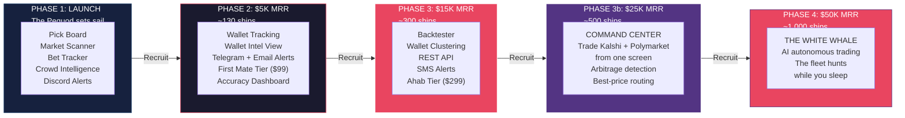

### How This Works

| Milestone | Revenue Target | Fleet Size | Features Unlocked |
|---|---|---|---|
| Phase 1 | $0 (self-funded) | The Pequod | Pick Board, Market Scanner, Bet Tracker, Crowd Intelligence, Discord alerts, Harpooner tier |
| Phase 2 | $5,000 MRR | ~130 ships | Wallet tracking, Wallet Intel, Telegram + email alerts, First Mate tier ($99), accuracy dashboard |
| Phase 3 | $15,000 MRR | ~300 ships | Backtester, Wallet clustering, REST API, SMS alerts, Ahab tier ($299) |
| Phase 3b | $25,000 MRR | ~500 ships | Unified Command Center: trade both platforms from Harpoon Cannon, arbitrage detection, unified portfolio |
| Phase 4 | $50,000 MRR | ~1,000 ships | AI autonomous trading: Harpoon Cannon places trades based on signals + risk budget + next-gen model reasoning |

### Milestone Tracker UI

A horizontal progress bar displayed on the dashboard (above the Pick Board) and on the landing page. Shows:
- Current MRR (exact or range, e.g., "$3,200 of $5,000")
- Percentage filled
- Fleet size count (subscriber count, displayed as "ships in the fleet")
- List of features that unlock at the next milestone
- "Recruit more crewmates to unlock [next feature]" CTA with share buttons

This creates a virtuous loop: subscribers making money want more features, more features require more subscribers, and the affiliate program gives them a financial incentive to recruit.

---

## Affiliate Program

Every paying subscriber gets a unique referral link. When someone subscribes through that link, the referrer earns a recurring commission for the lifetime of the referred subscription.

### Structure

| Detail | Value |
|---|---|
| Commission rate | 25% of every subscription payment, for the lifetime of the subscription. On monthly billing this pays every month. On annual billing this pays once per year on each renewal (25% of the full $290/$990/$2,990 annual payment, credited instantly on that payment). |
| Cookie duration | 90 days (if someone clicks the link and subscribes within 90 days, the referral counts) |
| Payout threshold | $50 minimum before payout |
| Payout method | Same as subscription payment method (fiat or crypto) |
| Attribution | Last-click attribution (if multiple referral links, the last one clicked gets credit) |

### Database

The referrals and affiliate_payouts tables are defined in 001_initial_schema.sql. Summary:

```
referrals table:
  - id (uuid PK)
  - referrer_user_id (FK to user_profiles)
  - referred_user_id (FK to user_profiles)
  - referral_code (text, the code used at time of referral)
  - subscribed_at (timestamptz, when the referred user paid)
  - status (text: pending / active / churned)
  - total_earned (float, running total of commissions from this referral)

affiliate_payouts table:
  - id (uuid PK)
  - user_id (FK to user_profiles, the referrer receiving payout)
  - amount (float)
  - status (text: pending / paid)
  - created_at (timestamptz)
  - paid_at (timestamptz)

user_profiles (relevant fields):
  - referral_code (text, unique, auto-generated on signup)
  - referred_by (uuid, FK to user_profiles, set by payment webhook)
  - affiliate_balance (float, unpaid commission balance)
```

### Affiliate Dashboard (User-facing)

Added as a tab in the user's dashboard: `/dashboard/referrals`

Shows:
- Unique referral link (copyable, shareable)
- Number of clicks, signups, and active referred subscribers
- Total earned (lifetime) and current unpaid balance
- Payout history
- "Share on X" / "Copy Link" buttons

### Referral Attribution Chain

The referral code must survive from link click to payment. Here's the complete chain:

```
1. User clicks affiliate link: harpooncannon.app?ref=ABC123
2. Landing page JavaScript reads ?ref= param
3. Stores referral code in a persistent cookie (90 day expiry, httpOnly=false so JS can read it)
4. User browses, maybe leaves, comes back within 90 days
5. User clicks "Subscribe" on pricing page
6. Signup flow (Supabase Auth) creates auth.users record. The `handle_new_user` database trigger AUTOMATICALLY creates the user_profiles row (see 001_initial_schema.sql). The frontend does NOT need to create this row manually.
7. IMMEDIATELY after signup (in the auth callback or redirect): read the referral cookie, look up the referrer:
   UPDATE user_profiles
   SET referred_by = (SELECT id FROM user_profiles WHERE referral_code = 'ABC123')
   WHERE id = [new_user_id] AND referred_by IS NULL
8. Clear the referral cookie (attribution complete)
9. User pays → webhook fires → handler checks user_profiles.referred_by → credits commission
```

**Critical implementation notes:**
- The cookie must be persistent (90 days), not session-based. Users may click today and sign up next month.
- Self-referral prevention: if the referral code belongs to the signing-up user, skip step 7.
- Last-click wins: if user clicks multiple referral links, each overwrites the cookie. The most recent referrer gets credit.
- The `referred_by` field is set ONCE on signup and never changed. Even if the user clicks a different referral link later, the original referrer keeps credit.

### Commission Calculation

Commissions are credited INSTANTLY on each payment webhook (not batched monthly). When a referred subscriber's payment succeeds:
1. Webhook handler checks `user_profiles.referred_by` on the paying user
2. Calculates 25% of the payment amount
3. Credits to the referrer's `affiliate_balance` immediately
4. Updates `referrals.total_earned` running total
5. Logs in `payments` table (commission_amount, commission_credited = true)

Payouts are processed monthly by the `process-payouts` cron: if `affiliate_balance >= $50`, create an `affiliate_payouts` record and debit the balance. Payouts are manually approved by admin initially.

**Banned affiliate handling.** When an affiliate's account is banned (chargeback, affiliate fraud, TOS violation), the chargeback/fraud handlers additionally execute:

1. **Forfeit unpaid balance.** Set `user_profiles.affiliate_balance = 0`. No future payout will ever be issued for accumulated but unpaid commission. This is codified in the affiliate TOS clause on fraudulent commissions ("forfeiture of ALL unpaid and future commissions").

2. **Cancel pending payouts.** `UPDATE affiliate_payouts SET status = 'cancelled' WHERE user_id = $banned_user_id AND status = 'pending'`. If a payout row exists in 'pending' state that hasn't been processed yet, mark it cancelled so process-payouts skips it on the next cron run. Record the cancellation reason in the row for audit (add a brief `cancelled_reason` field if helpful, or leave the audit trail in error_log).

3. **Freeze future commissions on referred users.** Set a `user_profiles.affiliate_fraud_flag = true` (this column exists as a Phase 2 ALTER TABLE per the SQL header). On every future payment webhook that has a referrer_id, the commission calculator checks the referrer's affiliate_fraud_flag. If true, the commission amount is recorded in `payments.commission_amount` for audit but `commission_credited` is set to false AND `affiliate_balance` is NOT credited. The referred users continue to use Harpoon Cannon normally; only the banned affiliate's attribution earnings are frozen. The platform keeps the 25% that would have been paid out.

4. **Referred users keep their tier.** A banned affiliate does not cascade into banning the people they referred. The referred users are customers in their own right and bear no responsibility for the referrer's behavior. Their `referred_by` field stays set (for historical audit), but commissions stop flowing to the banned account.

This policy is enforced by the webhook code path, not by the admin dashboard manually. Missing this automation means the commission calculator keeps crediting a banned account's balance that can never be paid out, bloating the balance number uselessly and creating ambiguity during tax time.

### Marketing Angle

**The Pequod Fleet.** Every subscriber is a ship in the fleet. The Pequod is the flagship, but one ship doesn't catch whales. A FLEET catches whales. And this fleet shares one truth: the more ships hunting, the smarter every ship gets and the more money everyone makes.

This is the triple incentive loop that makes Harpoon Cannon's growth self-reinforcing:

1. **Share = earn money.** 25% recurring commission. Ten Harpooner referrals = $72.50/month passive income. Five Ahab referrals = $373.75/month. Recruiting ships is a revenue stream.

2. **Share = improve the tool.** More ships in the fleet = more crowd intelligence data (Category 7). More people watching markets, logging bets, adding to the consensus signal. The AI gets smarter. YOUR signals get better. Every new ship makes the whole fleet more dangerous.

3. **Share = unlock weapons.** More subscribers = faster milestone unlocks = more features for everyone. The milestone tracker makes this visible. "We're at $3,200 of $5,000. Wallet tracking unlocks at $5K. 47 more ships and we're there."

The messaging everywhere: "You're not sharing a product. You're recruiting ships for the fleet. Every new ship makes us all smarter and puts money in your pocket. Grow the fleet. Hunt bigger whales."

### Social Sharing Integration (Every Surface)

Affiliate links baked into every shareable moment. The user never has to think about it. Their referral code is embedded automatically.

**Dashboard surfaces with share buttons:**
- Pick Board: "Share Harpoon Cannon" button in header (shares affiliate link)
- Pick Detail: "Share This Signal" button on every pick card (shares pick summary + affiliate link). Format: "Harpoon Cannon Intelligence found a +23 point edge on [market title]. Join the crew: [affiliate link]"
- Bet Tracker: "I made $X on Harpoon Cannon" share button when a bet resolves profitably (shares win + affiliate link). This is the most powerful share trigger. Someone posting "I just made $400 on one Harpoon Cannon signal" with their affiliate link is the highest-converting ad possible.
- Milestone Bar: "Help unlock [feature]" share button (shares milestone progress + affiliate link)
- Referrals Dashboard: Copy link, share to X, share to Telegram, share to Discord, share to Reddit buttons

**Notification footers:** Every Discord/Telegram/email notification includes: "Know someone who invests on Kalshi or Polymarket? Share your crew link: [affiliate url]"

**Post-signup onboarding:** After first payment, before dashboard: "Welcome to the Pequod Fleet. Your fleet recruitment link is [url]. Every ship you recruit earns you 25% of their subscription, forever. And every new ship makes Harpoon Cannon's analysis smarter for the whole fleet." CTA: share buttons for X, Telegram, Discord, copy link.

**Weekly digest email (Phase 2):** Summary of the week's best signals, accuracy stats, and "Your referrals earned you $X this week. Share your link to earn more: [url]"

**Win celebration modal:** When a user's bet resolves as a winner, show a celebration screen: "Your Harpoon Cannon signal was right. You made $[amount]. Share your win:" with pre-formatted share text + affiliate link baked in.

**The pre-formatted share texts (user can edit but defaults are optimized):**

For X/Twitter:
```
Found a +[edge] point edge on [market] using @HarpoonCannonHQ before the market corrected.

Stop gambling. Start investing.
[affiliate link]
```

For Reddit:
```
Been using Harpoon Cannon Intelligence for [X] weeks. It uses AI to analyze prediction
markets across 8 signal categories and finds mispricings before they correct.
My last 5 signals: [X] correct out of 5. Not affiliated with any platform,
just a tool that gives you an edge. [affiliate link]
```

For Discord/Telegram:
```
🎯 Harpoon Cannon signal hit: [market title] → [direction] at [entry] → resolved at [exit]
Edge called: +[X] points. Actual P&L: +$[amount]

Join the crew: [affiliate link]
```

---

## Competitive Landscape

### Actual Competitor Pricing (April 2026)

| Tool | Price | What You Get | What You DON'T Get |
|---|---|---|---|
| Alphascope | Free | AI signals, news impact, cross-platform comparison, arbitrage detection, 10K+ users | No evidence grading, no written rationale, no PRO/CON methodology, no crowd intelligence, no adversarial analysis, no political thesis. They give you a number. Not a reason. |
| Predly | Free/unknown | AI mispricing alerts, 89% claimed accuracy, instant notifications | No methodology transparency, no evidence quality scoring, no research depth, no crowd loop. A black box that says "trust me." |
| Oddpool Free | $0 | Dashboards, search, charts, paper trading | No AI analysis at all. Pure data terminal. |
| Oddpool Pro | $30/mo | Arbitrage scanner, whale tracking, volume dashboard, 1M API requests | Still no AI analysis, no picks, no rationale. You see the data. You figure out what it means yourself. |
| Oddpool Premium | $100/mo | Full API access, 5M requests, WebSocket streaming | Same problem. More data, no intelligence. Bloomberg for prediction markets, but Bloomberg without analysts. |
| Polymarket Analytics | Free | Polymarket-only data, top trader tracking, deposit monitoring | Single platform. No Kalshi. No AI. No scoring. |
| Various Telegram bots | Free | Whale alerts, basic tracking | Unverified accuracy, no methodology, no evidence, no research. Alerts without analysis. |
| **Harpoon Cannon** | **$29/mo** | **AI research across 8 signal categories, evidence graded A/B/C/D, bilateral PRO/CON analysis, written rationale, crowd intelligence loop, whale alerts, political nexus scoring, adversarial AI courtroom trial (Tier 2+), BYOAI (Tier 2+)** | **Nothing. This is the complete package.** |

### Why Free Tools Can't Compete

Free AI analysis tools are running on free or near-free model endpoints. They're using the cheapest possible inference, skipping web search (which costs real money per call), and generating surface-level probability estimates without evidence grading, source verification, or bilateral methodology. The output looks like AI analysis. It IS AI analysis the same way a gas station hot dog IS food. Technically correct. Practically worthless when real money is on the line.

Harpoon Cannon Intelligence runs a two-stage research pipeline. Stage 1 deploys a dedicated researcher model with live web search across all eight signal categories, gathering real-time evidence, grading sources, deduplicating overlapping reports. Stage 2 deploys a separate analyst model that weighs the evidence bilaterally (PRO and CON), calculates dual probabilities (evidence-only AND market-aware), identifies gaps, and writes a rationale that a trader can actually act on. Then the Courtroom puts the entire analysis on trial with twelve independent AI jurors, each analyzing from a different lens (statistician, contrarian, risk manager, momentum trader, and eight more), followed by a judge who delivers a verdict with position sizing and kill conditions.

That is not one API call to a free model. That is a proprietary multi-model intelligence system running dozens of analytical perspectives simultaneously. The difference between what we do and what a free tool does is the difference between a pair of Jordans and whatever your mom found in the clearance bin at Payless. You CAN walk in both. But only one of them lets you dunk.

### Who Built This and Why It Matters

Harpoon Cannon was built by people who make their living in prediction markets and trading. Not by a computer science student who discovered Polymarket last Tuesday and spun up a GitHub repo over the weekend. The team behind this tool has years of experience in both professional gambling and stock market analysis, and saw what nobody else saw: prediction markets are the intersection of BOTH disciplines, and nobody was building tools that treated them that way.

Every other tool in this space was built to solve a programmer's problem ("how do I parse this API?"). Harpoon Cannon was built to solve a TRADER's problem ("where is the edge and how confident should I be in it?"). That's why we grade evidence. That's why we research both sides. That's why we built an adversarial trial system that stress-tests every signal before you put money on it. Because we put money on it too.

This is a professional-grade intelligence platform competing in a market full of science fair projects. The tools you're comparing us to were built by people who have never placed a real trade with real money on the line. We built this because we needed it, and nothing that existed was good enough.

### Competitive Comparison Chart (for Landing Page)

This chart appears on the homepage between the "How It Works" section and the pricing cards.

| Feature | Free Tools (Alphascope, Predly, etc.) | Data Terminals (Oddpool $30-100/mo) | **Harpoon Cannon ($29/mo)** |
|---|---|---|---|
| AI probability estimates | Basic (single model, no web search) | None (data only) | **Multi-stage pipeline with live web research** |
| Evidence grading (A/B/C/D) | No | No | **Yes, every source graded and deduplicated** |
| Written rationale explaining WHY | No | No | **Yes, analyst-quality briefing on every signal** |
| Bilateral PRO/CON analysis | No | No | **Yes, both sides researched independently** |
| Political insider detection | No | No | **Yes, nexus scoring across Trump administration** |
| Crowd intelligence (more users = smarter signals) | No | No | **Yes, the fleet makes everyone smarter** |
| Adversarial AI trial (The Courtroom) | No | No | **Yes, 12 AI jurors + judge deliver a verdict** |
| Bring Your Own AI key | No | No | **Yes, plug in OpenAI/Anthropic/OpenRouter** |
| Cross-platform (Kalshi + Polymarket) | Some | Yes | **Yes** |
| Whale alerts | Some | Yes (Pro+) | **Yes, all tiers** |
| Arbitrage detection | Some | Yes (Pro+) | **Yes (Phase 3b)** |
| Accuracy tracking (public proof) | No | No | **Yes, every resolved signal tracked** |
| Affiliate program (25% recurring) | No | No | **Yes, recruit ships, get paid forever** |

**Landing page copy for this chart:** "Every free tool out there gives you a number and hopes you trust it. We give you the evidence, the grade, the counter-argument, and a 12-juror trial before you risk a dollar. Other tools are fishing with a hook. You're hunting with a cannon."

### Features absorbed from competitors and integrated into Harpoon Cannon tiers:

| Feature | Absorbed From | Integrated Into |
|---|---|---|
| Speed alerts (fire within minutes, not hours) | Predly | All tiers |
| Cumulative edge tracker ("$X identified") | Predly | All tiers (marketing + dashboard) |
| Cross-market correlation alerts | PredictEngine | First Mate+ |
| Wallet deposit/withdrawal monitoring | Polymarket Analytics | First Mate+ (Phase 2) |
| Automated trading execution | PredictEngine | Ahab (Phase 3) |
| Custom alert threshold rules | PredictEngine | Ahab |
| Historical accuracy proof dashboard | Predly | First Mate+ (Phase 2) |

### What nobody has that Harpoon Cannon owns exclusively

Political nexus scoring. Eight-signal structured methodology. Evidence grading with influence caps. Bilateral PRO/CON with source deduplication. Dual probability output (evidence-only vs market-aware). Crowd intelligence feedback loop where every new subscriber makes the signals smarter. The Courtroom adversarial trial with 12 analytical lenses. BYOAI for power users. Congressional trade correlation. Milestone-based community funding model. Built-in affiliate program with 25% lifetime recurring commissions. And the Pequod Fleet: a growing armada of informed investors who share intelligence, share profits, and hunt bigger whales together.

---

## Function Map (What Runs Where)

```mermaid
graph TB
    subgraph Vercel["VERCEL (ALL Code Execution)"]
        P1["poll-markets<br/>Cron: every 60s<br/>Fetch + upsert + snapshot +<br/>nexus tag + anomaly detect +<br/>detect market resolutions<br/>(single pass, all inline)"]
        V1["analyze-markets<br/>Cron: every hour<br/>Select markets, call AI engine,<br/>score + rank, write picks"]
        V2["analyze-urgent<br/>API route (POST, internal auth)<br/>Triggered by whale alert<br/>from poller. Immediate<br/>single-market analysis."]
        V3a["webhook-fiat<br/>API route (POST)<br/>Polar webhook.<br/>Verify signature, update tier,<br/>log payment, credit affiliate."]
        V3b["webhook-crypto<br/>API route (POST)<br/>Coinremitter webhook.<br/>Verify signature, update tier,<br/>set subscription_expires_at,<br/>log payment, credit affiliate."]
        V4["send-notifications<br/>API route (POST, internal auth)<br/>Dispatch Discord/Telegram<br/>for new top-ranked picks +<br/>whale alerts +<br/>crowd-trending alerts"]
        V5["resolve-picks<br/>Cron: daily + on-demand<br/>For newly resolved markets:<br/>score pick accuracy,<br/>compute user bet P&L"]
        V6["aggregate-crowd<br/>Cron: every 15 min<br/>Roll up market_views,<br/>user_bets, user_watchlist<br/>into markets crowd fields.<br/>Flag crowd-trending markets."]
        V7["track-view<br/>API route (POST, user auth)<br/>Lightweight. Logs market_id +<br/>user_id to market_views."]
        V8["check-expirations<br/>Cron: daily<br/>Downgrade expired subs (both rails).<br/>Prune old snapshots + views.<br/>Send renewal reminders.<br/>Monthly credit reset (1st of month)."]
        V9["milestone-status<br/>API route (GET, public, cached)<br/>Returns current MRR +<br/>milestone progress for<br/>landing page + dashboard."]
        V10["process-payouts<br/>Cron: monthly<br/>Calculate affiliate payouts.<br/>Queue payouts where<br/>balance >= $50."]
        V11["courtroom<br/>API route (POST, user auth)<br/>Final Judgement. Check tier,<br/>check credits, check cache.<br/>2-call trial+verdict.<br/>Write courtroom_verdicts.<br/>Phase 2."]
        V12["settings/byoai<br/>API route (POST + DELETE, user auth)<br/>Save+test BYOAI key (POST).<br/>Remove key (DELETE).<br/>Phase 2, First Mate+Ahab only."]
        V13["validate-models<br/>Cron: weekly (Sun 06:00 UTC)<br/>Call Anthropic GET /v1/models.<br/>Check fallback chain positions<br/>[0] and [2] against live list.<br/>Log drift + newer models.<br/>Updates last_success_model_validator."]
    end

    subgraph DB["SUPABASE (Database + Auth + Realtime)"]
        DATA["markets, snapshots,<br/>anomalies, picks,<br/>user_profiles, user_bets,<br/>user_watchlist, market_views,<br/>payments, referrals,<br/>affiliate_payouts,<br/>notification_log,<br/>active_sessions,<br/>error_log, system_state,<br/>courtroom_verdicts,<br/>user_events, user_feedback,<br/>waitlist"]
    end

    P1 -->|writes| DATA
    P1 -->|whale alert| V2
    P1 -->|market resolved| V5
    V1 -->|reads markets + anomalies + crowd| DATA
    V1 -->|writes picks| DATA
    V1 -->|triggers| V4
    V2 -->|reads/writes| DATA
    V2 -->|triggers| V4
    V3a -->|updates tier, logs payment, credits affiliate<br/>OR adds bonus_credits for top-ups| DATA
    V3b -->|updates tier + expiration, logs payment, credits affiliate| DATA
    V4 -->|reads user prefs, writes notification_log| DATA
    V5 -->|reads/updates picks + user_bets| DATA
    V6 -->|aggregates into| DATA
    V7 -->|writes| DATA
    V8 -->|reads/updates| DATA
    V9 -->|reads| DATA
    V10 -->|reads balances, writes payouts| DATA
    V11 -->|reads picks, writes verdicts, updates credits| DATA
    V12 -->|reads/writes user_profiles custom_ai fields| DATA
    V13 -->|reads fallback chains, updates active_model_*<br/>+ last_success_model_validator| DATA

    style Vercel fill:#1a1a2e,stroke:#e94560,color:#fff
    style DB fill:#0f3460,stroke:#533483,color:#fff
```

**Total backend functions: 15.** ALL on Vercel. Supabase is database + auth + realtime only. One codebase. One deploy target. `git push` deploys everything.

---

## Phased Build Sequence

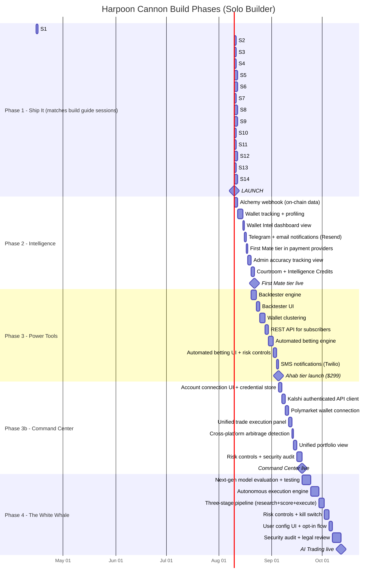

---

## Phase 1 Deliverables (Complete List)

```
SUPABASE (set and forget after setup)
├── Schema migration (all Phase 1 tables, indexes, RLS, error_log, market_views)
└── Realtime enabled on picks, anomalies, markets

VERCEL API ROUTES (ALL code execution)
├── /api/poll-markets (cron, every minute)
├── /api/analyze-markets (cron, hourly)
├── /api/analyze-urgent (POST, internal auth, whale trigger)
├── /api/webhook/fiat (POST, Polar webhook)
├── /api/webhook/crypto (POST, Coinremitter webhook)
├── /api/send-notifications (POST, internal auth)
├── /api/resolve-picks (cron daily + on-demand from poller)
├── /api/aggregate-crowd (cron, every 15 min)
├── /api/track-view (POST, user auth, lightweight)
├── /api/check-expirations (cron, daily)
├── /api/milestone-status (GET, public, cached)
├── /api/process-payouts (cron, monthly, affiliate payouts)
└── /api/courtroom (POST, user auth, credit-gated, Phase 2)

FRONTEND PAGES
├── / (landing page with milestone tracker + affiliate CTA)
├── /pricing (fiat + crypto checkout, three tiers displayed, Harpooner active at launch)
├── /login (Supabase Auth)
├── /dashboard (Pick Board - tier-filtered, crowd indicators, live edge, milestone bar)
├── /dashboard/pick/[id] (Pick Detail: rationale, evidence, risk, platform link, community activity, bet button)
├── /dashboard/markets (Market Scanner - tier-filtered)
├── /dashboard/bets (Bet Tracker with P&L)
├── /dashboard/referrals (Affiliate dashboard: link, clicks, signups, earnings, payouts)
├── /dashboard/alerts (Alert History)
├── /dashboard/settings (Notification prefs, watchlist, billing)
├── /admin (Command Center: health, revenue, milestone progress, aggregate bets, crowd trends, errors)
├── /admin/users (User activity)
└── /admin/affiliates (Top referrers, commission payouts, fraud detection)

CONFIG FILES (all in src/lib/)
├── nexus/config.ts (entity tiers, policy agenda, keywords)
├── utils/thresholds.ts (anomaly thresholds, anomaly expiration, crowd-trending thresholds)
├── utils/models.ts (SCORING_MODELS: always Haiku researcher + Sonnet analyst for background scoring)
├── scoring/prompt.ts (research prompt + scoring prompt, assembled from 4 blocks)
└── utils/tier-features.ts (feature flags + pick limits + market visibility per subscription tier)

MIDDLEWARE
├── Runtime: Node.js (NOT Edge). Add `export const runtime = 'nodejs'` at the
│   top of middleware.ts. Rationale: middleware needs to use the Supabase admin
│   client (service role key) for session writes, tier-expiration UPDATEs, and
│   active_sessions pruning. Edge runtime does not support the admin client
│   reliably (restricted Node APIs, fetch-only DB access), and the service role
│   key must never be bundled into Edge code paths that could leak to the
│   client. Node runtime costs a cold-start penalty on first request, negligible
│   on warm requests. If this ever becomes a performance problem, split the DB
│   writes into a dedicated /api/internal/middleware-ops route that middleware
│   calls via fetch, keeping middleware itself on Edge for auth reads only.
├── Auth + account_status + tier + admin check (protects /dashboard/*, /admin/*)
│   1. No auth token → redirect to /login
│   2. account_status = 'banned' → static "account terminated" page
│   3. tier IS NULL → redirect to /pricing (user signed up but hasn't paid, or subscription expired)
│   3a. tier IS NOT NULL but NOT one of 'harpooner','first_mate','ahab' → treat as NULL, redirect to /pricing. This prevents a corrupted or unexpected tier value from crashing TIER_FEATURES[tier] lookup.
│   3b. tier IS NOT NULL BUT subscription_expires_at < now() → clear tier in real-time: `UPDATE user_profiles SET tier = NULL WHERE id = $user_id AND tier IS NOT NULL` (the tier IS NOT NULL guard makes this a no-op on subsequent requests, preventing a flood of repeat UPDATEs from a stale tab). Then redirect to /pricing. This catches expired subscriptions BETWEEN daily cron runs. Defense-in-depth: cron is the batch cleaner, middleware is the real-time gate.
│   3c. SPECIAL CASE: /dashboard?checkout=success - if tier IS NULL, do NOT immediately redirect to /pricing. Instead show a "Processing your payment..." state that polls the user's tier every 2 seconds for up to 20 seconds. Webhook processing typically takes 1-5 seconds. If tier is set within the polling window, proceed to dashboard. If still NULL after 20 seconds, show "Payment processing is taking longer than expected. If your dashboard doesn't appear within a few minutes, contact support." This prevents the race condition where the user lands on the success URL before the webhook has set their tier.
│   4. tier set → set allowed_tiers, proceed to dashboard
│   5. /admin/* routes additionally check is_admin = true → 403 if not admin
│   6. Supabase unavailable (auth check fails with network/timeout error, NOT an auth rejection): show a static "Service temporarily unavailable. Please try again in a few minutes." page. Do NOT redirect to /login (user IS logged in, the database just can't confirm it). Do NOT expose the error details. Log to a local fallback (Vercel function logs) since error_log table is also unreachable.
├── Rate limiting (60 req/min per user on dashboard, 30 req/min per IP on API)
├── Concurrent session enforcement (active_sessions table, limits per tier)
├── x-client-id header check (reject API calls without frontend-generated token)
└── Bot User-Agent blocking (Playwright, Puppeteer, Selenium, known agent strings)
```

---

## Accelerator Resources (Save Weeks)

These existing open-source tools and datasets can be used immediately to speed up development. Each one eliminates days of work that would otherwise be spent building from scratch.

**Jon-Becker/prediction-market-analysis (GitHub):** The largest publicly available dataset of Polymarket + Kalshi market and trade data in Parquet format. Use for: pre-populating rolling averages on launch (solves the Day 1 false positive problem), backtesting data without building a backfill pipeline, and reference implementations for both platform API clients.

**polymarket-kit / @hk/polymarket (npm + GitHub):** Fully typed TypeScript SDK for all three Polymarket APIs (Gamma, CLOB, Data, WebSocket). Optional alternative to the hand-coded fetch connectors specified in the build guide. If the package is maintained and stable at build time, it can replace lib/platforms/polymarket.ts. If not, the native fetch approach in the build guide works without any external dependency.

**Polymarket/agents (GitHub):** Official Polymarket AI trading agents framework. Python-based but architecture patterns transfer directly to Phase 3 automated betting. Includes GammaMarketClient for market discovery.

**Polyseer (GitHub: yorkeccak/Polyseer):** MIT licensed. Multi-agent Bayesian research platform. Three patterns directly integrated into Harpoon Cannon's scoring engine: bilateral PRO/CON research, dual probability output (pNeutral/pAware), and evidence quality grading (A/B/C/D). See Scoring Enhancement section for implementation details. Clone for reference: `git clone https://github.com/yorkeccak/Polyseer.git`

**@polar-sh/sdk (npm):** Official Polar TypeScript SDK. Subscription management, checkout creation, webhook handling. Documentation at docs.polar.sh.

**Builder grant programs:** Both Kalshi and Polymarket offer multi-million dollar grants for teams building on their platforms. Harpoon Cannon qualifies as an analytics/signals platform. Application could provide enhanced API rate limits, grant funding, and ecosystem legitimacy.

---

## Phase 1 Business Quick Wins (Analyst Recommendations)

These are low-effort, high-impact features that reduce churn, improve cash flow, and generate data for growth decisions. All fit within Phase 1 sessions without adding significant complexity.

### Event Tracking (user_events table)

Every significant user action writes a row to user_events: login, view_pick, place_bet, upgrade_click, courtroom_use, share_click, watchlist_add, settings_change, feedback_submit, cancel_initiate, cancel_confirm, byoai_setup, credit_purchase, notification_click. Metadata column (JSONB) carries context: pick_id, market_id, from_tier, to_tier, reason, etc.

This is the data layer for everything that comes after: churn prediction (users who stop viewing picks for 7 days are about to cancel), upsell timing (users who hit the Courtroom modal 3+ times are ready for First Mate), feature prioritization (which features get used and which are ignored), and admin intelligence (what does a typical session look like).

Implementation: a single `trackEvent(userId, eventType, metadata)` utility function called from relevant pages and API routes. Write-only from the frontend (RLS: INSERT only, no SELECT). Admin reads via service role. Session 13 (Onboarding + Social Sharing) is the natural home for this. Add 30 minutes to that session.

### User Feedback (user_feedback table)

Pick detail page: a thumbs up / thumbs down button on every pick. Thumbs down expands to a brief "What was wrong?" textarea. Writes to user_feedback with feedback_type='pick_rating', pick_id, rating (1 or 5), and optional message.

Dashboard settings page: a "Send Feedback" link that opens a modal with type selector (bug report, feature request, general) and a message field. Writes to user_feedback.

Admin dashboard: a /admin/feedback page showing recent feedback, filterable by type, with user tier and pick context. This is how you find out what's broken without waiting for someone to email you.

### Annual Billing (Polar configuration)

Create annual products in Polar alongside monthly ones:
- Harpooner Annual: $290/year (save $58, ~17% off)
- First Mate Annual: $990/year (save $198, ~17% off)
- Ahab Annual: $2,990/year (save $598, ~17% off)

Pricing page shows a monthly/annual toggle. Annual is pre-selected with a "Save 17%" badge. The webhook handler already works because Polar sends the same events regardless of billing interval. subscription_expires_at is set by Polar's billing period, which is 12 months for annual. No code change needed in the webhook handler.

Fiscal impact: annual billing reduces churn 20-30% (users who prepay are invested) and improves cash flow (12 months revenue upfront). At 20% of subscribers choosing annual, that's significant cash flow improvement.

Env vars to add: POLAR_HARPOONER_ANNUAL_PRODUCT_ID, POLAR_FIRSTMATE_ANNUAL_PRODUCT_ID, POLAR_AHAB_ANNUAL_PRODUCT_ID (Phase 2/3 when those tiers launch).

### Cancellation Exit Survey

**Location:** Pre-redirect interstitial on our `/dashboard/settings` page. When user clicks "Cancel Subscription," we DO NOT send them straight to Polar's customer portal. Instead, our modal fires first: "Help us improve. Why are you leaving?" Once they submit, THEN we redirect to Polar for the actual cancellation flow. This pattern captures 100% of users who click cancel (vs post-return landing which misses anyone who doesn't redirect back). It also avoids injecting into Polar's customer portal (which we cannot modify).

**Options** (single select, radio buttons): "Too expensive," "Analysis wasn't accurate enough," "Missing features I need," "Found a better tool," "Just testing, plan to come back," "Other" (reveals optional text field).

**Implementation flow:**
1. User clicks "Cancel Subscription" button in billing settings
2. Modal appears: question + options + optional text field for "Other"
3. User submits → write to `user_events` with `event_type='cancel_initiate'` and `metadata: { reason: 'too_expensive' | 'not_accurate' | ..., custom_text: string | null }`
4. On submit success: redirect to Polar customer portal where they complete actual cancellation
5. When Polar webhook fires `subscription.canceled`, write second event `event_type='cancel_confirm'` (we already have this event)
6. The GAP between cancel_initiate and cancel_confirm is itself a metric: users who initiated but didn't confirm changed their mind (save rate).

**If user closes the modal without submitting:** do not redirect to Polar, do not write event. They're still a customer. Cancel button simply does nothing on close.

This costs nothing to build (one modal, one event write) and tells you exactly what to fix. If 40% say "too expensive," you know. If 40% say "not accurate enough," you know.

### Pre-Launch Email Capture

Before Phase 1 goes live, the landing page should collect emails instead of sending users to checkout. Replace the CTA with: "Join the Pequod Fleet. Be first aboard when we launch." Email input + submit button.

**Storage:** Dedicated `waitlist` table in our Supabase database. Columns: id (uuid PK), email (text unique), created_at (timestamptz), referrer_source (text nullable, captures utm_source or referrer_code cookie), notified_at (timestamptz nullable, set when blast sent). NOT a system_state JSON array (doesn't scale past ~1,000 entries). NOT a Polar audience (vendor lock-in, harder to query). Our table, our data, our migration path.

**Rate limiting.** The waitlist insert endpoint is a public route with RLS `INSERT WITH CHECK (true)` so any unauthenticated browser can POST. Without rate limiting, a bot can flood the table with thousands of fake emails in minutes, bloating storage and corrupting the "N people waiting" marketing number. Apply two defenses: (1) middleware rate limit of 3 requests per minute per IP on the waitlist endpoint (stricter than the standard 30/min because legitimate users never hit this endpoint more than once), (2) basic email format validation before INSERT (RFC-compliant regex; reject obvious garbage like "a@a" or "test"), (3) optional disposable-email check using a small embedded blocklist (mailinator.com, tempmail.org, etc.) — this can be a static array in `lib/utils/email-blocklist.ts`, no external service needed. Duplicate emails are rejected by the UNIQUE constraint on `email` and return 200 with a friendly "you're already on the list" message rather than an error (prevents the endpoint from leaking which emails are enrolled).

**Blast flow:** When Phase 1 ships, run a one-time script that reads waitlist where notified_at IS NULL, sends launch email, updates notified_at. No cron needed; one-shot.

**Table must be added to 001_initial_schema.sql before Session 12.**

### Public Status Indicator

The admin health dashboard already tracks last_success timestamps for every background function and shows RED/YELLOW/GREEN. Expose a simplified, read-only version at /status (no auth required).

**Disclosure level:** Binary only. Display either "All Systems Operational" (green) or "Analysis Delayed" (yellow/red). Do NOT expose WHICH component is degraded (scorer, poller, notifications, etc.) publicly. Specific component names give attackers reconnaissance data about our architecture. The admin dashboard shows component-level detail; the public page shows overall status only.

**Middleware exemption:** The `/status` route MUST be in the middleware whitelist along with `/api/*`, `/login`, `/auth/callback`. Without this, banned users redirected to the static "account terminated" page cannot reach /status (they'd be blocked by the `account_status='banned'` check). /status must be reachable by anyone on the open internet, no exceptions. Add to middleware config:

```typescript
const PUBLIC_ROUTES = ['/', '/pricing', '/login', '/auth/callback', '/status', '/api/status'];
```

**Implementation:** Single GET route `/api/status`. MUST use admin Supabase client (system_state has RLS enabled with only a mrr_cache public read policy — the browser/server clients cannot read last_success_* keys). Reads system_state keys (last_success_poller, last_success_scorer, last_success_aggregator), computes staleness (current time minus last_success), returns `{ status: 'operational' | 'degraded' | 'outage' }`. Thresholds: poller >5min = degraded, >15min = outage. Scorer >2h = degraded, >6h = outage. Aggregator >30min = degraded, >2h = outage. Worst status across all three wins. Cache result 30 seconds to prevent /status becoming a DB hammer.

---

## Operational Concerns

**Poller overlap prevention.** `system_state` table with `poller_lock` key. Atomic acquire at start (see Pre-Build Bug: Poller Lock Race Condition). Release in a `finally` block (MUST release even on error). Skip cycle if lock is < 3 minutes old.

**Poller execution.** Runs as Vercel API route `/api/poll-markets` with cron trigger every minute. Vercel Pro gives 300-second timeout, more than enough for fetching both platforms in parallel and running anomaly detection.

**Rate limits (Kalshi).** Public endpoints: no auth required, but rate limited. Paginate with 100ms delays. On 429: exponential backoff starting at 1 second, max 3 retries, then continue with partial data and log the gap to error_log.

**Rate limits (Polymarket).** CLOB API uses Cloudflare throttling (delays requests, doesn't reject). Data API is fully public. Gamma API for market metadata is also public and unauthenticated.

**Claude API errors.** On timeout or 5xx: retry once after 5 seconds. On 429 (rate limit): back off 30 seconds, retry. On 401 (invalid API key): do NOT retry (retrying a bad key wastes time and will never succeed). Log to error_log with `error_type: 'auth_error'` and send admin notification immediately. This is a config error, not a transient failure. On persistent failure (2+ retries failed): skip this analysis cycle, serve stale picks (last hour's data), log to error_log. Users see "Last updated: [time]" on the Pick Board so they know data isn't fresh.

**Scoring engine kill switch.** A system_state key `scoring_enabled` (default 'true'). The scoring engine checks this BEFORE acquiring the scorer_lock. If 'false', skip the cycle silently without logging an error (this is intentional, not a failure). Admin can set to 'false' via the admin dashboard command center to immediately stop all AI scoring without deploying code. Use cases: the scoring engine is producing garbage picks, the Claude API is having extended issues and retries are burning money, or you need to freeze picks during a system migration. The admin dashboard shows a prominent "Scoring: ACTIVE / PAUSED" toggle. When paused, the Pick Board shows "Analysis paused by admin. Last updated: [time]" so users aren't confused by stale data.

**Parallel API fetches.** Kalshi and Polymarket fetches in the poller run in parallel using `Promise.allSettled` (NOT Promise.all). If one platform is down, the other's data is still processed. For each settled promise: if fulfilled, process the markets. If rejected, log the failure to error_log with `error_type: 'platform_down'` and the platform name. Continue with whichever platform(s) returned data. If BOTH fail, skip the cycle, log both failures, release lock.

**Anomaly expiration.** Every anomaly gets `expires_at = detected_at + 6 hours`. Dashboard queries filter on `WHERE expires_at > now()`. The ranking formula's anomaly_bonus only applies to non-expired anomalies. No background job needed to deactivate, the query handles it.

**Market resolution detection.** The poller checks the `status` field from both platform APIs on every cycle. When a market transitions to resolved (Kalshi: status='settled', Polymarket: resolved=true), the NormalizedMarket connector maps this to `status = 'resolved'`. When the poller detects that a market's status changed to 'resolved':
1. Update `markets.status` to resolved
2. Record `markets.resolution_outcome`: prefer the platform's explicit resolution field (Kalshi: `result` field = "yes"/"no", Polymarket: check `resolved` + final token price). Fall back to price heuristic (yes_price >= 0.99 = YES won) only if the explicit field is missing or ambiguous.
3. Record `markets.resolved_at` timestamp
4. Immediately call the resolve-picks route (fire-and-forget, same pattern as whale alerts) to process that specific market without waiting for the daily cron

The resolve-picks route, whether triggered immediately by the poller or by the daily cron sweep:
- **Idempotency guard:** Only process picks WHERE `resolved = false`. If a pick is already resolved (from a previous run or concurrent trigger), skip it. This makes resolve-picks safe to run multiple times on the same market without double-counting or corrupting P&L.
- Marks matching picks as `resolved = true`
- Sets `was_correct`: normalize both `pick.direction` and `markets.resolution_outcome` to uppercase, then `was_correct = (direction === resolution_outcome)`. Example: pick direction "YES" + resolution "YES" = true. Pick direction "NO" + resolution "YES" = false.
- **Voided/cancelled markets:** Both Kalshi and Polymarket can void markets (regulatory change, event cancellation, ambiguous outcome). If the platform's resolution field indicates voided/cancelled/null: set `was_correct = NULL` (not scoreable), set `actual_pnl_pct = NULL`, update all `user_bets` with `exit_price = entry_price` and `pnl_usd = 0` (effectively a refund). Voided picks are EXCLUDED from accuracy tracking queries (`WHERE was_correct IS NOT NULL`).
- Calculates `actual_pnl_pct`:
  - If was_correct = true AND direction = YES: `(1.0 - market_price_at_scoring) / market_price_at_scoring * 100` (return on YES bet)
  - If was_correct = true AND direction = NO: `(1.0 - (1.0 - market_price_at_scoring)) / (1.0 - market_price_at_scoring) * 100` (return on NO bet)
  - If was_correct = false: `-100` (total loss)
  - Guard: if market_price_at_scoring is NULL, 0, or 1, set actual_pnl_pct = NULL (can't calculate return on a missing or zero-cost entry). NULL can occur if the scoring engine failed to record the price. 0 and 1 only happen with extreme illiquidity near resolution.
- Updates all `user_bets` for that market: exit_price based on user's bet direction (if user bet YES and YES won: exit_price = 1.00. If user bet YES and NO won: exit_price = 0.00. Same logic inverted for NO bets). pnl_usd = `(exit_price - entry_price) * size_usd`
- The daily cron still runs as a safety net to catch any resolutions the poller missed

**Market URL construction.** The poller populates `markets.market_url` during ingestion:
- Kalshi: `https://kalshi.com/markets/{event_ticker}` (event_ticker from API response)
- Polymarket: constructed from the Gamma API slug field, format `https://polymarket.com/event/{slug}`
- The pick detail page renders a "Bet on [Platform]" button linking to this URL, opening in a new tab.

**Snapshot pruning.** Handled by the `check-expirations` daily cron (which already runs daily for crypto subscription expiration). After checking expirations, it deletes snapshots older than 90 days, market_views older than 48 hours, and error_log entries older than 30 days (severity='warning' or 'info') or 180 days (severity='error' or 'critical'). Anomalies and picks are never pruned (they're the historical record that proves accuracy). Without the error_log prune, a sustained API outage or schema_change storm dumps rows at hundreds per minute and the table reaches millions of rows within months, making the admin error drill-down page unusable.

```sql
-- Inside check-expirations, after the subscription expiration sweep:
DELETE FROM error_log
WHERE created_at < now() - interval '30 days'
  AND (details->>'severity' IN ('warning', 'info') OR details->>'severity' IS NULL);

DELETE FROM error_log
WHERE created_at < now() - interval '180 days';
```

The two-tier retention keeps the low-severity noise short and preserves serious errors for a full quarterly review window. Production operators occasionally need to reconstruct a bug from three months ago; 30 days is too short for serious issues, 180 days is more than enough.

**Monthly credit reset.** On the 1st of each month (detected by: `new Date().getDate() === 1`, which returns the UTC day since Vercel runs in UTC), the check-expirations cron resets `monthly_credits_used = 0` for ALL users with a non-null tier. This is a single UPDATE query. Purchased credits (bonus_credits) are NOT reset.

**Timing note:** The cron fires at 07:00 UTC. Between 00:00 and 07:00 UTC on the 1st of each month, any credits consumed by users count against the previous month's counter (which is about to be zeroed anyway). This is effectively a 7-hour window where users get "free" credits beyond their monthly allowance. The impact is tiny (300 FM users each burning 3 Premium credits in that window = 900 credits = $126) and the fix (moving reset to 00:00 UTC) adds cron complexity without meaningful savings. Accept as-is, document in the admin dashboard tooltip on the credits stat: "Credits reset at 07:00 UTC on the 1st of each UTC month."

**Crowd signal aggregation.** The `aggregate-crowd` cron runs every 15 minutes. For each market with any nexus tag, it computes:
- `crowd_views_24h`: COUNT of market_views where viewed_at > now() - 24h
- `crowd_watchlist_count`: COUNT of user_watchlist entries for this market
- `crowd_bets_24h`: COUNT of user_bets where placed_at > now() - 24h
- `crowd_yes_pct`: percentage of user_bets in last 24h with direction = YES. Guard: if total bets = 0, default to 50.0 (no signal, neutral). Formula: `CASE WHEN total = 0 THEN 50.0 ELSE (yes_count::float / total * 100) END`
These values get written directly to the markets table. The scoring engine reads them from there.

**Crowd-trending detection.** During aggregation, if a market's `crowd_views_24h` exceeds 5x its 7-day rolling average AND exceeds a minimum threshold of 20 views, it gets flagged as crowd-trending. The minimum prevents false positives on new markets where 3 views would exceed `5 * 0`. Guard: `crowd_views_24h > MAX(5 * rolling_avg, 20)`. This triggers a notification via send-notifications (subject to the 3-per-hour throttle). The notification reads: "Trending on Harpoon Cannon: [market title] - [X] users watching. [link to pick detail]." Crowd-trending status also gets passed to the scoring engine as a bonus signal in Category 7.

**Social signal integration (phased).**

Phase 1 (no new APIs, no new cost): Claude's web search already hits social media. The scoring prompt now includes specific instructions to search Reddit and Twitter for social discussion sentiment on each market topic. Claude returns a `social_sentiment` object with direction, intensity, source summary, and divergence from market price. This is the contrarian signal: when social media is overwhelmingly bullish but price is flat, smart money isn't buying. When social media panics but price holds, smart money is holding. Zero infrastructure change. Just prompt engineering.

Phase 2 (low-cost APIs): Google Trends API (free) integrated into the poller. For each nexus-tagged market, query Google Trends for related search terms. A spike in search volume for "Iran war" correlates with the Iran prediction market. Store as `markets.google_trend_score` (0-100 normalized). Reddit API (free for moderate usage) monitored for r/polymarket, r/kalshi, and topic-specific subreddit activity. Store discussion volume and sentiment per market.

Phase 3 (premium): X/Twitter API ($100/mo basic tier) for real-time political figure monitoring. Track Trump Truth Social posts, congressional member tweets, key influencer takes. Political figure social activity is a LEADING INDICATOR for prediction markets: Trump posts about Iran → Iran markets move within hours.

**Crowd intelligence performance.** Track aggregate user betting behavior alongside social signals. When Harpoon Cannon users bet opposite to social media consensus, that's the highest-value signal. The platform's own users are informed by Harpoon Cannon's analysis. If they disagree with the crowd, the analysis + crowd disagree = strong edge.

**View tracking performance.** The `/api/track-view` route is deliberately lightweight: one INSERT into market_views, no joins, no aggregation. It fires asynchronously from the pick detail page on load. If it fails, it fails silently. View counts are directionally accurate, not precisely accurate. Missing a few views doesn't matter. The signal is about magnitude, not precision.

**Error logging.** Every background function (poller, scorer, notifier, crowd aggregator, resolver, check-expirations, process-payouts) wraps its execution in try/catch. On failure: write to `error_log` table with structured details.

Error log entry format:
```typescript
{
  source: string,        // 'poller' | 'scorer' | 'resolver' | 'notifier' | 'aggregator' | 'webhook-fiat' | 'webhook-crypto' | 'check-expirations' | 'process-payouts'
  error_type: string,    // 'api_timeout' | 'api_429' | 'api_5xx' | 'parse_error' | 'db_error' | 'lock_conflict' | 'validation_error' | 'auth_error' | 'unknown'
  details: {
    message: string,     // error.message
    stack: string,       // error.stack (first 1000 chars)
    context: {           // what was happening when it failed
      market_id?: string,
      batch_size?: number,
      cycle_id?: string,
      user_id?: string,
      attempt?: number,  // which retry attempt (1, 2, 3)
      duration_ms?: number, // how long the operation ran before failing
    },
    input_snapshot?: any, // the data that caused the failure (truncated to 500 chars)
    recovery_action: string // 'skipped_cycle' | 'retried_success' | 'retried_failed' | 'partial_data' | 'stale_served' | 'none'
  }
}
```

**Admin error dashboard (/admin, Command Center):**
- Errors in last 24 hours, grouped by source
- Error rate chart (errors per hour over last 7 days)
- Last successful run time for each background function (from system_state)
- Alert threshold: if any function has 5+ errors in 1 hour, send admin Discord notification
- Drill-down: click any error to see full details including input_snapshot and stack trace
- Health status per function: GREEN (ran successfully in last expected interval), YELLOW (ran but had errors), RED (hasn't run in 2x expected interval)

Expected intervals for health check:
```
poller:           1 minute  (RED if >3 min since last success)
analyze-markets:  1 hour    (RED if >2.5 hours)
aggregate-crowd:  15 min    (RED if >45 min)
resolve-picks:    24 hours  (RED if >50 hours)
check-expirations: 24 hours (RED if >50 hours)
process-payouts:  monthly   (RED if >35 days)
```

**For AI coders debugging issues:** When a build session produces errors, the coder checks `/admin` first. The error dashboard shows exactly WHICH function failed, WHAT it was processing, WHY it failed (error type + message), and WHAT recovery action was taken. The input_snapshot field shows the data that triggered the failure so the coder can reproduce it. The stack trace shows exactly where in the code the failure occurred. No guessing. No log diving. One screen.

**Scoring accuracy tracking.** Fed by the market resolution flow above. The admin accuracy dashboard computes:
- Overall accuracy (% of resolved picks where direction was correct)
- Accuracy by confidence level (are HIGH confidence picks actually more accurate?)
- Accuracy by edge size (do bigger edges correlate with better outcomes?)
- Accuracy by category (are we better at foreign policy than regulation?)
- Accuracy over time (is the system getting better or worse?)
This data is the credibility backbone of the product. Publish it externally as proof the system works.

**Affiliate commission flow.** Commissions are credited instantly, not batched monthly. When a payment webhook fires (fiat or crypto), the handler checks if the paying user has a `referred_by` value. If yes: calculate 25% of the payment amount, credit it to the referrer's `affiliate_balance`, log the commission in the `payments` table (`commission_amount`, `commission_credited = true`), and update the `referrals.total_earned` running total. Payouts are processed monthly: if `affiliate_balance >= $50`, create an `affiliate_payouts` record and debit the balance. Payouts are initially manual (admin approves via admin dashboard), automated later.

**Commission clawback on chargeback/fraud.** If a referred subscriber's payment is reversed (chargeback, fraud dispute), the commission must be clawed back. On chargeback webhook: debit the referrer's `affiliate_balance` by the commission amount. If `affiliate_balance` goes negative (commission already paid out), log the negative balance for manual recovery. Update `referrals.status` to 'churned'. If the REFERRER is generating multiple chargebacked referrals, this is affiliate fraud: flag the referrer account for admin review. Cancellation (non-fraudulent) does NOT trigger clawback. The referrer earned the commission on the month that was paid. Future months that aren't paid simply don't generate new commissions.

**Commission clawback on refund.** Same logic as chargeback clawback. If Polar issues a refund (event type: `refund.created` or equivalent), the commission for that payment must be reversed. Debit the referrer's `affiliate_balance`, handle negative balance the same way. Partial refunds prorate the clawback (refunded $14.50 of $29 → claw back 50% of the commission). Mark `referrals.status = 'refunded'` to distinguish from chargebacks for analytics. This prevents an exploit where a referred user subscribes, referrer gets paid, user requests refund two days later, and referrer keeps money that customer got back.

**Notification throttle enforcement.** The send-notifications route uses an atomic INSERT pattern to prevent the same race condition documented elsewhere (poller lock, credit consumption, analyze-urgent throttle). The naive read-count-then-INSERT approach lets three simultaneous dispatches for the same user all read `count = 2`, all pass, all INSERT, producing four notifications per hour instead of three. Fix: combine the throttle check and the INSERT into a single SQL statement:

```sql
-- Atomic insert-if-under-limit. Returns the new row if under the cap,
-- returns zero rows if the 3-per-hour cap would be exceeded.
INSERT INTO notification_log (user_id, pick_id, notification_type, channel)
SELECT $user_id, $pick_id, $notification_type, $channel
WHERE (
  SELECT COUNT(*)
  FROM notification_log
  WHERE user_id = $user_id
    AND sent_at > now() - interval '1 hour'
) < 3
RETURNING id;
```

If zero rows returned, the user has hit the 3-per-hour cap. Skip this dispatch silently and do NOT send the notification via Discord/Telegram/email. If one row returned, proceed with the actual channel POST (Discord webhook call, etc.). The INSERT commits atomically with the count check inside a single statement, so simultaneous dispatches cannot all pass the check. This ensures the 3-per-hour cap is enforced per user regardless of how many triggers fire.

**Notification channel failure handling.** If a Discord webhook POST returns 4xx (invalid URL, expired, deleted): log to error_log with the user_id and channel. Do NOT retry (the URL is bad, retrying wastes time). Track consecutive failures using a `discord_fail_count` column on user_profiles (int DEFAULT 0). Reset to 0 on every successful send. Increment by 1 on every failure. After 3 consecutive failures (discord_fail_count >= 3), set `notify_discord = false`. The next time they visit /dashboard/settings, show a warning: "Your Discord webhook is no longer working. Please update it." This prevents silent notification failure for users with stale webhook URLs.

**Discord webhook URL validation on save.** Before storing a Discord webhook URL in `user_profiles.discord_webhook_url`, the settings save route validates the URL in two passes. First, regex match against the Discord webhook pattern: `^https://(discord\.com|discordapp\.com)/api/webhooks/\d+/[A-Za-z0-9_-]+$`. Reject immediately with "That doesn't look like a Discord webhook URL" if the format is wrong. Second, perform a test POST to the URL with a benign payload (`{"content":"Harpoon Cannon webhook verified."}`). On 2xx, save. On 4xx, reject with "Discord rejected that webhook URL. Please check that it exists and the channel still allows webhooks." On timeout or 5xx, save but warn: "Webhook saved but Discord didn't respond to the test. If you don't receive a test message, update the URL." This catches the obvious bad-URL cases before they burn the 3-strike auto-disable budget and gives the user immediate feedback that the URL works.

**Realtime debounce on Pick Board.** When a scoring cycle completes, 20-50 picks are written to the picks table in rapid succession. Each INSERT fires a Supabase Realtime event. The frontend must DEBOUNCE these events: after receiving the first Realtime event, wait 3 seconds before re-querying the Pick Board. This ensures all picks from the cycle are written before the dashboard refreshes. Without debounce, the dashboard would flash/flicker 20-50 times as each pick arrives. Implementation: in the Realtime subscription callback, set a 3-second timeout. Reset the timeout on each new event. Only re-query when the timeout completes (no new events for 3 seconds).

**MRR calculation for milestone tracker.** The `milestone-status` API route calculates MRR as: `(COUNT users WHERE tier = 'harpooner') * 29 + (COUNT users WHERE tier = 'first_mate') * 99 + (COUNT users WHERE tier = 'ahab') * 299`. Approximate but accurate enough for a progress bar. Cache result for 1 hour in a `system_state` row (key: `mrr_cache`, value: JSON with mrr and timestamp). Landing page fetches this public endpoint on load.

**Claude API response parsing.** Claude with web_search tool enabled produces multi-block responses: text blocks, tool_use blocks, and tool_result blocks. The scoring engine must extract ONLY the text content blocks, concatenate them, and parse as JSON. Do not assume the entire API response is a single JSON string. Filter `response.content` for blocks where `type === "text"`, join their `.text` values, then `JSON.parse()`. Handle malformed JSON gracefully: retry the batch once, then log to error_log and skip if it fails again.

**Web search tool configuration.** The Anthropic API requires the tool to be specified in the request:
```typescript
tools: [{ type: "web_search_20250305", name: "web_search" }]
```
This tool type string is version-dated. Check Anthropic docs for the current version when building. Only the Researcher stage (Stage 1) includes the web search tool. The Analyst stage (Stage 2) does NOT include it (evidence already gathered).

**Partial batch handling.** Claude may return fewer markets than were in the batch (it might skip one it can't analyze, or truncate due to output length). The parser MUST handle this: compare `response.length` to `batch.length`. For each market in the batch, check if a matching `market_platform_id` exists in the response. Write picks for markets that WERE returned. Log missing markets to error_log with `error_type: 'partial_batch'` and the list of missing market_platform_ids. Do NOT discard the entire batch because one market was missed. Do NOT retry the whole batch for one missing market (waste of tokens). The missing market will be picked up in the next hourly cycle.

**Automated betting security (Phase 3).** Users who enable auto-betting store their Kalshi/Polymarket API credentials. These credentials can move real money. Requirements: encrypt at rest using AES-256 with a per-user encryption key derived from HARPOON_ENCRYPTION_SECRET. Never log credentials, never expose in API responses, never send to the AI engine. Store only the encrypted blob in a `user_trading_credentials` table (not in user_profiles). Risk controls per user: max_bet_size (dollars per pick), max_daily_exposure (total dollars per day), min_confidence_threshold (only auto-bet on picks above this level), auto_stop_loss (disable auto-betting if cumulative P&L drops below this), max_bets_per_day (hard cap on number of auto-placed bets). All of these are user-configurable in settings. The system defaults to conservative values and requires explicit opt-in.

**Empty state handling.** Every dashboard page must handle the "no data yet" state with a helpful message, not a blank page or error. Specific empty states per page:

- **/dashboard (Pick Board):** "Harpoon Cannon Intelligence is analyzing markets. First picks will appear within the hour." Show a subtle loading animation.
- **/dashboard/pick/[id] (Pick Detail):** If pick ID not found (deleted or bad URL): "This signal is no longer available." with a link back to the Pick Board.
- **/dashboard/bets (Bet Tracker):** "No bets logged yet. Browse picks and tap 'I Bet This' to start tracking your positions."
- **/dashboard/referrals (Affiliate):** "Your fleet recruitment link is ready. Share it to start earning 25% of every subscription, forever." Show the referral link prominently even with zero referrals.
- **/dashboard/alerts (Alert History):** "No alerts yet. Whale alerts and trending signals will appear here as the system detects them."
- **/dashboard/markets (Market Scanner):** "Markets loading. The poller runs every minute." If markets exist but none match the tier filter: "No markets match your current filter."
- **/dashboard/settings:** No empty state needed (always has form fields).
- **/admin (Command Center):** "System initializing. Data will populate as the poller and scorer complete their first cycles." Show health status as YELLOW (not yet run) instead of RED (failed).
- **/admin/accuracy:** "No resolved picks yet. Accuracy data will appear after markets begin settling." Show the chart axes with no data points.
- **Milestone tracker (landing page):** "The fleet is assembling. First milestone: $5,000 MRR." Show progress bar at 0%.

**Platform API breaking change playbook.** Kalshi or Polymarket can change their API at any time without warning. The connector response validation (Audit K11) catches 50%+ field-missing anomalies and alerts admin. But beyond detection, the team needs a response procedure:
1. Admin receives schema_change alert via Discord.
2. Immediately check the platform's developer docs/changelog for announced changes.
3. If confirmed API change: update the relevant connector's field mapping in `lib/platforms/`. Deploy.
4. If temporary API outage (not a schema change): do nothing, the poller resumes automatically on next cycle.
5. If one platform is completely broken and the other is fine: that's OK. Promise.allSettled ensures the healthy platform continues. One-sided data is better than no data. Markets from the broken platform will show "stale" timestamps.
6. If BOTH platforms are broken simultaneously: the status page turns RED. Scoring engine skips cycles (nothing to score). Users see stale picks with "Analysis delayed" notice.
7. Maximum acceptable recovery time: push a fix within 4 hours during business hours, 12 hours overnight. If longer, post a status update to Discord and consider pausing subscriptions.

**Resolution window priority.** The hourly scoring cycle treats a market closing in 2 hours the same as one closing in 2 weeks. For Phase 1 this is acceptable because all picks include `close_time` and the user can see urgency themselves. Phase 2 enhancement: add a priority boost to the scoring engine batch query — markets with `close_time < now() + interval '24 hours'` get scored first in the batch, and get re-analyzed even if they'd normally be skip-if-unchanged. This prevents a user seeing a stale 3-day-old analysis on a market that closes tonight. Add to Phase 2 roadmap.

**Anthropic API down during user-facing requests.** If the Courtroom (Phase 2) or any future on-demand AI feature calls Anthropic and gets 5xx errors, timeout, or connection refused:
- Do NOT deduct credits. The credit consumption must happen AFTER a successful API response, never before.
- User-facing error: "Our analysis engine is temporarily unavailable. Please try again in a few minutes. No credits were charged."
- Log to error_log with `source='anthropic_api'`, `error_type='provider_down'`, include HTTP status code and response body (truncated to 500 chars).
- If 3+ consecutive failures within 5 minutes: fire admin Discord alert "Anthropic API appears down. [N] consecutive failures."
- The background scoring engine already handles this via error_log + scoring_enabled kill switch. This spec is for the user-facing path only.

**Polar test mode vs production.** Polar provides separate test-mode API keys and webhook secrets. During development (Sessions 1-13), use test-mode credentials. Before Session 14 (Security + Deploy), switch to production credentials. Spec:
- Add `POLAR_MODE` env var (value: `test` or `live`). Default: `test`.
- The webhook handler checks: if `POLAR_MODE=test`, only accept webhooks signed with the test webhook secret. If `POLAR_MODE=live`, only accept webhooks signed with the production webhook secret. This prevents test-mode webhooks from accidentally creating real subscriptions in production, and vice versa.
- Session 14 deploy checklist must include: "Verify POLAR_MODE=live in Vercel production environment."
- In test mode, all successful checkouts should log `event_type='test_checkout'` in error_log (not payments table) to keep test data out of production tables.

---

## Security Hardening

Harpoon Cannon is a paid intelligence product. The analysis IS the product. If someone can extract it for free, clone it, or redistribute it, the business dies. These defenses are designed for a world where autonomous AI agents can sign up for accounts, pay with stolen cards, and systematically extract content at machine speed.

### Threat Model

| Threat | Severity | Vector | Defense |
|---|---|---|---|
| AI agent scraping (all picks/rationale extracted) | CRITICAL | Autonomous browser agent pays $29, bulk-downloads everything | Rate limits + behavioral detection + content fingerprinting |
| Credit burning (Claude API abuse) | CRITICAL | Hammering analyze-urgent to burn API budget | Internal auth + rate limit on internal routes |
| Account sharing | HIGH | One subscription shared across 10+ users | Concurrent session limits + device fingerprinting |
| Webhook spoofing | HIGH | Fake Polar/Coinremitter webhooks for free tier | Signature verification (already specified) |
| Content redistribution | HIGH | Copy-paste rationale to blog/social media verbatim | Watermarking + TOS enforcement |
| Credential stuffing | MEDIUM | Automated login attempts with breached credentials | Supabase rate limiting + CAPTCHA on auth |
| Session hijacking | MEDIUM | Steal auth token from compromised browser | Short-lived sessions + secure cookie flags |
| Prompt injection | LOW | User input reaching scoring prompt | No user input in scoring prompt (already enforced) |

### Rate Limiting (Middleware)

Implement in Next.js middleware. Use Vercel's built-in edge rate limiting (available on Pro plan, configured via middleware using the @vercel/edge-rate-limit package or Vercel's Firewall rules in the dashboard). Do NOT use in-memory counters. Vercel serverless functions do not share memory between invocations. Every cold start resets an in-memory counter to zero. An in-memory rate limiter on Vercel does literally nothing. Alternative approach if Vercel's built-in rate limiting doesn't meet needs: use a Supabase-based counter (INSERT into a rate_limit table with timestamp, query recent count before allowing the request). This adds one DB round trip but actually works.

```
Dashboard pages (Pick Board, Pick Detail, Markets):
  Authenticated users: 60 requests/minute per user
  If exceeded: 429 response + 60-second cooldown
  If exceeded 3x in one hour: flag account for review

API routes (track-view, webhook handlers):
  Per-IP: 30 requests/minute
  If exceeded: 429 + backoff

Internal routes (analyze-urgent, send-notifications):
  HARPOON_INTERNAL_SECRET required (already specified)
  Per-route: 10 requests/minute (prevents runaway loops)
```

### Bot and AI Agent Detection

The biggest threat is an autonomous agent (Mythos, OpenClaw, or a custom browser agent) that looks like a normal user but extracts data systematically.

**Behavioral signals that indicate bot/agent activity:**
- More than 50 unique pick detail pages viewed in 10 minutes (human can't read that fast)
- Accessing picks in sequential order (rank 1, 2, 3, 4...) instead of clicking what interests them
- No mouse movement or scroll events between page loads (headless browser)
- Consistent request timing (exactly 2.0s between each request = script)
- User-Agent containing known agent strings (OpenClaw, Playwright, Puppeteer, Selenium)
- Accessing the API directly without loading CSS/JS/images first (API-only scraper)

**Implementation (Phase 1, simple):**
1. Track `market_views` already stores user_id + market_id + viewed_at. Add a daily cron check: if any user viewed > 200 pick detail pages in 24 hours, flag account for review.
2. Add `x-client-id` header from frontend JavaScript (simple random token generated on page load, stored in sessionStorage). If API requests arrive without this header, they're not from the real frontend.
3. Block known automation User-Agent strings in middleware.

**Implementation (Phase 2, advanced):**
1. Invisible canvas fingerprint on login. Store hash. Alert if the same account produces different fingerprints within 1 hour (account sharing or bot rotation).
2. Mouse movement entropy check via lightweight client-side script. Zero entropy = headless browser.

### Concurrent Session Limits

Prevents account sharing (one $29 subscription used by 10 people).

```
user_profiles table already has id.
Add: active_sessions table
  - session_id text PK
  - user_id uuid FK
  - created_at timestamptz
  - last_active_at timestamptz
  - device_hash text

Max concurrent sessions per tier:
  Harpooner: 2 (phone + laptop)
  First Mate: 3
  Ahab: 5

Session lifecycle:
  CREATE: middleware checks Supabase auth session. If valid auth but NO active_sessions row for this session_id:
    INSERT INTO active_sessions (user_id, session_id, device_hash, last_active_at)
    VALUES ($user_id, $session_id, $device_hash, now())
    ON CONFLICT (session_id) DO UPDATE SET last_active_at = now();
    The ON CONFLICT clause prevents PK violations when two browser tabs open
    simultaneously and both middleware invocations try to INSERT the same session_id.
    The second tab's INSERT becomes an UPDATE, which is the correct behavior anyway
    (bump the last_active_at timestamp).
    Then check COUNT(*) WHERE user_id = X. If over tier limit: DELETE the row with oldest last_active_at
    (this logs out the oldest device on their next request when auth check fails).
  UPDATE: on each authenticated request, UPDATE last_active_at = now() WHERE session_id = X.
  DELETE: on explicit logout, DELETE WHERE session_id = X.
  PRUNE: middleware also deletes any rows WHERE last_active_at < now() - interval '30 minutes' for this user.
    This auto-cleans abandoned sessions without a separate cron.
  
device_hash: SHA-256 of (User-Agent + screen resolution + timezone), sent from frontend on session creation.
  Not a security feature, just a rough device fingerprint so admin can see "Chrome on Windows" vs "Safari on iPhone."
  Two rapid device_hash changes on the same account within 1 hour = possible account sharing. Log to error_log for admin review.
```

### Content Protection

The rationale text, evidence grades, and probability scores are the product. Protect them.

**Invisible watermarking:** Each rationale served to a user contains invisible Unicode characters (zero-width spaces, zero-width joiners) that encode the user_id. If the text appears verbatim on a blog or social media, the watermark identifies who leaked it. Implementation: a simple function in the pick detail page server component that inserts the watermark before rendering. Encoding scheme: convert the user_id UUID to a hex string (32 chars), then to binary (128 bits). Map each bit to either U+200B (zero-width space) for 0 or U+200D (zero-width joiner) for 1. Insert the 128-character invisible sequence after the first sentence of the rationale text. To decode: extract all zero-width characters from the text, map U+200B back to 0 and U+200D back to 1, reconstruct the 128-bit binary string, convert to hex, format as UUID. This is trivial to implement and invisible to the user but uniquely identifies the source of any leaked text.

**Watermark survival limits (set expectations honestly):** The zero-width character watermark survives copy-paste from the web into most text editors and most platforms (Substack, Medium, Twitter, Reddit). It does NOT survive: screenshots, OCR extraction, manual paraphrasing, Unicode normalization filters (some platforms strip invisible characters on paste), or text sanitizers that normalize whitespace. If the leaker is competent enough to strip invisible characters, the watermark gives zero signal. The tool is good for catching casual leakers; it's not forensics-grade evidence. Admin dashboard has a "Decode watermark" input where you paste suspicious text and get back the user_id if the watermark is intact, or "Unable to extract watermark" if stripped. The Phase 2 screenshot-deterrence email overlay covers the screenshot attack vector that this technique cannot.

**No bulk export:** There is no "export all picks" feature. No CSV download. No API endpoint that returns all picks at once. Users see one pick detail at a time, each requiring a page load that triggers rate limiting and view tracking.

**Screenshot deterrence (Phase 2):** CSS `user-select: none` on rationale text (prevents copy-paste, not screenshots). Overlay user's email in light gray behind rationale text (visible in screenshots, identifies the leaker). This is the same approach Bloomberg Terminal uses.

### Webhook Security

Already specified but consolidating here for completeness:

**Verification order matters.** Every webhook handler runs checks in this exact order:
1. **Signature verification FIRST** (or callback verification for Coinremitter). Reject 401 if invalid. This ensures no unauthenticated request ever touches the database. Without this ordering, an attacker could POST forged webhooks with crafted `provider_event_id` values, and even though processing would fail on other checks, the attacker could DoS the payments table by burning UNIQUE constraint slots or observe timing side-channels.
2. **Schema validation** of the payload (required fields, types). Reject 400 if malformed, log to error_log.
3. **Idempotency check** via `provider_event_id` UNIQUE. If duplicate, return 200 immediately without re-processing.
4. **Business logic** (tier assignment, commission credit, etc.)

Do NOT reverse steps 1 and 3. The idempotency check is a database lookup that tells an attacker which event_ids exist in your system if it runs before signature verification.

- Polar webhooks: verify signature using POLAR_WEBHOOK_SECRET. Reject if signature invalid.
- Coinremitter webhooks: Coinremitter does NOT use HMAC signatures. Verification is callback-based. When the webhook fires, extract the transaction `id` from the POST body. Call the Coinremitter getTransaction API (`POST https://api.coinremitter.com/v1/transaction` with `x-api-key` and `x-api-password` headers, body `{ id: [webhook_id] }`). Verify ALL of the following: the API confirms the transaction exists, the wallet_id matches OUR expected wallet (not some other merchant's transaction), the amount matches the expected subscription price, and the status is "confirm" with sufficient confirmations. If any check fails, reject and log. If the verification API call TIMES OUT (10 second timeout): return HTTP 500 so Coinremitter retries the webhook later. Do NOT process or permanently reject on timeout. This prevents both the security hole (fake webhook) and the false rejection (user paid but our verification call was slow).

**Crypto underpay and overpay handling.** Crypto payments frequently arrive in non-exact amounts due to network fees, price volatility between checkout creation and broadcast, or user error. The verification API returns the ACTUAL paid amount. Define three bands:
- **Exact match (within 1% of invoice amount):** Grant tier normally. Log the payment at the invoice price, not the paid price (the 1% drift is too small to matter and using invoice keeps accounting consistent).
- **Underpay (more than 1% below invoice):** Do NOT grant tier. Log the transaction to error_log with source='webhook-crypto', error_type='crypto_underpay', and include the paid amount, expected amount, and transaction id. Return 200 (prevent Coinremitter retries). The user's funds are not lost — they show up in the Coinremitter dashboard — but they don't get access. Admin reviews manually: either refund in crypto (low-friction for both parties), issue a top-up invoice for the shortfall, or grant the tier anyway if the shortfall is small and the user contacts support. Add this to the admin health dashboard as a daily-reviewed queue.
- **Overpay (more than 1% above invoice):** Grant tier normally. The excess stays in the Coinremitter wallet and is not automatically credited. This is rare (crypto users typically send exact amounts via QR code) but does happen. Admin-reviewed case-by-case; typical response is refund the excess or credit it toward the next renewal. Log to error_log with error_type='crypto_overpay' so it doesn't get lost.

The 1% tolerance band is a round number that handles the common case (price rounding in UI conversion rates, small network fee variance) without opening an arbitrage window. Values below 1% are not worth disputing; values above 1% should trigger a human review.
- Coinremitter webhooks: verify using COINREMITTER_PASSWORD. Reject if invalid.
- Both: check `payments.provider_event_id` unique constraint for idempotency. Reject duplicates.
- Both: validate the amount and tier match expected values. Don't trust the webhook payload blindly for tier assignment. Cross-check: if webhook says "harpooner" but amount is $299, something is wrong.

### Authentication Hardening

Supabase Auth handles the heavy lifting. Configure these settings in Supabase Dashboard:
- Enable email confirmation (prevent throwaway email signups)
- Rate limit login attempts: 5 per minute per IP (Supabase default, verify it's enabled)
- Enable CAPTCHA on signup (Supabase supports hCaptcha and Turnstile)
- Session duration: 7 days (not indefinite)
- Refresh token rotation: enabled (prevents token reuse after refresh)

**Email confirmation enforcement (middleware chain step 1a):** With email confirmation enabled, `auth.users` rows exist for users who have NOT yet clicked the confirmation link. The `handle_new_user` trigger creates `user_profiles` rows on auth.users INSERT regardless of confirmation status. Without an explicit middleware guard, an unconfirmed user could reach `/pricing`, complete a Polar checkout, and receive a tier despite never verifying their email. This defeats the anti-throwaway-email defense and creates an account that Supabase Auth itself cannot authenticate via password reset or magic link.

The fix: middleware checks `auth.users.email_confirmed_at` alongside the tier check. Unconfirmed users are redirected to a dedicated `/verify-email` page that shows "We sent a confirmation link to [email]. Click it to continue," with a "Resend email" button (calls Supabase's `auth.resend` with 60-second cooldown between sends). The `/verify-email` route is added to the public routes whitelist alongside `/login` and `/auth/callback`. `/pricing` is NOT in the whitelist for unconfirmed users (unconfirmed users cannot pay). Once confirmed, the auth callback redirects them to `/pricing` automatically. This adds one step to the conversion funnel but eliminates the throwaway-email-to-paid-account path and prevents a class of support tickets ("I paid but can't log in with my password").

Insert this check into the middleware chain between step 1 (no auth token) and step 2 (banned):

```
1. No auth token → redirect to /login
1a. auth.users.email_confirmed_at IS NULL → redirect to /verify-email
    EXCEPT on /verify-email itself (avoid redirect loop).
    /auth/callback is also exempt (the callback is where confirmation completes).
2. account_status = 'banned' → static "account terminated" page
...
```

### Secure Cookie Configuration

Set in the Supabase client configuration:
```
cookies: {
  httpOnly: true,
  secure: true,        // HTTPS only
  sameSite: 'lax',     // Prevents CSRF
  maxAge: 60 * 60 * 24 * 7  // 7 days
}
```

### Content Security Policy

Add to `next.config.ts` headers:
```
Content-Security-Policy:
  default-src 'self';
  script-src 'self' 'unsafe-inline';
  style-src 'self' 'unsafe-inline';
  img-src 'self' data: https:;
  connect-src 'self' https://*.supabase.co https://api.anthropic.com
    https://api.polar.sh https://coinremitter.com;
  frame-ancestors 'none';
```

`frame-ancestors 'none'` prevents the dashboard from being embedded in an iframe (clickjacking defense).

### Environment Variable Security

- NEVER commit `.env.local` to git. `.gitignore` must include it.
- Vercel environment variables: set all secrets in the Vercel dashboard, not in code.
- SUPABASE_SERVICE_ROLE_KEY: this bypasses ALL RLS. Only used server-side in admin operations and background crons. NEVER expose to the client. NEVER include in `NEXT_PUBLIC_` prefixed variables.
- HARPOON_INTERNAL_SECRET: 64-character random string. Regenerate quarterly.
- ANTHROPIC_API_KEY: if compromised, attacker burns your Claude API budget. Monitor usage at console.anthropic.com. Set billing alerts.

### Monitoring and Alerting

Add to the admin Command Center:
- API credit burn rate (Claude API spend per hour, alert if > 2x normal)
- Failed login attempts per hour (alert if > 50, indicates credential stuffing)
- Flagged accounts (users who triggered bot detection or rate limits)
- Webhook failure rate (alert if > 10% failures, indicates spoofing attempt or config issue)
- Error log volume (alert if > 20 errors/hour from any single source)

All alerts route to the admin's configured Discord webhook (same notification infrastructure, zero additional cost).

---

## Pre-Build Bug Prevention

These are bugs that would be discovered during development or early production if not addressed in the architecture. Every item here was identified through tracing data flows end-to-end and checking for race conditions, data integrity violations, missing edge cases, and query correctness. Fix them in the spec. Don't discover them in code.

### CRITICAL: Platform Price Normalization

**Bug:** Kalshi API has TWO sets of price fields. Legacy fields (`yes_bid`, `no_bid`) are in CENTS (0-100). New fields (`yes_bid_dollars`, `no_bid_dollars`) are dollar strings ("0.5500"). If the coder uses the WRONG field, a Kalshi market priced at 55 cents would store `yes_price = 55` instead of `0.55`. The edge calculation produces `78 - 5500 = -5422`. Everything downstream breaks.

**Fix:** The poller uses ONLY `yes_bid_dollars` (Kalshi) and `outcomePrices` (Polymarket). Both parse to 0.00-1.00 with `parseFloat()`. No division needed. The legacy cent fields are IGNORED. Validation check after parsing: `if (yes_price > 1.0 || yes_price < 0.0) throw Error("price not normalized")`. This catches accidental use of the wrong field immediately.

### CRITICAL: Poller Lock Race Condition

**Bug:** The poller lock check ("if lock < 3 minutes old, skip") is described as two operations: READ the lock, then WRITE the lock. If two poller invocations fire simultaneously (Vercel cron overlap, retry, etc.), both can READ "idle" before either WRITES "running." Both proceed. Double-writes to snapshots, duplicate anomalies.

**Fix:** Use an atomic compare-and-swap query:
```
UPDATE system_state
SET value = 'running', updated_at = now()
WHERE key = 'poller_lock'
AND (value = 'idle' OR updated_at < now() - interval '3 minutes')
RETURNING *
```
If no rows returned, another poller is running. Skip. This is a single atomic operation. No race window.

### CRITICAL: Scoring Engine Has No Lock

**Bug:** The poller has overlap prevention but the scoring engine doesn't. Vercel cron jobs CAN overlap (if a cycle takes longer than 1 hour, the next cron fires while the previous is running). Two scoring engines writing picks simultaneously with different cycle_ids = dashboard chaos.

**Fix:** Same atomic lock pattern. `system_state` row with key `scorer_lock`. Check-and-acquire at start, release in a `finally` block (MUST release even on error or the scorer locks permanently). Skip if locked and lock is less than 2 hours old (analysis cycles are long).

### CRITICAL: Day 1 Anomaly False Positives

**Bug:** Anomaly detection compares current volume to a 7-day rolling average. On day 1, there is no 7-day history. Rolling average is near-zero. First real data looks like a massive spike. EVERY market gets flagged as anomalous. Hundreds of false whale alerts fire. Users get spammed with notifications. Scoring engine gets overwhelmed with urgent analysis requests.

**Fix:** Anomaly detection requires a minimum snapshot count before activating. Config value in thresholds.ts: `MIN_SNAPSHOTS_FOR_ANOMALY = 100` (roughly 2 days of hourly snapshots, or ~1.5 hours if snapshotting every minute). Until a market has this many snapshots, skip anomaly detection for it. This means the system runs "blind" for the first 2 days. That's fine. It's building its baseline.

### CRITICAL: Webhook Idempotency

**Bug:** Payment webhooks can be delivered multiple times (provider retries on timeout). Without idempotency, a retried webhook would: update the tier again (harmless), log a duplicate payment record (bad), and credit a duplicate affiliate commission (money bug).

**Fix:** The `payments` table has `provider_event_id` with a UNIQUE constraint. Before processing any webhook, attempt to INSERT into payments. If the insert fails (duplicate key violation), the event was already processed. Return 200 and skip. This is the standard idempotency pattern for webhooks. The fiat and crypto webhook handlers BOTH must implement this.

### HIGH: Chargeback Policy and Enforcement

Harpoon Cannon does not offer refunds. This is stated plainly on the pricing page, in the FAQ, and in the Terms of Service before the user enters their payment information. A user who initiates a credit card chargeback after accessing the platform is not requesting a refund. They are committing payment fraud: they consumed a service, received the benefit, and are now attempting to reclaim the payment through their bank.

**Technical handling:**
1. Fiat webhook handler detects chargeback/dispute event from payment provider
2. Immediately downgrade user tier to null (access revoked)
3. Log the chargeback in the payments table as a negative amount with `event_type = 'chargeback'`
4. Flag the account as `account_status = 'banned'` in user_profiles
5. DELETE all rows from active_sessions WHERE user_id = banned user (force logout from all devices immediately)
6. Call Supabase admin API to revoke all auth sessions: `supabase.auth.admin.signOut(user_id, 'global')` (prevents token refresh)
7. Revoke any active affiliate status and freeze unpaid commissions
8. Record the user's email, payment fingerprint, and any associated referral data for fraud tracking

**Terms of Service (chargeback clause):**

1. **Chargeback = account termination.** Initiating a chargeback or payment dispute through your bank or card issuer instead of contacting Harpoon Cannon support constitutes a material breach of the Terms of Service. Your account will be permanently terminated, all access revoked, and you will be banned from the platform.

2. **Fraudulent chargeback recovery.** If a user initiates a chargeback after accessing Harpoon Cannon's analysis, picks, or any paid feature, the operator will contest the dispute with the payment provider and provide evidence of service delivery (login timestamps, page views, picks accessed). If the chargeback is upheld despite evidence of usage, the operator reserves the right to pursue recovery of the disputed amount plus associated processor fees plus ALL legal fees, attorney costs, court costs, and collection costs incurred by Harpoon Cannon and its principals through civil litigation. The user agrees to this fee-shifting provision upon acceptance of the TOS.

3. **Pre-payment disclosure.** The no-refund, no-chargeback policy is displayed on the pricing page, in the checkout flow, and in the TOS. Users acknowledge this policy before payment is processed. There is no ambiguity.

**Crypto payments are non-reversible by nature.** No chargeback handling needed. This is one reason the crypto payment option exists: it eliminates this entire class of dispute. Users who want zero friction in both directions should pay with crypto.

### HIGH: min_tier Query Mismatch

**Bug:** The picks table stores `min_tier` as TEXT ("harpooner", "first_mate", "ahab"). The dashboard query is described as `WHERE min_tier_rank <= user_tier_rank`. But `min_tier_rank` is not a column. A text comparison `WHERE min_tier <= 'harpooner'` doesn't work because alphabetical ordering of tier names doesn't match the hierarchy.

**Fix:** Either store `min_tier` as INTEGER (1, 2, 3) and document the mapping, OR use an explicit IN clause:
- Harpooner sees: `WHERE min_tier IN ('harpooner')`
- First Mate sees: `WHERE min_tier IN ('harpooner', 'first_mate')`
- Ahab sees: no filter (sees everything)

The IN-clause approach is more readable and doesn't require remembering a mapping. Use it. The middleware sets the allowed tiers based on the user's subscription.

### HIGH: Missing Database Indexes

**Bug:** Without indexes, every dashboard page load does a sequential scan. With 50K+ picks, 1M+ snapshots, and 100K+ market_views, queries will be painfully slow from week 2 onward.

**Required indexes (add to schema migration):**

```
-- Pick Board query (the most-hit query in the system)
CREATE INDEX idx_picks_board ON picks (cycle_id, min_tier, pick_score DESC);

-- Active anomaly lookup
CREATE INDEX idx_anomalies_active ON anomalies (market_id, expires_at DESC);

-- Rolling average calculation (poller, every 60s)
CREATE INDEX idx_snapshots_rolling ON snapshots (market_id, captured_at DESC);

-- Notification throttle check
CREATE INDEX idx_notif_throttle ON notification_log (user_id, sent_at DESC);

-- Webhook idempotency check
CREATE UNIQUE INDEX idx_payments_idempotent ON payments (provider_event_id);

-- Referral code lookup (on every signup with referral link)
CREATE UNIQUE INDEX idx_referral_code ON user_profiles (referral_code);

-- Scoring engine market selection
CREATE INDEX idx_markets_scoring ON markets (nexus_score DESC, status) WHERE status = 'active';

-- Crowd aggregation queries
CREATE INDEX idx_bets_crowd ON user_bets (market_id, placed_at DESC);
CREATE INDEX idx_views_crowd ON market_views (market_id, viewed_at DESC);

-- User bets by market (for resolution processing)
CREATE INDEX idx_bets_market ON user_bets (market_id) WHERE status = 'active';
```

### HIGH: cycle_id Generation Not Specified

**Bug:** The scoring engine uses `cycle_id` to group picks per analysis run. But the document never says what cycle_id IS or how it's generated. A coder might use a timestamp (collision-prone), an auto-increment (not UUID), or forget to generate one entirely.

**Fix:** `cycle_id = gen_random_uuid()` generated ONCE at the start of each scoring run. All picks written in that run share this cycle_id. The dashboard queries `SELECT cycle_id FROM picks ORDER BY scored_at DESC LIMIT 1` to find the latest cycle. No DISTINCT needed because the most recent pick's cycle_id IS the latest cycle. This is unambiguous.

### MEDIUM: Edge Calculation Direction Ambiguity

**Bug:** The spec shows `edge = true_probability - (yes_price * 100)`. This works when direction = YES. But when direction = NO, the math is different. If Claude says "72% chance this resolves NO" and yes_price = 0.55, the edge should compare against NO price (0.45), not YES price. The formula would give `72 - 55 = 17` which is wrong. The actual edge for NO is `72 - 45 = 27`.

**Fix:** Specify the formula explicitly:
- If direction = YES: `edge = true_probability - (yes_price * 100)`
- If direction = NO: `edge = true_probability - ((1 - yes_price) * 100)`
- Claude's `true_probability` always represents the probability of the direction it recommends, not the probability of YES specifically.

### MEDIUM: Affiliate Fraud Prevention and Enforcement

**Bug:** Self-referral (user creates second account with own referral link), fake account farms, cookie stuffing, or any scheme to generate fraudulent commissions.

**Technical prevention:**
- On signup with referral code: reject if `referrer_user_id == new_user_id`
- Reject if referrer email and new user email share the same domain
- Flag accounts where the referrer and referred share the same IP on signup
- Flag referrers with abnormally high referral-to-churn ratios (10+ referrals, 80%+ churn within 30 days = probable fraud). **Automated action:** When a referrer crosses this threshold, the `process-payouts` cron automatically sets `user_profiles.affiliate_fraud_flag = true` and HOLDS their pending payout (does NOT transfer). An admin notification fires to Discord admin channel: "Referrer [email] flagged: [N] referrals, [X]% churn, $[Y] payout held for review." Admin reviews in `/admin/affiliates` page, can either clear the flag (payout releases next cron cycle) or ban the account (payout forfeited). This requires an `affiliate_fraud_flag boolean DEFAULT false` column on user_profiles — add in Phase 2 ALTER TABLE migration when affiliate system scales.
- Admin dashboard surfaces fraud indicators: referral velocity, churn rate per referrer, IP clustering, payment method overlap

**Enforcement (codified in affiliate Terms of Service):**

The affiliate TOS is not a suggestion. It is a legal agreement with teeth. Key clauses:

1. **Zero tolerance for fraudulent referrals.** Any attempt to generate commissions through self-referral, fake accounts, bot signups, cookie stuffing, misleading advertising, or any other deceptive method results in IMMEDIATE and PERMANENT account termination, forfeiture of ALL unpaid and future commissions, and a lifetime ban from the platform.

2. **Clawback provision.** If fraudulent commissions are discovered after payout, the operator reserves the right to recover all fraudulently obtained funds through any legal means available, including but not limited to civil litigation, regardless of the affiliate's jurisdiction.

3. **Monitoring disclosure.** All affiliate activity is monitored. IP addresses, device fingerprints, referral patterns, signup velocity, and churn correlation are tracked and analyzed. Attempts to circumvent detection are themselves violations of the TOS.

4. **Legal action.** The operator will pursue legal remedies against affiliate fraud including injunctive relief, recovery of all fraudulently obtained funds, and ALL legal fees, attorney costs, court costs, and collection costs incurred by Harpoon Cannon and its principals. This applies globally. Jurisdiction is established by the affiliate's acceptance of the TOS. The affiliate agrees to this fee-shifting provision upon enrollment in the program.

**Product positioning context:** Harpoon Cannon's affiliate program pays 25% recurring because the product delivers real value and the operator wants genuine word-of-mouth growth. A single Ahab referral pays $74.75/month forever. Ten Harpooner referrals pay $72.50/month forever. An affiliate making $500+/month from legitimate referrals is not going to risk it gaming the system for an extra $10. The affiliate TOS makes this math explicit: the legitimate path pays more than the scam path, and the scam path ends in legal action. Anyone choosing the scam path is leaving real money on the table to commit fraud, and they will be treated accordingly.

### MEDIUM: RLS Policies Not Specified

**Bug:** Row Level Security was mentioned in v1 but dropped from v3. Without RLS, any authenticated user can query any other user's bets, notification preferences, and affiliate data directly through Supabase client.

**Required policies:**
- `user_profiles`: Users read/update own row only. Admin reads all.
- `user_bets`: Users read/write own rows only. Admin reads all.
- `notification_log`: Users read own rows. System inserts.
- `referrals`: Users read rows where they are the referrer. Admin reads all.
- `payments`: Users read own rows. System inserts.
- `picks`: All authenticated users read all rows. System writes via admin client. Tier filtering happens in the application query (WHERE min_tier IN...), not at the RLS level.
- `anomalies`: All authenticated users read all rows. System writes via admin client.
- `snapshots`: All authenticated users read all rows. System writes via admin client.
- `markets`: No RLS (market data is publicly available on both platforms). Crowd fields are a minor exposure but not worth the complexity.
- `market_views`: Insert-only for authenticated users (no read needed, aggregation happens server-side via admin client).

### MEDIUM: All Timestamps UTC

**Bug:** Timezone inconsistency causes off-by-hours errors in anomaly detection windows, notification throttle windows, subscription expiration checks, and crowd aggregation rolling windows.

**Fix:** All `timestamptz` columns store UTC. All server-side code operates in UTC. All cron schedules are UTC. The dashboard converts to the user's local timezone for DISPLAY ONLY using the browser's `Intl.DateTimeFormat`. No timezone conversions happen server-side. This is a one-line note but prevents an entire class of bugs.

### LOW: N+1 Query Risk on Pick Board

**Bug:** The Pick Board needs picks + their current market prices (for live edge) + crowd data (for crowd indicator). If coded naively, this is: 1 query for picks, then N queries for each pick's market data. With 50 picks, that's 51 queries per page load.

**Fix:** Single JOIN query, deduplicated per market. The regular hourly cycle and analyze-urgent can both produce a pick for the same market within an hour (see "analyze-urgent concurrency rules" above). The dashboard must show at most ONE card per market (the most recent one wins). Use `DISTINCT ON` to collapse duplicates in a single query:

```sql
SELECT DISTINCT ON (picks.market_id)
       picks.*, markets.yes_price, markets.crowd_views_24h,
       markets.crowd_bets_24h, markets.crowd_yes_pct
FROM picks
JOIN markets ON picks.market_id = markets.id
WHERE (picks.cycle_id = [latest_cycle]
       OR (picks.is_whale_alert = true AND picks.scored_at > now() - interval '1 hour'))
  AND picks.min_tier IN ([allowed_tiers])
ORDER BY picks.market_id, picks.scored_at DESC;

-- Then sort and limit in the application (or wrap in a subquery):
-- SELECT * FROM ([above]) ORDER BY pick_score DESC LIMIT [tier_limit]
```

One query, one card per market, most recent pick wins. Document this as the canonical Pick Board query so the coder doesn't invent their own.

---

## Development Methodology (Agentic Engineering)

This document is designed for agentic engineering, not traditional development and not vibe coding. The process:

**For each component (poller, scoring engine, dashboard, payments, etc.):**

1. PLAN: Copy the relevant section from this document into Claude Code or Cursor as context. Include the database schema and any cross-referenced sections (API field reference, pre-build bug prevention notes). This is your CLAUDE.md / context file for that session.

2. EXECUTE: Tell the agent to build it. The section contains every field name, every data format, every edge case, every constraint. The agent has complete context. One session, one component, clean context.

3. VERIFY: Test against the pre-build bug prevention checklist. Does the poller normalize prices correctly? Does the lock use atomic compare-and-swap? Does the webhook check idempotency? Every bug listed in this document has a verification test.

**Session isolation matters.** Each component is a separate coding session with fresh context. The poller session doesn't need to know how the dashboard works. The dashboard session doesn't need to know how the scoring engine works. They share the database schema and nothing else. This prevents context rot that degrades output quality in long sessions.

**The build order follows the Gantt chart.** Each task in the Gantt is one agent session. The estimated days are conservative for a solo builder doing PEV on each session. A skilled agentic engineer may compress this.

**Tools:** Claude Code (terminal) for multi-file features that span backend and frontend. Cursor for focused single-file edits and UI work. Both use CLAUDE.md as their persistent context. The Jon-Becker historical dataset and Polyseer reference implementation are pre-built accelerators listed in the Accelerator Resources section.

---

## Legal and Compliance

### Terms of Service Requirements
The TOS must include: no refund policy (stated before payment), chargeback enforcement with fee-shifting, affiliate anti-fraud provisions with clawback, financial disclaimer (not financial advice, prediction markets carry risk, past performance not indicative), data usage disclosure (crowd intelligence), intellectual property protection (Harpoon Cannon analysis is proprietary, redistribution prohibited), account termination conditions, limitation of liability, and jurisdiction/governing law.

### Privacy Policy Requirements
What data is collected (email, payment info, betting behavior, page views), how it's used (service delivery, crowd intelligence, accuracy tracking), data sharing policy (aggregate data may be used in marketing, individual data never shared), data retention periods, user rights (access, deletion), cookie/tracking disclosure. GDPR/CCPA compliance considerations if serving EU/CA users.

### Regulatory Note
Kalshi is CFTC-regulated (federally authorized in all 50 US states). Polymarket operates on crypto rails (varies by jurisdiction). Harpoon Cannon does not handle user funds and does not execute trades in Phase 1-2. Phase 3 automated betting creates additional considerations: may require registration as a trading advisor depending on jurisdiction. Consult a securities attorney before Phase 3 launch.

### Payment Vendors
Fiat: Polar (polar.sh). Crypto: Coinremitter. Both selected. No changes needed.

---

## Success Criteria

### Phase 1
- Poller runs 72+ hours without failure
- Scoring engine produces picks with written rationale that a human would find useful (not AI slop, not vague, not hedged into meaninglessness)
- Pick Board displays tier-filtered picks, refreshing hourly
- At least 3 picks per week where the edge was correct (market moved toward the scored probability)
- Crowd signal pipeline functional: views tracked, aggregation running, crowd data appearing in pick cards and flowing to scoring engine
- Tier upsell displaying correctly (Harpooner users see "[X] more picks on First Mate")
- Payment processing works (both fiat and crypto) and tier gating enforced
- 10+ paying subscribers within 14 days
- Admin dashboard shows aggregate user betting behavior, system health, and error log

### Phase 2
- Wallet tracking identifies repeat whale actors
- Scoring accuracy improves measurably with wallet + crowd signal data
- At least one pick flagged before a major announcement
- First Mate tier has 10+ subscribers
- Crowd-trending notifications firing on genuine interest spikes (not false positives)

### Phase 3
- Backtester produces verifiable historical results
- API has active consumers
- Total MRR exceeds $10K
- Published accuracy data shows system beats random chance by meaningful margin
- Crowd signal data demonstrably improves pick accuracy (compare picks on markets with high crowd consensus vs. low)
- Unified command center functional: users can view and trade on both Kalshi and Polymarket from Harpoon Cannon

---

## Phase 3 Feature: Unified Command Center

Harpoon Cannon becomes the single interface for prediction market investing. Instead of users bouncing between Kalshi, Polymarket, and Harpoon Cannon, they do everything from Harpoon Cannon. View markets, read the analysis, place trades, track positions, manage risk. One screen. Two platforms. Full intelligence layer underneath.

This is the endgame moat. Once a user connects their trading accounts to Harpoon Cannon and starts executing from here, switching costs are enormous. Their portfolio is here, their P&L history is here, their analysis is here, their workflow is here.

### What Changes

Phase 1-2: Harpoon Cannon shows a "Bet on Kalshi" / "Bet on Polymarket" button that opens the platform in a new tab. The user places their own trade on the platform's site.

Phase 3: That button becomes "Place Trade." The user enters amount, selects direction, and Harpoon Cannon places the order via API directly on the platform. The user never leaves.

### Platform Authentication Requirements

**Kalshi (CFTC-regulated, US-based):**
- Auth method: RSA-PSS key signing. User generates an API key pair in their Kalshi account settings.
- Harpoon Cannon stores: the user's Kalshi API key ID and private key (encrypted at rest, AES-256).
- On trade: sign the request with the user's private key, send to Kalshi API with JWT.
- JWT tokens expire every 30 minutes. Harpoon Cannon handles re-authentication transparently.
- Rate limits: Basic tier 20 read/10 write per second. Apply for Advanced (30/30) once volume justifies it.

**Polymarket (crypto rails, Polygon network):**
- Auth method: EIP-712 wallet signing. User connects a Polygon wallet (MetaMask, Rabby, etc.).
- Harpoon Cannon stores: NOTHING. The user signs each trade with their own wallet via browser extension.
- Alternative for automated betting: user provides a dedicated trading wallet private key (encrypted at rest). Harpoon Cannon signs on their behalf. Higher risk, opt-in only, with explicit warnings.
- CLOB API uses HMAC-SHA256 for ongoing request signing after initial wallet auth.
- Trades settle in USDC on Polygon. User needs USDC balance in their connected wallet.

### Account Connection Flow

```
KALSHI CONNECTION:
1. User goes to Settings > Connected Accounts
2. Clicks "Connect Kalshi Account"
3. Instructions: "Go to kalshi.com > Settings > API Keys. Generate a new key pair. Paste your API Key ID and Private Key below."
4. User pastes credentials
5. Harpoon Cannon encrypts and stores in user_trading_credentials table (NOT user_profiles)
6. Test connection: make a read-only API call to verify credentials work
7. Show green "Connected" badge

POLYMARKET CONNECTION:
1. User clicks "Connect Polymarket Wallet"
2. Browser wallet extension popup (MetaMask/Rabby)
3. User signs a verification message
4. Harpoon Cannon stores the wallet address (public, not sensitive)
5. For manual trading: each trade triggers a wallet signing popup
6. For automated trading (opt-in): user provides private key with explicit risk warnings
7. Show green "Connected" badge with wallet address
```

### Unified Trading Interface

The Pick Detail page gains a trade execution panel (replaces the "Bet on [Platform]" external link):

```
TRADE PANEL (on Pick Detail page):
┌─────────────────────────────────────┐
│ PLACE TRADE                         │
│                                     │
│ Market: Will US strike Iran...      │
│ Available on: [Kalshi] [Polymarket] │
│                                     │
│ Direction: [YES ●] [NO ○]          │
│ Amount: [$___________]              │
│                                     │
│ Kalshi price:      $0.55            │
│ Polymarket price:  $0.53            │
│ Best price: Polymarket (-$0.02)     │
│                                     │
│ Harpoon Cannon edge: +23 points           │
│ Evidence: 4A, 2B, 1C                │
│                                     │
│ [Execute on Best Price]             │
│ [Execute on Kalshi] [Execute on PM] │
└─────────────────────────────────────┘
```

**Best price routing:** When a market exists on both platforms, Harpoon Cannon shows both prices and highlights the better deal. One click executes on whichever platform has the better price. This is a feature no individual platform offers.

### Unified Portfolio View

New dashboard page: `/dashboard/portfolio`

Shows all positions across both platforms in one view:
- Combined P&L (total, per platform, per market category)
- Open positions sorted by unrealized P&L
- Position sizes with exposure warnings
- Performance charts (daily, weekly, monthly)
- Harpoon Cannon pick accuracy on positions (did you follow the signal? how did it do?)

Data sourced from:
- Kalshi: GET /portfolio/positions, GET /portfolio/settlements (authenticated)
- Polymarket: Data API /positions for the connected wallet address (public by wallet)
- Harpoon Cannon: user_bets table for self-reported bets from Phase 1-2 (merged with verified data)

### Cross-Platform Arbitrage Detection

New signal added to the scoring engine: when the same event has markets on both Kalshi AND Polymarket with different prices, that's an arbitrage opportunity.

```
Example:
  "Will US strike Iran before 2027?"
  Kalshi YES price:      $0.55
  Polymarket YES price:  $0.51
  Spread: $0.04 (7.3%)

  If you believe YES: buy on Polymarket (cheaper)
  If you believe NO: buy NO on Kalshi (cheaper NO = $0.45 vs PM NO = $0.49)
  Pure arbitrage: buy YES on PM at $0.51 + buy NO on Kalshi at $0.45 = $0.96 cost for guaranteed $1.00 payout = 4.2% risk-free return
```

Implementation: the poller already tracks both platforms. Add a cross-platform price comparison step after upsert. If the same market exists on both (matched by title similarity or manual mapping) and the spread exceeds a threshold (e.g., 3%), flag it as an arbitrage opportunity. Display on the Pick Board with a special "ARB" badge. Ahab tier only.

### Credential Security (extends existing Phase 3 spec)

The automated betting security section already specifies:
- AES-256 encryption at rest with per-user derived key
- Separate `user_trading_credentials` table (not user_profiles)
- Never log, never expose in API responses, never send to AI engine
- Risk controls: max_bet_size, max_daily_exposure, min_confidence_threshold, auto_stop_loss, max_bets_per_day

Additional for command center:
- Kalshi private keys are the most sensitive data in the system. Compromise = someone can trade with the user's real money.
- Encryption key derivation: HARPOON_ENCRYPTION_SECRET + user_id + salt → HKDF → per-user AES key
- Keys are decrypted ONLY at the moment of trade execution, in memory, never written to disk decrypted
- Connection test on save (verify credentials work before storing)
- User can disconnect at any time (deletes encrypted credentials immediately)
- Audit log: every trade placed through Harpoon Cannon is logged with timestamp, market, direction, amount, platform, and execution price

### Phase 3 Environment Variables (additions for command center)

```
# Already specified for Phase 3:
KALSHI_API_KEY_ID=...           # Harpoon Cannon's own Kalshi account (for market data WebSocket)
KALSHI_PRIVATE_KEY_PATH=...     # Harpoon Cannon's own key (not user keys)

# New for command center:
HARPOON_ENCRYPTION_SECRET=...  # 64-char random, for encrypting user trading credentials
```

User credentials are stored encrypted in the database, NOT as environment variables.

### Why This Is Phase 3, Not Phase 1

1. Kalshi RSA-PSS auth is complex to implement correctly
2. Polymarket wallet integration requires browser extension interaction
3. Handling real user money creates legal and security liability
4. May require registration as a trading advisor depending on jurisdiction (see Legal section)
5. The intelligence layer (Phase 1) must prove itself before users will trust Harpoon Cannon with trade execution
6. Needs the accuracy track record from Phase 1-2 to justify "let us place your trades"

### Build Estimate

Add to Phase 3 Gantt (after existing Phase 3 tasks):
- Account connection UI + credential storage: 2 days
- Kalshi authenticated API client: 2 days
- Polymarket wallet connection: 2 days
- Unified trade execution panel: 2 days
- Cross-platform arbitrage detection: 1 day
- Unified portfolio view: 2 days
- Risk controls UI: 1 day
- Security audit + testing: 2 days
Total: ~14 days additional for command center

---

## Phase 4 Feature: The White Whale (AI Autonomous Trading)

This is the endgame. The fleet hunts while you sleep.

Harpoon Cannon's AI doesn't just tell you where the edge is. It places the trades. You set your risk budget, your confidence threshold, your exposure limits. The AI watches the markets 24/7, identifies edges, evaluates evidence quality, and executes trades on your behalf across both Kalshi and Polymarket. You wake up to a P&L report.

### Why This Requires Next-Gen Models

Current models (Sonnet, Opus) are excellent at analysis but not reliable enough for autonomous financial decisions with real money. The failure modes are subtle: a model that's 85% accurate at probability estimation is great for generating investment signals a human reviews. It's dangerous for autonomous trade execution where the 15% error rate means real money lost without human oversight.

What's needed:
- Reasoning reliability above 95% on political/financial probability estimation
- Robust calibration (when the model says 80%, it should be right 80% of the time)
- Ability to say "I don't have enough information to trade this" (current models tend to always produce an answer)
- Real-time processing speed (evaluate and execute within seconds of a signal)

This is likely 12-18 months away based on current model development trajectories. When it arrives, Harpoon Cannon's architecture is ready. The two-stage pipeline, the evidence grading, the bilateral analysis, the risk controls infrastructure from Phase 3 all feed directly into autonomous execution. The pieces are in place. The model capability is the bottleneck.

### How It Would Work

```
USER CONFIGURATION (Settings page):
- Enable AI Trading: [ON/OFF] (explicit opt-in, default OFF)
- Connected accounts: Kalshi [Connected] Polymarket [Connected]
- Risk budget: $[500] per day maximum exposure
- Min confidence: [HIGH only] (only trade on high-confidence picks)
- Min edge: [15] points minimum before auto-trading
- Min evidence quality: [At least 3 A-tier sources]
- Max single trade: $[50]
- Max trades per day: [10]
- Auto-stop: disable if daily P&L drops below -$[100]
- Platforms: [Kalshi + Polymarket] or [Kalshi only] or [Polymarket only]

AI EXECUTION LOOP (runs continuously when enabled):
1. New pick scored by Harpoon Cannon Intelligence
2. Check: confidence >= user's threshold? edge >= user's minimum?
3. Check: evidence quality meets user's bar?
4. Check: daily exposure < user's budget? daily P&L > stop-loss?
5. Check: trade count < daily max?
6. If ALL pass: select best platform (price routing)
7. Place trade via authenticated API
8. Log execution: market, direction, amount, platform, fill price, reasoning
9. Notify user (Discord/Telegram): "Harpoon Cannon traded [market] [direction] $[amount] on [platform]. Edge: +[X]. Confidence: HIGH."
```

### What Makes This Different From Existing Auto-Trading Bots

Every auto-trading bot on the market uses static rules or simple ML signals. "If price drops 5%, buy." "If sentiment score > 0.7, go long." These are pattern-matching machines.

Harpoon Cannon's autonomous trader would use the full eight-signal methodology with bilateral evidence analysis, source-quality grading, and Bayesian probability estimation, powered by next-gen reasoning models. It doesn't pattern-match. It REASONS about whether a trade makes sense, weighing conflicting evidence the same way a human analyst would, but faster and across more markets simultaneously.

The intelligence layer from Phase 1 IS the autonomous trading engine. Every improvement to the scoring accuracy from Phase 1 through Phase 3 directly improves the autonomous trader's performance. The fleet has been training the AI since day one.

### Model Upgrade Path

The `SCORING_MODELS` in `models.ts` makes upgrades seamless. For autonomous trading, a separate `AUTONOMOUS_MODELS` config:

```typescript
// Phase 4 addition (when next-gen models ship):
export const AUTONOMOUS_MODELS = {
  researcher: "claude-sonnet-next",    // Or whatever ships
  analyst: "claude-opus-next",         // Best reasoning available
  executor: "claude-opus-next",        // Trade decision confirmation
}
```

Three-stage pipeline for autonomous trading: Researcher gathers evidence, Analyst scores probability, Executor makes the final go/no-go trade decision. The Executor stage is new: it reviews the Analyst's output specifically through a risk lens before committing real money. Belt AND suspenders.

### Revenue Model for Phase 4

Phase 4 could justify a new tier above Ahab or a percentage-of-profits model:
- Option A: "Captain" tier at $499/month with autonomous trading included
- Option B: Free autonomous trading for Ahab subscribers, 5% of profits above a threshold
- Option C: Usage-based pricing tied to number of autonomous trades per month

Decision deferred until Phase 4 approaches. The subscriber base will tell you what they'll pay for.

### The Marketing Pitch

"You found Harpoon Cannon because you wanted an edge. You stayed because the edge was real. Now the fleet is big enough to build the ultimate weapon. Harpoon Cannon Intelligence doesn't just show you where the whales are. It hunts them for you. Set your risk. Set your limits. The AI does the rest. The fleet hunts while you sleep."
